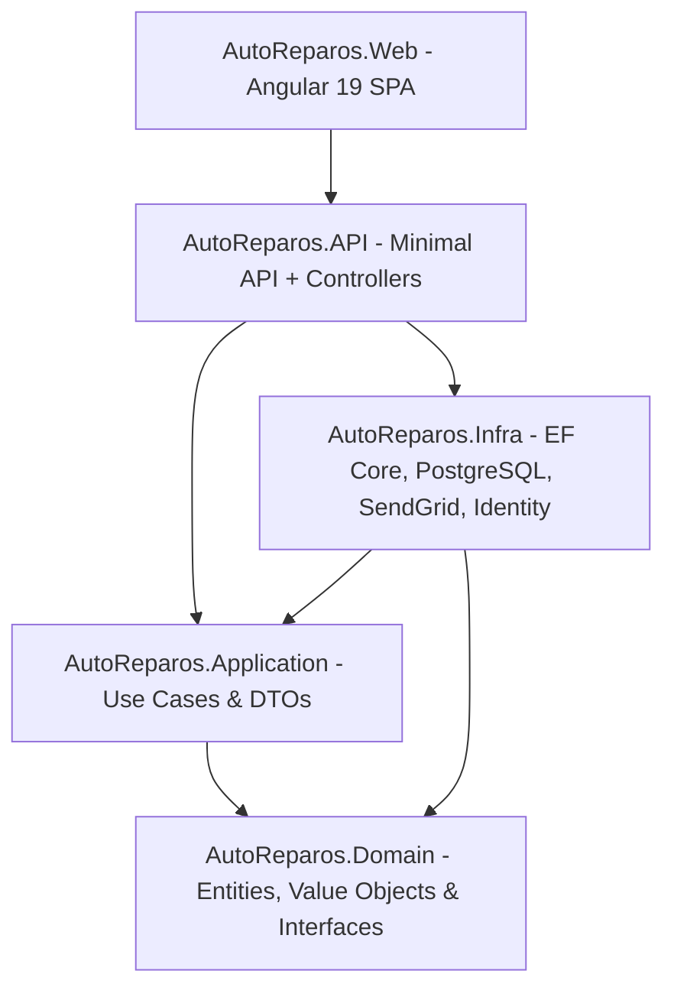
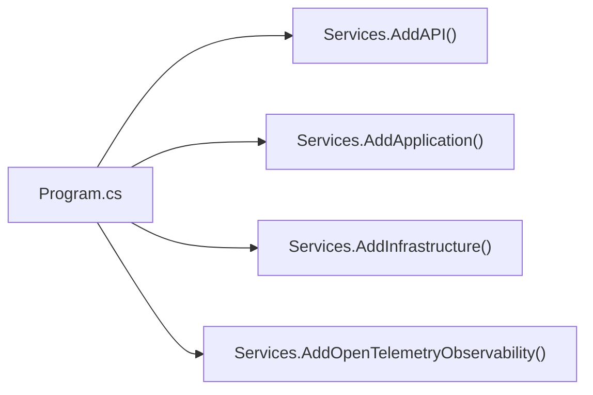
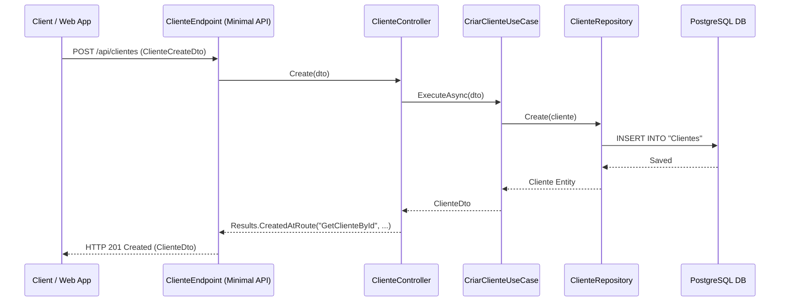

# AutoReparos - Architecture Overview Specification

## 1. Architectural Style & Layering

**AutoReparos** follows **Clean Architecture** (Onion/Hexagonal) principles combined with a **Minimal API + Controller Delegation Pattern** in .NET 9.

### Layer Responsibilities

1. **`AutoReparos.Domain`**:
   - Pure C# domain logic with zero external infrastructure dependencies.
   - Contains Entities, Value Objects, Domain Exceptions, Enums, and Repository Interfaces (`IClienteRepository`, `IOrdemServicoRepository`, etc.).
2. **`AutoReparos.Application`**:
   - Implements application Use Cases using Single Responsibility Principle (SRP) classes (e.g., [`CriarClienteUseCase`](../../AutoReparos.Application/Clientes/UseCases/CriarClienteUseCase.cs)).
   - Defines Request/Response DTOs, Mapping extensions, Service Interfaces (`INotificacaoService`, `IJwtService`, `IAprovacaoTokenService`), and Kanban Strategy interfaces (`IKanbanCardStrategy`).
3. **`AutoReparos.Infra`**:
   - Handles persistence via EF Core & PostgreSQL (`Npgsql`).
   - Implements Domain Repository interfaces and ASP.NET Core Identity Core (`UsuarioIdentity`).
   - Handles external integrations: SendGrid for email notifications ([`NotificacaoService.cs`](../../AutoReparos.Infra/Services/NotificacaoService.cs)) and HMAC-SHA256 token generation ([`AprovacaoTokenService.cs`](../../AutoReparos.Infra/Services/AprovacaoTokenService.cs)).
4. **`AutoReparos.API`**:
   - Minimal API route definitions ([`Program.cs`](../../AutoReparos.API/Program.cs), [`Endpoints/`](../../AutoReparos.API/Endpoints)) mapping HTTP routes to lightweight Controllers ([`Controllers/`](../../AutoReparos.API/Controllers)).
   - Configures JWT Bearer authentication, Swagger OpenAPI, Global Exception Handling, and OpenTelemetry observability.
5. **`AutoReparos.Web`**:
   - Modern Angular 19 Frontend utilizing Standalone Components, Reactive Forms, Guards (`auth.guard.ts`, `role.guard.ts`), and HTTP Interceptors (`jwt.interceptor.ts`, `error.interceptor.ts`).

---

## 2. Dependency Injection Setup

Dependency Injection is configured using modular Extension Methods across assembly boundaries:

### Registration Breakdown

- **`AddAPI()`** ([`DependencyInjectionAPI.cs`](../../AutoReparos.API/DependencyInjectionAPI.cs)): Registers Options (`JwtSettings`, `SeedUsuarioSettings`), Exception Handlers (`GlobalExceptionHandler`), CORS policy, JWT Authentication & Authorization, and Scoped Controllers (`ClienteController`, `OrdemServicoController`, etc.).
- **`AddApplication()`** ([`DependencyInjection.cs`](../../AutoReparos.Application/DependencyInjection.cs)): Registers all Use Cases as Scoped services (`ICriarOrdemServicoUseCase` -> `CriarOrdemServicoUseCase`) and Kanban Card Strategies (`IKanbanCardStrategy`).
- **`AddInfrastructure()`** ([`DependencyInjectionInfra.cs`](../../AutoReparos.Infra/IoC/DependencyInjectionInfra.cs)): Registers EF Core `AppDbContext` (Npgsql), Identity Core stores, Repositories (`IClienteRepository` -> `ClienteRepository`), `IJwtService`, `IAprovacaoTokenService`, `INotificacaoService`, and `IDashboardQueryService`.
- **`AddOpenTelemetryObservability()`** ([`OpenTelemetryExtensions.cs`](../../AutoReparos.API/OpenTelemetryExtensions.cs)): Registers Tracing, Metrics, and Logging exporters targeting OpenTelemetry Collectors (OTLP/gRPC at port `4317`).

---

## 3. Minimal API + Controller Delegation Pattern

The API layer uses a hybrid pattern combining **Minimal API route declarations** with **Scoped Controller delegation**.

### Pattern Advantages
- **Clean Route Mapping**: Endpoints are grouped cleanly using `app.MapGroup("/api/...")` in endpoint extension classes (e.g. [`ClienteEndpoint.cs`](../../AutoReparos.API/Endpoints/ClienteEndpoint.cs)).
- **Separation of Metadata and Logic**: Swagger annotations, auth rules (`RequireAuthorization()`), and status code contracts (`Produces<T>`) remain in the Endpoint file, while execution logic resides in testable Controller methods.

### Example Sequence Flow

---

## 4. OpenTelemetry & Observability

Observability is integrated via OpenTelemetry standards ([`OpenTelemetryExtensions.cs`](../../AutoReparos.API/OpenTelemetryExtensions.cs)):

- **Distributed Tracing**:
  - ASP.NET Core request instrumentation (`AddAspNetCoreInstrumentation`).
  - HttpClient outbound calls (`AddHttpClientInstrumentation`).
  - EF Core database queries (`AddEntityFrameworkCoreInstrumentation`).
  - OTLP Exporter forwarding traces to Jaeger / OpenTelemetry Collector at `http://localhost:4317`.
- **Metrics**:
  - Process/Runtime metrics (Memory, GC, CPU).
  - ASP.NET Core HTTP request counts and latency histograms.
- **Structured Logging**:
  - Log events forwarded via OpenTelemetry OTLP Exporter with formatted messages and execution scopes.

---

## 5. Cross-Cutting Concerns

### 5.1. Global Exception Handling
Errors are caught globally by `GlobalExceptionHandler` ([`GlobalExceptionHandler.cs`](../../AutoReparos.API/Handlers/GlobalExceptionHandler.cs)):

| Exception Type | HTTP Status Code | Response Type |
| :--- | :--- | :--- |
| `DomainException` / `InvalidClienteException` / etc. | `400 Bad Request` | `ProblemDetails` |
| `NotFoundException` | `404 Not Found` | `ProblemDetails` |
| `RelatedEntityException` / Duplication Exceptions | `400 Bad Request` | `ProblemDetails` |
| `UnauthorizedAccessException` | `401 Unauthorized` | `ProblemDetails` |
| Unhandled System `Exception` | `500 Internal Server Error` | `ProblemDetails` |

### 5.2. Security & Token Authorization
- **JWT Bearer Authentication**: Claims include `sub` (UserId), `email`, and `role` (`Administrador`, `Atendente`, `Mecanico`).
- **HMAC Customer Approval Tokens**: Anonymous links sent to customers use HMAC-SHA256 signed Base64Url tokens ([`AprovacaoTokenService.cs`](../../AutoReparos.Infra/Services/AprovacaoTokenService.cs)), eliminating the need for customer passwords or logins to approve budget quotes.
