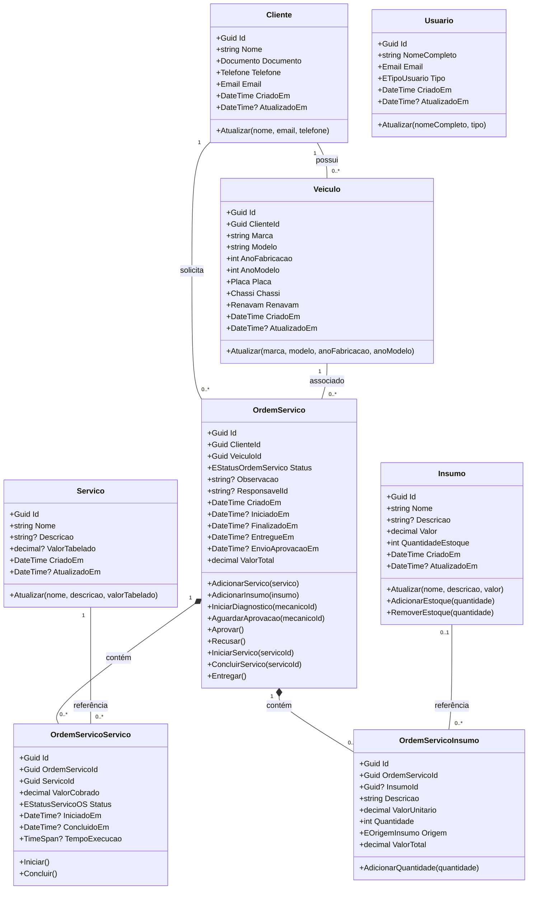
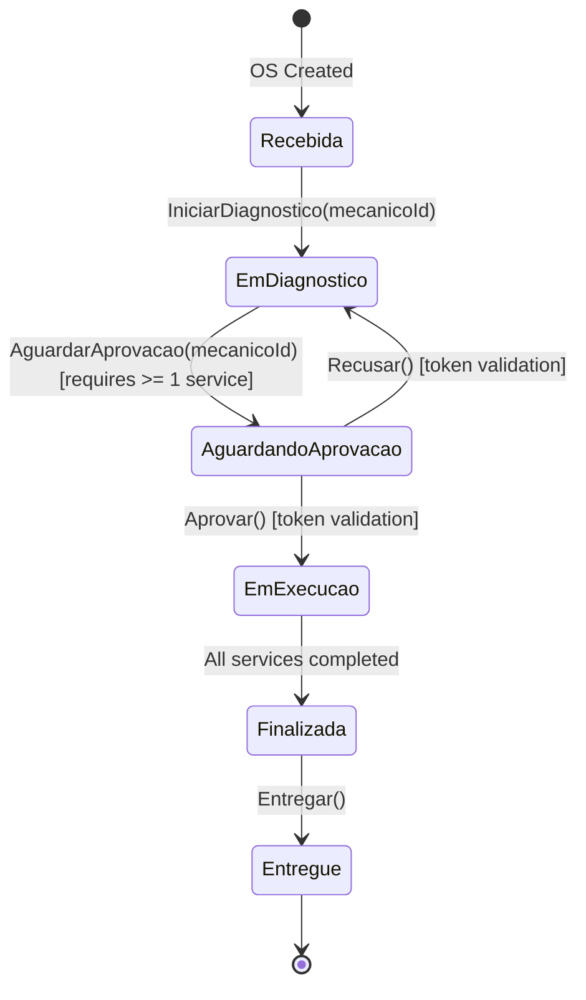
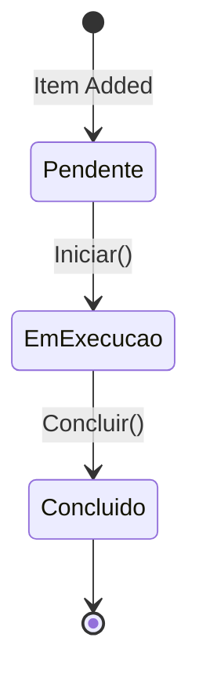

# AutoReparos - Domain Model Specification

## 1. Overview

The domain model of **AutoReparos** (`AutoReparos.Domain`) is structured following **Domain-Driven Design (DDD)** principles and Rich Domain Model patterns. Business rules, invariants, and state transitions are encapsulated directly inside entities and value objects, avoiding anemic domain models.

All entities inherit from the base `Entity` class ([Entity.cs](../../AutoReparos.Domain/Shared/Entity.cs)) which handles identity (`Guid Id`) and equality logic.

---

## 2. Entities and Aggregates



### 2.1. Cliente Aggregate
- **File**: [`Cliente.cs`](../../AutoReparos.Domain/Clientes/Entities/Cliente.cs)
- **Properties**:
  - `Nome`: string (Required, max length 100).
  - `Documento`: ValueObject `Documento` (CPF/CNPJ).
  - `Telefone`: ValueObject `Telefone`.
  - `Email`: ValueObject `Email`.
- **Invariants & Validation**:
  - Name is mandatory and capped at 100 characters.
  - Document, Telefone, and Email must pass structural validation via their respective Value Objects.

### 2.2. Veiculo Aggregate
- **File**: [`Veiculo.cs`](../../AutoReparos.Domain/Veiculos/Entities/Veiculo.cs)
- **Properties**:
  - `ClienteId`: Guid (Foreign Key to `Cliente`).
  - `Marca`: string (Required, max length 50).
  - `Modelo`: string (Required, max length 50).
  - `AnoFabricacao`: int (Valid range: 1900 to current year + 1).
  - `AnoModelo`: int (Must be `>= AnoFabricacao`).
  - `Placa`: ValueObject `Placa`.
  - `Chassi`: ValueObject `Chassi`.
  - `Renavam`: ValueObject `Renavam`.

### 2.3. Insumo Aggregate
- **File**: [`Insumo.cs`](../../AutoReparos.Domain/Insumos/Entities/Insumo.cs)
- **Properties**: `Nome`, `Descricao`, `Valor` (decimal > 0), `QuantidadeEstoque` (int >= 0).
- **Domain Methods**:
  - `AdicionarEstoque(int quantidade)`: Increments stock.
  - `RemoverEstoque(int quantidade)`: Decrements stock; throws `InvalidInsumoException` if requested quantity > current stock.

### 2.4. Servico Aggregate
- **File**: [`Servico.cs`](../../AutoReparos.Domain/Servicos/Entities/Servico.cs)
- **Properties**: `Nome`, `Descricao`, `ValorTabelado` (nullable decimal > 0). Standard catalog items available for inclusion in work orders.

### 2.5. Usuario Aggregate
- **File**: [`Usuario.cs`](../../AutoReparos.Domain/Usuarios/Entities/Usuario.cs)
- **Properties**: `NomeCompleto`, `Email`, `Tipo` (`ETipoUsuario`: `Administrador = 1`, `Atendente = 2`, `Mecanico = 3`).
- **Decoupling Note**: Domain representation of users, separated from ASP.NET Core Identity infrastructure.

---

## 3. OrdemServico Aggregate Root & State Machines

`OrdemServico` ([OrdemServico.cs](../../AutoReparos.Domain/OrdensServicos/Entities/OrdemServico.cs)) is the primary Aggregate Root in the system.

### 3.1. Work Order Lifecycle State Machine (`EStatusOrdemServico`)



#### Status Enum (`EStatusOrdemServico`)
1. **`Recebida` (1)**: Initial state when created by receptionist/system.
2. **`EmDiagnostico` (2)**: Assigned to a mechanic (`ResponsavelId`) for assessment.
3. **`AguardandoAprovacao` (3)**: Quote generated and sent to customer via email token link.
4. **`EmExecucao` (4)**: Customer approved quote; mechanics execute items.
5. **`Finalizada` (5)**: All services inside OS marked `Concluido`.
6. **`Entregue` (6)**: Vehicle delivered to customer.

### 3.2. Work Order Service Item State Machine (`EStatusServicoOS`)
Each service item inside an OS ([OrdemServicoServico.cs](../../AutoReparos.Domain/OrdensServicos/Entities/OrdemServicoServico.cs)) maintains its own status:



- When the **last** service item transitions to `Concluido`, the parent `OrdemServico` automatically updates its status to `Finalizada` and sets `FinalizadoEm = DateTime.UtcNow`.

---

## 4. Value Objects and Invariants

| Value Object | Validation Rules | Primary Exception |
| :--- | :--- | :--- |
| **`Documento`** | Only digits; 11 digits for CPF, 14 digits for CNPJ. Includes full Brazilian checksum validation algorithms. | `InvalidDocumentoException` |
| **`Telefone`** | Digits only; must have 10 (landline) or 11 (mobile) digits. | `InvalidTelefoneException` |
| **`Email`** | Regex matching standard email patterns (`^[^@\s]+@[^@\s]+\.[^@\s]+$`). | `InvalidEmailException` |
| **`Placa`** | 7 alphanumeric characters. Supports Traditional (`AAA1234`) and Mercosul (`AAA1A23`) formats. | `InvalidPlacaException` |
| **`Chassi`** | Exact 17 uppercase alphanumeric characters (VIN standard), excluding I, O, Q. | `InvalidChassiException` |
| **`Renavam`** | Exact 11 digits with mod 11 check algorithm. | `InvalidRenavamException` |

---

## 5. Domain Exception Hierarchy

All custom domain exceptions inherit from `DomainException` ([DomainException.cs](../../AutoReparos.Domain/Shared/Exceptions/DomainException.cs)):

```
DomainException (abstract)
├── InvalidClienteException
├── InvalidDocumentoException
├── InvalidTelefoneException
├── InvalidVeiculoException
├── InvalidPlacaException
├── InvalidChassiException
├── InvalidRenavamException
├── DuplicatedPlacaException
├── DuplicatedChassiException
├── DuplicatedRenavamException
├── InvalidOrdemServicoException
├── InvalidInsumoException
├── InvalidServicoException
├── InvalidUsuarioException
├── InvalidEmailException
├── NotFoundException
└── RelatedEntityException
```

When thrown, these exceptions are intercepted by `GlobalExceptionHandler` ([GlobalExceptionHandler.cs](../../AutoReparos.API/Handlers/GlobalExceptionHandler.cs)) and transformed into standardized RFC 7807 `ProblemDetails` responses.
