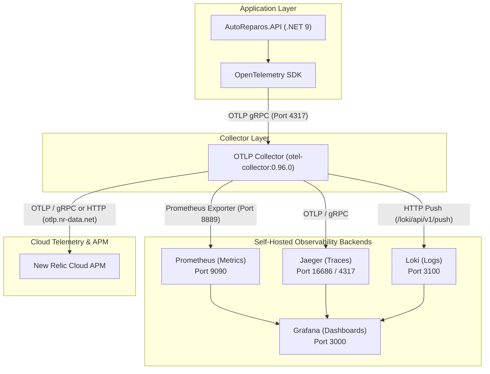
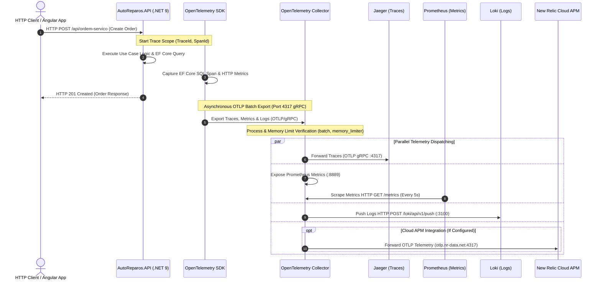

# AutoReparos - Observability Stack Specification

## 1. Executive Summary & Architectural Overview

The **AutoReparos Observability Stack** is designed around open-source, vendor-agnostic standards using **OpenTelemetry (OTel)**. The architecture decouples telemetry generation within the application from telemetry storage and visualization backends.

The ASP.NET Core Web API ([`AutoReparos.API`](../../AutoReparos.API/Program.cs)) instruments requests, database queries, and logs using the OpenTelemetry .NET SDK. Telemetry data is exported via OTLP (OpenTelemetry Protocol) to a centralized **OpenTelemetry Collector**, which processes, batches, and routes traces, metrics, and logs to local self-hosted backends (**Jaeger**, **Prometheus**, **Loki**) and cloud APM solutions (**New Relic**).



---

## 2. Component Architecture & Responsibilities

### 2.1. ASP.NET Core API & OpenTelemetry SDK
- **Implementation**: [`OpenTelemetryExtensions.cs`](../../AutoReparos.API/OpenTelemetryExtensions.cs)
- **Registration**: Integrated during application bootstrap in [`Program.cs`](../../AutoReparos.API/Program.cs) via `builder.Services.AddOpenTelemetryObservability()`.
- **Capabilities**:
  - **Distributed Tracing**: Captures incoming HTTP requests (`AddAspNetCoreInstrumentation`), outgoing HTTP calls (`AddHttpClientInstrumentation`), and Entity Framework Core database operations (`AddEntityFrameworkCoreInstrumentation`). Records unhandled exceptions automatically.
  - **Metrics Collection**: Emits ASP.NET Core HTTP metrics, HttpClient request counts/latencies, and .NET runtime performance metrics (GC collections, memory usage, thread pool stats).
  - **Structured Logging**: Captures `ILogger` output including log scopes, formatted messages, and trace correlation IDs via `AddOpenTelemetry`.
  - **Transport**: Pushes traces, metrics, and logs via unified OTLP gRPC exporter to `OpenTelemetry:Endpoint` (configured in [`docker-compose.yml`](../../docker-compose.yml)).

### 2.2. OpenTelemetry Collector (`otel-collector`)
- **Container**: `otel/opentelemetry-collector-contrib:0.96.0`
- **Configuration**: [`otel-collector-config.yaml`](../../infra/otel/otel-collector-config.yaml)
- **Pipelines**:
  - **Receivers**: Receives OTLP telemetry on `0.0.0.0:4317` (gRPC) and `0.0.0.0:4318` (HTTP).
  - **Processors**: Applies `memory_limiter` (75% limit, 20% spike limit, 1s check interval) and `batch` processing (8192 batch size, 1s timeout) to optimize network throughput and memory consumption.
  - **Exporters**: Forwarding pipelines send traces to Jaeger, metrics to Prometheus exporter (`0.0.0.0:8889`), logs to Loki, and enterprise telemetry to New Relic.

### 2.3. Distributed Tracing: Jaeger
- **Container**: `jaegertracing/all-in-one:1.55`
- **Port**: `16686` (Web UI), `4317` (Internal OTLP ingestion)
- **Role**: Receives trace spans from OTLP Collector over OTLP gRPC. Provides end-to-end trace visualization, latency breakdown across database queries, application handlers, and HTTP endpoint calls.

### 2.4. Metrics Engine: Prometheus
- **Container**: `prom/prometheus:v2.51.0`
- **Configuration**: [`prometheus.yml`](../../infra/otel/prometheus.yml)
- **Scrape Interval**: `5s`
- **Role**: Periodically scrapes metric endpoint exposed by OTLP Collector at `otel-collector:8889`. Stores time-series data for HTTP request rates, response latency histograms, error rates, and system resource utilization.

### 2.5. Log Aggregation: Loki
- **Container**: `grafana/loki:2.9.5`
- **Configuration**: [`loki-config.yaml`](../../infra/otel/loki-config.yaml)
- **Port**: `3100` (HTTP Ingest / LogQL API), `9096` (gRPC)
- **Role**: Ingests structured application logs pushed from OTLP Collector via `/loki/api/v1/push`. Labels logs with application attributes enabling log-to-trace correlation in Grafana.

### 2.6. Unified Visualization: Grafana
- **Container**: `grafana/grafana:10.4.1`
- **Provisioned Data Sources**: [`datasources.yaml`](../../infra/grafana/provisioning/datasources/datasources.yaml)
  - Prometheus (`http://prometheus:9090`) - Default
  - Jaeger (`http://jaeger:16686`)
  - Loki (`http://loki:3100`)
- **Provisioned Dashboards**: [`dashboards.yaml`](../../infra/grafana/provisioning/dashboards/dashboards.yaml) loading JSON definitions like [`dotnet_api_overview.json`](../../infra/grafana/provisioning/dashboards/json/dotnet_api_overview.json).
- **Port**: `3000` (Web UI, Default credentials `admin`/`admin`).

### 2.7. Cloud APM: New Relic Integration
- **Role**: Provides enterprise cloud APM, synthetic monitoring, and cloud-hosted telemetry storage.
- **Data Flow**: The OTLP Collector acts as a gateway forwarding traces, metrics, and logs to New Relic's OTLP ingest endpoint (`otlp.nr-data.net:4317` or `https://otlp.nr-data.net:4318`) using the `NEW_RELIC_LICENSE_KEY` in the `api-key` header.

---

## 3. Trace & Telemetry Propagation Sequence

The sequence diagram below illustrates trace context generation during an HTTP request, OTLP export, batch processing, and multi-destination dispatching to local tools (Jaeger, Prometheus, Loki) and cloud APM (New Relic).



---

## 4. Configuration Specification for OTLP Ports

The following table details all ports utilized across the Observability Stack, including container bindings configured in [`docker-compose.yml`](../../docker-compose.yml):

| Service | Port | Protocol | Purpose / Description | Reference Configuration |
| :--- | :--- | :--- | :--- | :--- |
| **OTLP Collector** | `4317` | gRPC | Inbound OTLP gRPC ingestion for Traces, Metrics, and Logs | [`docker-compose.yml`](../../docker-compose.yml#L89) |
| **OTLP Collector** | `4318` | HTTP | Inbound OTLP HTTP Protobuf/JSON ingestion endpoint | [`docker-compose.yml`](../../docker-compose.yml#L90) |
| **OTLP Collector** | `8889` | HTTP | Prometheus metrics exporter endpoint scraped by Prometheus | [`otel-collector-config.yaml`](../../infra/otel/otel-collector-config.yaml#L20) |
| **OTLP Collector** | `13133` | HTTP | Health check extension endpoint (`/`) | [`otel-collector-config.yaml`](../../infra/otel/otel-collector-config.yaml#L33) |
| **Prometheus** | `9090` | HTTP | Prometheus Web UI, PromQL API, and Grafana datasource target | [`docker-compose.yml`](../../docker-compose.yml#L106) |
| **Jaeger UI** | `16686` | HTTP | Jaeger Web UI for trace querying, dependency graphs, and span visualization | [`docker-compose.yml`](../../docker-compose.yml#L115) |
| **Loki Ingest** | `3100` | HTTP | Loki HTTP log ingestion (`/loki/api/v1/push`) & LogQL query API | [`docker-compose.yml`](../../docker-compose.yml#L127) |
| **Loki gRPC** | `9096` | gRPC | Internal Loki gRPC ring and cluster communication port | [`loki-config.yaml`](../../infra/otel/loki-config.yaml#L5) |
| **Grafana UI** | `3000` | HTTP | Grafana Web Dashboard UI (Default login: `admin`/`admin`) | [`docker-compose.yml`](../../docker-compose.yml#L143) |

---

## 5. Environment Variables & Operational Guidelines

Configuration parameters for telemetry endpoints and enterprise cloud forwarding should be declared in environment files ([`.env.example`](../../.env.example)) or application settings ([`appsettings.json`](../../AutoReparos.API/appsettings.json)).

### 5.1. OpenTelemetry Environment Variables

| Variable Name | Default / Sample Value | Description |
| :--- | :--- | :--- |
| `OpenTelemetry__Endpoint` | `http://otel-collector:4317` (Docker)<br/>`http://localhost:4317` (Local) | OTLP gRPC collector target URL consumed by [`OpenTelemetryExtensions.cs`](../../AutoReparos.API/OpenTelemetryExtensions.cs). |
| `OpenTelemetry__ServiceName` | `AutoReparos.API` | Resource service identifier injected into trace, metric, and log headers. |

### 5.2. New Relic Environment Variables & Collector Guidelines

To enable cloud APM forwarding to New Relic via the OpenTelemetry Collector:

| Variable Name | Sample Value | Description |
| :--- | :--- | :--- |
| `NEW_RELIC_LICENSE_KEY` | `nr_ingest_key_sample...` | New Relic Ingestion License Key passed in OTLP headers. |
| `NEW_RELIC_OTLP_ENDPOINT` | `otlp.nr-data.net:4317` (US)<br/>`otlp.eu01.nr-data.net:4317` (EU) | Destination New Relic OTLP gRPC endpoint. |

#### OTLP Collector Configuration snippet for New Relic (`infra/otel/otel-collector-config.yaml`):

```yaml
exporters:
  otlp/newrelic:
    endpoint: ${NEW_RELIC_OTLP_ENDPOINT}
    headers:
      api-key: ${NEW_RELIC_LICENSE_KEY}

service:
  pipelines:
    traces:
      receivers: [otlp]
      processors: [memory_limiter, batch]
      exporters: [otlp/jaeger, otlp/newrelic]
    metrics:
      receivers: [otlp]
      processors: [memory_limiter, batch]
      exporters: [prometheus, otlp/newrelic]
    logs:
      receivers: [otlp]
      processors: [memory_limiter, batch]
      exporters: [loki, otlp/newrelic]
```

---

## 6. Local Execution & Telemetry Verification

### 6.1. Starting the Observability Stack
Run Docker Compose from the project root:

```bash
docker compose up -d
```

### 6.2. Verifying Service Health
- **Jaeger Web UI**: Navigate to `http://localhost:16686` to inspect service traces.
- **Prometheus UI**: Navigate to `http://localhost:9090` and verify targets at `http://localhost:9090/targets` (Status: `UP` for `otel-collector`).
- **Grafana UI**: Navigate to `http://localhost:3000` (User: `admin`, Pass: `admin`) and inspect pre-configured dashboards.
- **Collector Health Check**: Query `http://localhost:13133` (Returns HTTP 200 `{ "status": "Server available" }`).
