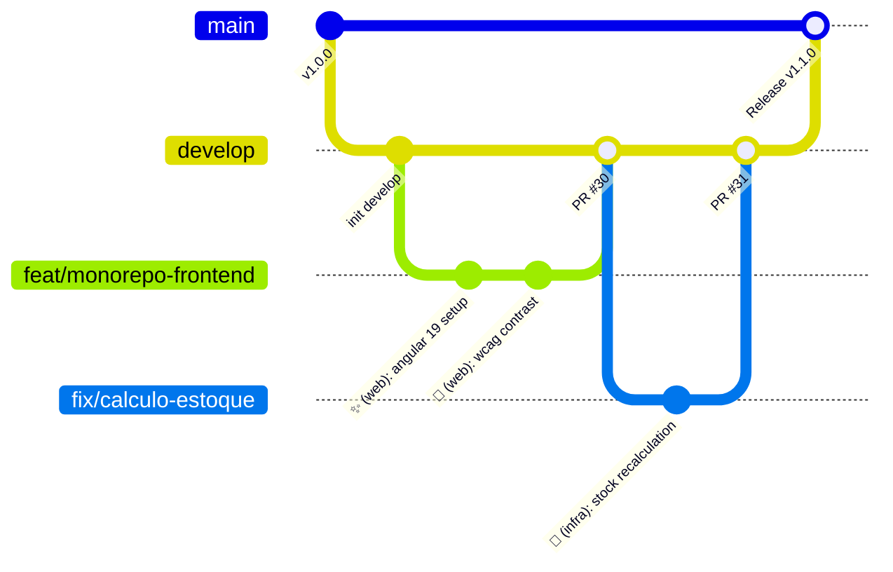

# Git Branching Strategy & Lifecycle Specification

This specification defines the branching model, naming conventions, branch lifecycle, protection rules, and merge policies for the **AutoReparos** repository.

---

## 1. Primary Branches & Environment Mapping

The repository adheres to a Git Flow-inspired branching model with `develop` as the active integration target and `main` as the production release branch.



### Branch Definitions

| Branch Name | Environment | Protection Rules | Purpose |
| :--- | :--- | :--- | :--- |
| `main` | Production / AWS EKS | Protected (Requires PR + CI pass) | Production-ready state. Merges trigger Terraform apply, ECR image push, and Helm EKS deployment ([`deploy.yml`](../../.github/workflows/deploy.yml)). |
| `develop` | Integration / Staging / Local | Protected (Default PR Base) | Primary integration branch. All feature, fix, and refactor work must merge into `develop` first. |

---

## 2. Supporting Branch Taxonomy & Naming Conventions

All supporting work branches must be created from `develop` (except hotfixes), be lowercase, use hyphens as word separators, and strictly follow these prefixes:

| Branch Prefix | Target Base | Lifecycle | Example Branch Name | Description |
| :--- | :--- | :--- | :--- | :--- |
| `feat/` | `develop` | Short-lived | `feat/monorepo-frontend`, `feat/dashboard-kanban` | New domain feature, API endpoint, or Web component. |
| `fix/` | `develop` | Short-lived | `fix/calculo-estoque-insumo`, `fix/ordem-status` | Bug fix, exception handling resolution, or Sonar code smell fix. |
| `refactor/` | `develop` | Short-lived | `refactor/clean-arch-adjustments`, `refactor/entities` | Code reorganization, DDD refinement, or layer decoupling without behavior change. |
| `docs/` | `develop` / `main` | Short-lived | `docs/add-tech-challenge-docs`, `docs/architecture-update` | Documentation updates, architecture specs, or README updates. |
| `chore/` | `develop` | Short-lived | `chore/update-dependencies`, `chore/otel-collector-config` | Dependency updates, tooling setup, or CI/CD configuration. |
| `hotfix/` | `main` & `develop` | Immediate | `hotfix/jwt-auth-header-leak` | Urgent production patch. Merging to `main` triggers deploy, then backported to `develop`. |

---

## 3. Step-by-Step Branch Lifecycle

### 1. Creating a Branch
Always branch off the latest `origin/develop`:
```bash
git fetch origin
git checkout develop
git pull origin develop
git checkout -b feat/os-drawer-kanban
```

### 2. Developing & Local Commits
Follow the **Gitmoji + Conventional Commits** standard ([`git-workflow.md`](../rules/git-workflow.md)):
```bash
git commit -m "✨ (web): adicionar gaveta lateral no kanban de ordens de serviço"
```

### 3. Keeping Branch Up to Date
Rebase against `origin/develop` before opening a Pull Request to prevent merge conflicts:
```bash
git fetch origin
git rebase origin/develop
```

### 4. Opening a Pull Request
Target `develop` as the base branch via GitHub CLI or Web UI ([`git-pr/SKILL.md`](../skills/git-pr/SKILL.md)):
```bash
gh pr create \
  --title "✨ (web): suporte a gaveta lateral no kanban" \
  --body-file .agents/skills/git-pr/templates/PULL_REQUEST_TEMPLATE.md \
  --base develop
```

### 5. Automated CI/CD & Merge Policy
- GitHub Actions ([`deploy.yml`](../../.github/workflows/deploy.yml)) runs compilation and test suites across all 3 test projects (`Domain.Tests`, `Application.Tests`, `IntegrationTests`).
- Once approved and green, merge using **Squash & Merge** or **Rebase & Merge**.
- Delete the remote feature branch upon merging (`gh pr merge --delete-branch`).

---

## 4. Release Strategy: `develop` ➔ `main`

When a milestone is reached:
1. Open a PR from `develop` to `main`.
2. Pipeline runs full build, test suite, and Terraform validation.
3. Upon merge to `main`, GitHub Actions automatically:
   - Builds Docker container (`autoreparos-api:${GITHUB_SHA}`).
   - Pushes image to Amazon ECR.
   - Deploys to EKS via Helm (`helm upgrade --install autoreparos ./k8s`).
