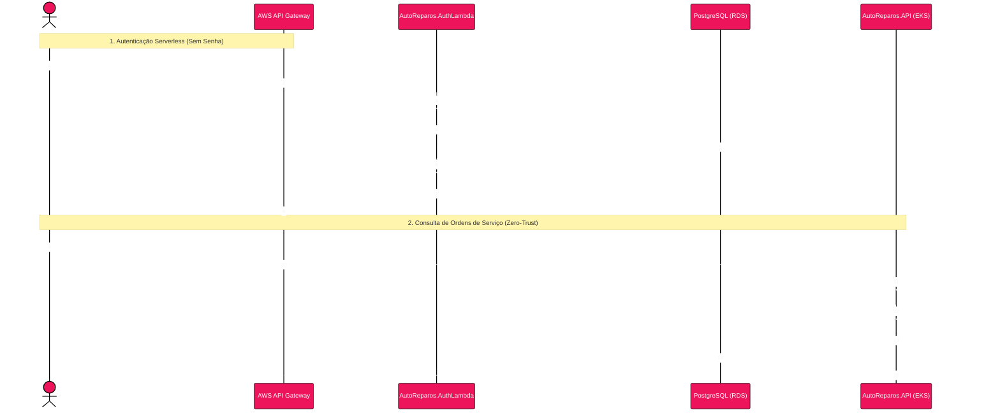
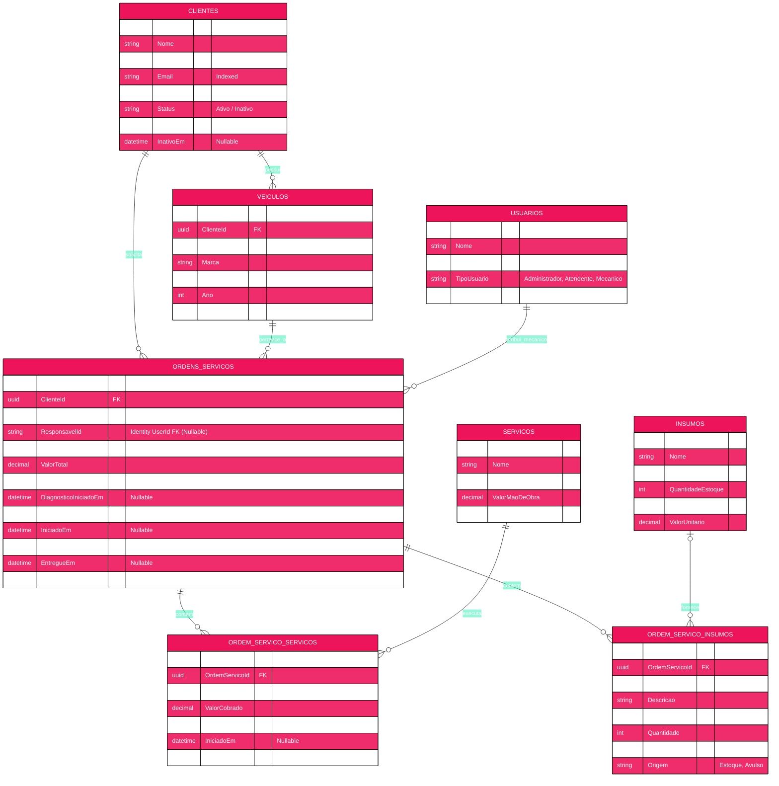

# AutoReparos - Sistema Integrado de Oficina Mecânica

<p align="center">
  
  
  
  
  
  
  
  
</p>

Este repositório é o **repositório pai e orquestrador (Umbrella)** do **AutoReparos**, uma plataforma corporativa integrada de atendimento, execução de serviços, controle de estoque e portal do cliente para oficinas automotivas.

O projeto foi concebido e evoluído ao longo das três fases do **Tech Challenge** da Pós-Graduação em **Software Architecture (SOAT - Turmas 13/15)** pela **FIAP**:
- **Fase 1 (MVP & DDD):** Modelagem de Domínio Estratégico (DDD), Clean Architecture, API REST .NET 10, Entity Framework Core e persistência relacional.
- **Fase 2 (Cloud & DevOps):** Escalabilidade elástica com Kubernetes (HPA), Helm Charts, esteira de CI/CD GitHub Actions, observabilidade distribuída com OpenTelemetry e provisionamento em nuvem AWS via Terraform.
- **Fase 3 (Corporativa & Serverless):** Desacoplamento arquitetural em **4 Repositórios Git Independentes**, autenticação serverless de clientes via AWS Lambda (CPF + E-mail), banco de dados gerenciado (AWS RDS PostgreSQL), API Gateway de borda, dashboards de telemetria de negócio e portal Zero-Trust.

---

## 📑 Sumário Completo

1. [Visão Geral e Jornada das Fases 1, 2 e 3](#1-visão-geral-e-jornada-das-fases-1-2-e-3)
   - [Fase 1: O Desafio Operacional e a Solução DDD](#fase-1-o-desafio-operacional-e-a-solução-ddd)
   - [Fase 2: Nuvem, DevOps, Escalabilidade e Observabilidade](#fase-2-nuvem-devops-escalabilidade-e-observabilidade)
   - [Fase 3: Operação Corporativa, Serverless e Segregação Multi-Repo](#fase-3-operação-corporativa-serverless-e-segregação-multi-repo)
2. [Arquitetura Multi-Repo e Submódulos Git](#2-arquitetura-multi-repo-e-submódulos-git)
   - [Os 4 Repositórios Oficiais da Fase 3](#os-4-repositórios-oficiais-da-fase-3)
   - [Organização dos Repositórios no Ecossistema](#organização-dos-repositórios-no-ecossistema)
   - [Estratégia de Branches e Proteção](#estratégia-de-branches-e-proteção)
3. [Desenho e Padrões da Arquitetura](#3-desenho-e-padrões-da-arquitetura)
   - [Diagrama Geral de Componentes (Fase 3)](#diagrama-geral-de-componentes-fase-3)
   - [Clean Architecture & DDD na Aplicação Principal](#clean-architecture--ddd-na-aplicação-principal)
   - [Frontend Web Angular 19 (Signals & Standalone)](#frontend-web-angular-19-signals--standalone)
   - [Arquitetura Serverless & Fluxo de Autenticação de Clientes](#arquitetura-serverless--fluxo-de-autenticação-de-clientes)
   - [Diagrama de Sequência: Autenticação Serverless e Consulta de OS](#diagrama-de-sequência-autenticação-serverless-e-consulta-de-os)
4. [Banco de Dados: Modelo Relacional e Justificativa](#4-banco-de-dados-modelo-relacional-e-justificativa)
   - [Justificativa Formal do Banco de Dados (PostgreSQL 16)](#justificativa-formal-do-banco-de-dados-postgresql-16)
   - [Diagrama Entidade-Relacionamento (ERD)](#diagrama-entidade-relacionamento-erd)
   - [Evolução para Banco de Dados Gerenciado (AWS RDS)](#evolução-para-banco-de-dados-gerenciado-aws-rds)
5. [Funcionalidades de Negócio e Ciclo de Vida da OS](#5-funcionalidades-de-negócio-e-ciclo-de-vida-da-os)
   - [Fluxo de Estados da Ordem de Serviço](#fluxo-de-estados-da-ordem-de-serviço)
   - [Fila Inteligente de Atendimento](#fila-inteligente-de-atendimento)
   - [Controle de Estoque e Baixa Automática](#controle-de-estoque-e-baixa-automática)
   - [Portal do Cliente com Proteção Zero-Trust](#portal-do-cliente-com-proteção-zero-trust)
6. [Monitoramento, Observabilidade e Dashboards](#6-monitoramento-observabilidade-e-dashboards)
   - [Stack de Telemetria (OpenTelemetry, Prometheus, Jaeger, Loki)](#stack-de-telemetria-opentelemetry-prometheus-jaeger-loki)
   - [Métricas e Dashboards Obrigatórios da Fase 3](#métricas-e-dashboards-obrigatórios-da-fase-3)
   - [Rastreamento Distribuído e Correlação de Logs](#rastreamento-distribuído-e-correlação-de-logs)
7. [Guia de Execução Local](#7-guia-de-execução-local)
   - [Pré-requisitos](#pré-requisitos)
   - [Clonando o Projeto com Submódulos](#clonando-o-projeto-com-submódulos)
   - [Configuração de Ambiente (.env)](#configuração-de-ambiente-env)
   - [Executando via Docker Compose](#executando-via-docker-compose)
   - [Executando os Testes Automatizados](#executando-os-testes-automatizados)
8. [Pipelines de CI/CD e Qualidade de Código](#8-pipelines-de-cicd-e-qualidade-de-código)
   - [Esteiras de Integração Contínua nos Repositórios](#esteiras-de-integração-contínua-nos-repositórios)
   - [Análise Estática de Código (SonarQube) e Qualidade](#análise-estática-de-código-sonarqube-e-qualidade)
9. [Documentação de Arquitetura (RFCs e ADRs)](#9-documentação-de-arquitetura-rfcs-e-adrs)
10. [Entregáveis Oficiais e Links](#10-entregáveis-oficiais-e-links)
11. [Integrantes do Grupo](#11-integrantes-do-grupo)

---

## 1. Visão Geral e Jornada das Fases 1, 2 e 3

O projeto AutoReparos foi desenvolvido incrementalmente para solucionar os gargalos reais de gestão de oficinas mecânicas modernas:

### Fase 1: O Desafio Operacional e a Solução DDD
- **Cenário Inicial:** A oficina operava com controle manual, planilhas dispersas, perda de histórico de clientes/veículos e falta de visibilidade no estoque de peças.
- **Entregas da Fase 1:**
  - Modelagem rica baseada em **Domain-Driven Design (DDD)** com entidades não anêmicas e invariantes de negócio protegidas.
  - Value Objects imutáveis (`CPF`, `CNPJ`, `Placa Mercosul`, `Email`).
  - **Clean Architecture** em 4 camadas (`Domain`, `Application`, `Infra`, `API`) com isolamento total da camada de domínio.
  - API REST com ASP.NET Core (.NET 10), mapeamentos de persistência com Entity Framework Core e PostgreSQL 16.
  - Ciclo de vida completo da Ordem de Serviço com envio de links seguros e efêmeros para aprovação de orçamentos por e-mail (SendGrid).
  - Suíte de testes unitários com **xUnit**, **FluentAssertions** e **NSubstitute**.

### Fase 2: Nuvem, DevOps, Escalabilidade e Observabilidade
- **Cenário de Evolução:** Com o aumento na base de clientes, tornou-se mandatória a operação em nuvem de alta disponibilidade, com capacidade de absorver picos de tráfego.
- **Entregas da Fase 2:**
  - **Kubernetes & Helm:** Manifestos Helm organizados com **Horizontal Pod Autoscaler (HPA)** baseado em CPU e Memória (80%), Probes de Liveness/Readiness e Ingress Nginx.
  - **Infraestrutura como Código (Terraform):** Provisionamento de VPC na AWS com subnets públicas/privadas, NAT Gateways, cluster AWS EKS e repositórios AWS ECR com State remoto em AWS S3.
  - **Pipeline de CI/CD (GitHub Actions):** Esteira automatizada contendo validação de concorrência, build, execução de testes unitários e de integração, `terraform apply`, build/push de contêineres e deploy no EKS via Helm.
  - **Observabilidade Completa:** Instrumentação nativa de tracing distribuído e métricas com **OpenTelemetry (OTel Collector)**, exportação para Prometheus, visualização de traces no Jaeger e agregação de logs no Loki.
  - **Frontend Moderno:** Aplicação web responsiva em **Angular 19** utilizando **Standalone Components** e **Signals**, com interceptors globais e design system acessível.

### Fase 3: Operação Corporativa, Serverless e Segregação Multi-Repo
- **Desafio Corporativo:** A expansão da oficina para múltiplas unidades exigiu elevar a arquitetura ao padrão corporativo:
  - **Isolamento de Segurança para Clientes:** O cliente final não deve ter login de usuário interno nem poluir as tabelas de operadores (`AspNetUsers`).
  - **Autenticação Serverless:** Criação de Function Serverless independente para autenticação via CPF e E-mail, gerando tokens JWT efêmeros.
  - **Arquitetura Multi-Repo:** Divisão estrita da solução em **4 repositórios Git independentes**, cada um com sua esteira de CI/CD e governança de releases.
  - **Banco de Dados Gerenciado (AWS RDS):** Segregação do banco de dados para instância PostgreSQL gerenciada na AWS.
  - **Borda com API Gateway:** Roteamento de borda unificado conectando a Function Serverless e a aplicação em Kubernetes.
  - **Dashboards de Negócio:** Monitoramento em tempo real do volume diário de OSs, tempo médio por status e detecção proativa de falhas em integrações externas.

---

## 2. Arquitetura Multi-Repo e Submódulos Git

Para atender integralmente aos requisitos corporativos da Fase 3 sem perder a capacidade de orquestração local unificada, o AutoReparos adota a abordagem **Multi-Repo com Git Submodules**.

### Os 4 Repositórios Oficiais da Fase 3

| # | Repositório | Responsabilidade | Tecnologias Principais |
|---|---|---|---|
| **1** | [**AutoReparos.AuthLambda**](https://github.com/Grupo78-PosTech-15SOAT/AutoReparos.AuthLambda) | Function Serverless para autenticação de clientes externos via CPF + E-mail, emissão de JWT efêmero (1h) e validação matemática de CPF. | .NET 10, C#, AWS Lambda Core, Npgsql, JWT |
| **2** | [**AutoReparos.Infra.Database**](https://github.com/Grupo78-PosTech-15SOAT/AutoReparos.Infra.Database) | Provisionamento IaC dedicado do banco de dados relacional gerenciado (AWS RDS PostgreSQL 16), Subnet Groups, Security Groups e backup automatizado. | Terraform, AWS RDS PostgreSQL 16 |
| **3** | [**AutoReparos.Infra.K8s**](https://github.com/Grupo78-PosTech-15SOAT/AutoReparos.Infra.K8s) | Provisionamento IaC do Cluster AWS EKS, Node Groups escaláveis, VPC e AWS API Gateway HTTP v2 integrado às rotas da aplicação e da Lambda. | Terraform, AWS EKS, AWS API Gateway v2 |
| **4** | [**AutoReparos.App**](https://github.com/Grupo78-PosTech-15SOAT/AutoReparos.App) | Núcleo da aplicação corporativa: API REST (.NET 10 Minimal APIs), Domínio (DDD), Infraestrutura (EF Core), suíte de testes e Frontend Angular 19. | .NET 10, EF Core 10, Angular 19, Yarn, Docker |

### Organização dos Repositórios no Ecossistema

No repositório pai (`AutoReparos`), os projetos são orquestrados através de submódulos git configurados em [`.gitmodules`](./.gitmodules):

```
AutoReparos/                                         # Repositório Pai / Orquestrador
├── .gitmodules                                      # Registro oficial dos submódulos
├── docker-compose.yml                               # Orquestração local unificada
├── AutoReparos.slnx                                 # Solution consolidada .NET 10
├── docs/                                            # Documentação centralizada (ADRs, RFCs, Especificações)
│   ├── specs/                                       # PDFs de requisitos oficiais
│   └── architecture/                                # Decisões arquiteturais
│
└── submodules/
    ├── AutoReparos.AuthLambda/                      # Submódulo 1: Function Serverless (Autônoma)
    │   ├── src/AutoReparos.AuthLambda/
    │   ├── tests/AutoReparos.AuthLambda.Tests/
    │   ├── .github/workflows/ci.yml
    │   └── README.md
    │
    ├── AutoReparos.App/                             # Submódulo 4: Aplicação Principal
    │   ├── AutoReparos.API/                         # Endpoints REST & Controllers
    │   ├── AutoReparos.Application/                 # Casos de Uso & DTOs
    │   ├── AutoReparos.Domain/                      # Entidades DDD & Value Objects
    │   ├── AutoReparos.Infra/                       # EF Core 10 & PostgreSQL
    │   ├── AutoReparos.Web/                         # Frontend Angular 19 (Signals)
    │   ├── AutoReparos.Domain.Tests/                # 113 testes unitários
    │   ├── AutoReparos.Application.Tests/           # 123 testes unitários
    │   ├── AutoReparos.IntegrationTests/            # 67 testes com Testcontainers
    │   ├── AutoReparos.App.slnx                     # Solution autônoma
    │   ├── .github/workflows/ci.yml                 # CI/CD (Testes + Docker)
    │   └── README.md
    │
    ├── AutoReparos.Infra.Database/                  # Submódulo 2: Terraform AWS RDS
    └── AutoReparos.Infra.K8s/                       # Submódulo 3: Terraform AWS EKS & API Gateway
```

### Estratégia de Branches e Proteção
Em conformidade com a especificação da Fase 3:
- A branch `main` de todos os repositórios possui **Branch Protection Rules** ativada (bloqueio de commits diretos).
- Alterações são submetidas obrigatoriamente através de **Pull Requests**, exigindo aprovação de code review e sucesso nas esteiras de CI.
- O usuário avaliador da banca (`soat-architecture`) está adicionado como colaborador em todos os repositórios.

---

## 3. Desenho e Padrões da Arquitetura

### Diagrama Geral de Componentes (Fase 3)

```mermaid
%%{init: {
  'theme': 'base',
  'themeCSS': 'svg { background-color: #ffffff !important; } .subgraph rect { fill: #FDE7EE !important; }',
  'themeVariables': {
    'primaryColor': '#ED145B',
    'primaryTextColor': '#ffffff',
    'primaryBorderColor': '#000000',
    'tertiaryColor': '#FDE7EE',
    'tertiaryBorderColor': '#ED145B',
    'edgeLabelBackground': '#000000'
  }
}}%%
graph TB
    subgraph Clients["Camada de Clientes e Acesso"]
        Browser["Portal Web do Cliente (Angular 19)"]
        Operator["Estação de Trabalho do Operador (Angular 19)"]
    end

    subgraph Edge["Borda de Nuvem (AWS API Gateway v2)"]
        APIGW["AWS API Gateway HTTP API"]
        RouteAuth["/auth/cliente (POST)"]
        RouteCore["/api/* (Proxy Reverso)"]
        APIGW --> RouteAuth
        APIGW --> RouteCore
    end

    subgraph ServerlessModule["Repositório 1: AutoReparos.AuthLambda"]
        Lambda["AWS Lambda Function (.NET 10)<br/>Autenticação por CPF + E-mail"]
        RouteAuth -->|Payload {cpf, email}| Lambda
    end

    subgraph AppCluster["Repositório 4: AutoReparos.App (AWS EKS Cluster)"]
        Ingress["Nginx Ingress Controller"]
        RouteCore --> Ingress
        
        subgraph Pods["Deployments & Pods Escaláveis"]
            APIService["AutoReparos.API (.NET 10)"]
            HPA["Horizontal Pod Autoscaler (HPA)"]
            HPA -.->|CPU/RAM > 80%| APIService
        end
        Ingress --> APIService
    end

    subgraph DatabaseModule["Repositório 2: AutoReparos.Infra.Database"]
        RDS[("AWS RDS PostgreSQL 16<br/>Multi-AZ / Subnets Privadas")]
        Lambda -->|Npgsql Direct Query| RDS
        APIService -->|EF Core 10 / Npgsql| RDS
    end

    subgraph Observability["Observabilidade e Telemetria"]
        OTel["OpenTelemetry Collector"]
        APIService -->|OTLP Traces & Metrics| OTel
        OTel --> Prom["Prometheus (Métricas)"]
        OTel --> Jaeger["Jaeger (Traces)"]
        OTel --> Loki["Grafana Loki (Logs Estruturados)"]
        Grafana["Dashboards de Negócio (Grafana)"]
        Grafana --> Prom
        Grafana --> Loki
    end

    Browser -->|1. Solicita Token| APIGW
    Browser -->|2. Requisições com JWT| APIGW
    Operator -->|Login Operacional| APIGW
```

### Clean Architecture & DDD na Aplicação Principal

A aplicação principal (`AutoReparos.App`) implementa estritamente os preceitos de **Clean Architecture** e **DDD**, garantindo inversão de dependências e isolamento completo do domínio:

```
AutoReparos.API (Controllers / Minimal APIs)
       ↓
AutoReparos.Application (Casos de Uso / DTOs / Validação)
       ↓
AutoReparos.Domain (Entidades Ricas / Value Objects / Interfaces)
       ↑
AutoReparos.Infra (EF Core / Repositórios PostgreSQL / Identity / SendGrid)
```

- **`AutoReparos.Domain` (Zero Dependências Externas):**
  - Entidades ricas com encapsulamento de invariantes (`OrdemServico`, `Cliente`, `Veiculo`, `Insumo`, `Servico`, `Usuario`).
  - Value Objects imutáveis com validação embutida (`Documento` com validação de algoritmo Módulo 11 de CPF e CNPJ, `Placa` com suporte a padrão convencional e Mercosul, `Email`).
  - Exceções ricas de domínio (`DomainException`, `BusinessRuleException`).
- **`AutoReparos.Application`:**
  - Padrão **Vertical Slice** organizado por Bounded Contexts.
  - Orquestração de casos de uso com mapeamento estrito para DTOs de entrada e saída.
- **`AutoReparos.Infra`:**
  - Persistência via Entity Framework Core com mapeamentos Fluent API explícitos.
  - Repositórios com transações ACID consistentes.
- **`AutoReparos.API`:**
  - Dupla camada de adaptadores: **Endpoints** (ASP.NET Minimal APIs) e **Controllers** (Clean Architecture Adapters) para total desacoplamento do framework.
  - Middlewares globais de tratamento de exceções e mapeamento de Problem Details.

### Frontend Web Angular 19 (Signals & Standalone)

O frontend (`AutoReparos.Web`) é construído com os mais modernos padrões de arquitetura Angular:
- **Standalone Components:** 100% livre de `NgModule`, proporcionando carregamento assíncrono e tree-shaking otimizado.
- **Reatividade com Signals:** Uso de `signal()`, `computed()` e `effect()` para atualização granular e previsível da UI.
- **Interceptors Funcionais:**
  - `jwtInterceptor`: Injeção automática de Token Bearer nas requisições.
  - `errorInterceptor`: Captura unificada de erros HTTP com notificações amigáveis ao usuário.
- **Design System Acessível:** Estilização responsiva em tons escuros (Deep Charcoal & FIAP Rose) com conformidade WCAG AA.

### Arquitetura Serverless & Fluxo de Autenticação de Clientes

Em conformidade com a especificação da Fase 3 e as diretrizes do projeto:
- O **cliente da oficina não possui conta nem senha no Identity (`AspNetUsers`)**.
- Para consultar o andamento de seus serviços, o cliente acessa o **Portal do Cliente** e informa apenas seu **CPF** e **E-mail**.
- A requisição é direcionada para a **AWS Lambda (`AutoReparos.AuthLambda`)**, que:
  1. Valida matematicamente o CPF (algoritmo Módulo 11).
  2. Consulta a base de dados PostgreSQL via query parametrizada direta, verificando a existência do cliente e seu status (`Ativo`).
  3. Gera um token JWT efêmero (validade de 1 hora) assinado criptograficamente (HMAC-SHA256), contendo as claims mínimas necessárias: `sub`, `cpf`, `email`, `role: "Cliente"`.
- O cliente utiliza esse JWT para consumir os endpoints protegidos:
  - `GET /api/clientes/meus-veiculos`
  - `GET /api/ordem-servico/minhas-os` (com filtro opcional por placa)
- Caso o cliente tente acessar qualquer rota operacional interna da oficina (ex: `/api/clientes`, `/api/ordem-servico/kanban`), a API rejeita com **HTTP 403 Forbidden** via política `OperadorOficina`.

### Diagrama de Sequência: Autenticação Serverless e Consulta de OS



---

## 4. Banco de Dados: Modelo Relacional e Justificativa

### Justificativa Formal do Banco de Dados (PostgreSQL 16)

A adoção do **PostgreSQL 16** como banco relacional do AutoReparos baseia-se em critérios técnicos fundamentados:

1. **Garantias ACID e Consistência Financeira:** Em uma oficina mecânica, operações de baixa de estoque e fechamento de ordens de serviço exigem transacionalidade atômica. A perda ou inconsistência no saldo de uma peça pode paralisar a linha de reparo.
2. **Consultas Complexas e Índices Otimizados:** O ciclo de vida da OS demanda filtros dinâmicos de alta performance (busca de veículos por placa com índices parciais, histórico de revisões por cliente e agregação de tempo médio de atendimento).
3. **Maturidade e Suporte a Nuvem (AWS RDS):** O PostgreSQL possui suporte nativo gerenciado na AWS com réplicas de leitura, backups automatizados em tempo point-in-time, criptografia KMS em repouso e alta disponibilidade Multi-AZ.
4. **Driver de Alta Performance (.NET / Npgsql):** O ecossistema .NET possui no **Npgsql** um dos drivers mais maduros e performáticos do mercado, permitindo mapeamento avançado com Entity Framework Core 10 e conexão ultrarrápida na AWS Lambda.

### Diagrama Entidade-Relacionamento (ERD)



### Evolução para Banco de Dados Gerenciado (AWS RDS)
Na Fase 2, o PostgreSQL era executado em um StatefulSet conteinerizado no cluster Kubernetes. Na Fase 3, através do repositório dedicado **`AutoReparos.Infra.Database`**, o banco de dados foi segregado para uma instância gerenciada **AWS RDS PostgreSQL 16**, garantindo escalabilidade vertical sem downtime, backup automatizado diário e isolamento de rede em subnets privadas da VPC.

---

## 5. Funcionalidades de Negócio e Ciclo de Vida da OS

### Fluxo de Estados da Ordem de Serviço

```mermaid
%%{init: {
  'theme': 'base',
  'themeCSS': 'svg { background-color: #ffffff !important; }',
  'themeVariables': {
    'primaryColor': '#ED145B',
    'primaryTextColor': '#ffffff',
    'primaryBorderColor': '#000000'
  }
}}%%
stateDiagram-v2
    [*] --> Recebida: Criação da OS
    Recebida --> EmDiagnostico: Mecânico assume a triagem (grava DiagnosticoIniciadoEm)
    EmDiagnostico --> AguardandoAprovacao: Orçamento montado (link efêmero enviado por e-mail)
    
    AguardandoAprovacao --> EmExecucao: Cliente aprova orçamento (Baixa no estoque)
    AguardandoAprovacao --> Cancelada: Cliente recusa orçamento (Estorno de peças)
    
    EmExecucao --> Finalizada: Serviços e testes concluídos
    Finalizada --> Entregue: Veículo retirado pelo cliente
    Entregue --> [*]
    Cancelada --> [*]
```



### Fila Inteligente de Atendimento
O endpoint `/api/ordem-servico/fila` implementa uma ordenação dinâmica prioritária:
1. **Prioridade de Status:** Ordens `Em Execução` têm precedência máxima, seguidas por `Aguardando Aprovação`, `Em Diagnóstico` e `Recebida`.
2. **Antiguidade Transacional:** Dentro de um mesmo status, as ordens mais antigas são atendidas primeiro (FIFO justo).
3. **Exclusão Lógica:** Ordens `Finalizadas`, `Entregues` ou `Canceladas` saem automaticamente da fila de trabalho da oficina.

### Controle de Estoque e Baixa Automática
- Na aprovação da Ordem de Serviço, a aplicação efetua a baixa imediata e atômica da quantidade de insumos alocados.
- Caso o estoque atinja o patamar mínimo (`EstoqueMinimo`), alertas automáticos são disparados para a equipe de compras.
- Em caso de cancelamento da OS, as peças reservadas têm o estoque recomposto automaticamente.

### Portal do Cliente com Proteção Zero-Trust
- O cliente possui acesso exclusivo às suas informações sem necessidade de senha prévia.
- A consulta à API valida dinamicamente o ID do cliente emitido no JWT:
  - `GET /api/clientes/meus-veiculos`: Lista apenas os carros registrados sob o CPF do requisitante.
  - `GET /api/ordem-servico/minhas-os?placa=...`: Filtra apenas as ordens vinculadas ao cliente. Se o cliente tentar consultar a placa de outro proprietário, a API retorna uma lista vazia, impossibilitando vazamento de dados de terceiros.

---

## 6. Monitoramento, Observabilidade e Dashboards

### Stack de Telemetria (OpenTelemetry, Prometheus, Jaeger, Loki)

A arquitetura conta com instrumentação de observabilidade distribuída completa:
- **OpenTelemetry SDK (.NET 10):** Rastreamento automático de chamadas HTTP, consultas de banco Npgsql/EF Core e métricas de aplicação.
- **OTel Collector:** Agente central de coleta e roteamento de telemetria.
- **Prometheus:** Coleta periódica de métricas de runtime (.NET Garbage Collection, Threads, HTTP Latency) e métricas customizadas de negócio.
- **Jaeger:** Rastreamento distribuído ponto a ponto com visualização gráfica dos spans de cada requisição.
- **Grafana Loki:** Ingestão de logs estruturados em formato JSON nativo contendo `TraceId` e `SpanId` correlacionados.

### Métricas e Dashboards Obrigatórios da Fase 3

Em conformidade com os requisitos da Fase 3, o sistema expõe:
1. **Volume Diário de Ordens de Serviço:** Gráfico de linha temporal detalhando a entrada de ordens criadas por dia.
2. **Tempo Médio por Status (Lead Time):**
   - Tempo médio na fase de **Diagnóstico** (`EnvioAprovacaoEm - DiagnosticoIniciadoEm`).
   - Tempo médio na fase de **Execução** (`FinalizadoEm - IniciadoEm`).
   - Tempo total até a **Entrega**.
3. **Alertas e Monitoramento de Integrações:**
   - Métrica de latência e contadores de erro para serviços externos (SendGrid API de e-mail e AWS Lambda).
   - Alertas para falhas no processamento de transições de status da OS.

### Rastreamento Distribuído e Correlação de Logs
Todo log gerado pela aplicação emite campos estruturados em JSON:
```json
{
  "Timestamp": "2026-09-14T03:30:00.000Z",
  "LogLevel": "Information",
  "TraceId": "4bf92f3577b34da6a3ce929d0e0e4736",
  "SpanId": "00f067aa0ba902b7",
  "Message": "Ordem de serviço OS-1048 aprovada com sucesso pelo cliente.",
  "ClienteId": "3fa85f64-5717-4562-b3fc-2c963f66afa6"
}
```

---

## 7. Guia de Execução Local

### Pré-requisitos
- [Docker e Docker Compose](https://www.docker.com/) (versão 24+)
- [.NET 10 SDK](https://dotnet.microsoft.com/download/dotnet/10.0) (opcional, para compilação fora de contêineres)
- [Node.js 22 & Yarn](https://yarnpkg.com/) (opcional, para frontend fora do Docker)
- [Git](https://git-scm.com/)

### Clonando o Projeto com Submódulos
Como a solução é organizada em submódulos Git, utilize o comando `--recurse-submodules`:

```bash
# Clonar repositório pai e inicializar todos os submódulos automaticamente
git clone --recurse-submodules https://github.com/Grupo78-PosTech-15SOAT/AutoReparos.git
cd AutoReparos

# Caso já tenha clonado sem os submódulos:
git submodule update --init --recursive
```

### Configuração de Ambiente (.env)
Crie o arquivo `.env` na raiz do repositório pai:

```env
# Banco de Dados PostgreSQL
DB_PASSWORD=admin123

# Segurança e JWT
JWT_SECRET=FBQOvEaUYAlmdilnGOk7vKzO9xUHiLgb8QCFUrk6af9
JWT_EXPIRY_HOURS=2
SEED_USER_EMAIL=admin@autoreparos.com
SEED_USER_PASSWORD=Admin@123
APROVACAO_TOKEN_SECRET=another_super_secret_key_for_approval_tokens_with_enough_length

# Integração de E-mail (SendGrid)
SENDGRID_API_KEY=SG.dummy_key
SENDGRID_FROM_EMAIL=noreply@autoreparos.com
SENDGRID_FROM_NAME=AutoReparos

# pgAdmin
PGADMIN_EMAIL=admin@admin.com
PGADMIN_PASSWORD=admin
ASPNETCORE_ENVIRONMENT=Development
```

### Executando via Docker Compose
Para subir todo o ecossistema localmente (API, Banco PostgreSQL, Frontend Angular, pgAdmin e stack de Observabilidade):

```bash
docker compose up -d --build
```

Endpoints disponíveis:
- **Aplicação Web (Angular 19):** [http://localhost:4200](http://localhost:4200)
- **API REST & Swagger:** [http://localhost:8080/swagger](http://localhost:8080/swagger)
- **pgAdmin (Gerenciador do PostgreSQL):** [http://localhost:5050](http://localhost:5050)
- **Jaeger (Distributed Traces):** [http://localhost:16686](http://localhost:16686)
- **Prometheus (Métricas):** [http://localhost:9090](http://localhost:9090)

### Executando os Testes Automatizados

A solução conta com **343 testes automatizados** (100% passando):
- **Domínio (`AutoReparos.Domain.Tests`):** 113 testes unitários (regras de negócio puras).
- **Aplicação (`AutoReparos.Application.Tests`):** 123 testes unitários (casos de uso).
- **Serverless (`AutoReparos.AuthLambda.Tests`):** 40 testes unitários (Módulo 11 CPF, geração de token).
- **Integração (`AutoReparos.IntegrationTests`):** 67 testes executados contra PostgreSQL real via **Testcontainers** (sem banco in-memory).

```bash
# Executar todos os testes da solução unificada:
dotnet test AutoReparos.slnx

# Executar testes da aplicação principal (submódulo):
dotnet test submodules/AutoReparos.App/AutoReparos.App.slnx

# Executar testes da Lambda Serverless (submódulo):
dotnet test submodules/AutoReparos.AuthLambda/tests/AutoReparos.AuthLambda.Tests.csproj
```

---

## 8. Pipelines de CI/CD e Qualidade de Código

### Esteiras de Integração Contínua nos Repositórios

Cada um dos 4 repositórios possui sua própria esteira automatizada no **GitHub Actions**:
1. **`AutoReparos.AuthLambda`:** Restauração, compilação .NET 10, execução de 40 testes unitários com cobertura e empacotamento do arquivo zip serverless.
2. **`AutoReparos.App`:** Validação paralela:
   - Backend: Compilação .NET 10, testes unitários, testes de integração com Testcontainers PostgreSQL e build da imagem Docker.
   - Frontend: Instalação via Yarn, build de produção Angular 19 e testes de componentes.
3. **`AutoReparos.Infra.Database`:** `terraform fmt`, `terraform validate`, `tflint`, security scanning com tfsec/Checkov e `terraform plan`.
4. **`AutoReparos.Infra.K8s`:** Validação de sintaxe Terraform e validação de templates de Helm Charts.

### Análise Estática de Código (SonarQube) e Qualidade
O projeto adota padrões rigorosos de qualidade verificados via SonarQube e GitHub Dependabot:
- **Clean Architecture Gate:** Camada de domínio com 0 acoplamento a frameworks.
- **Segurança de Dependências (SCA):** Verificação contínua de pacotes NuGet e Yarn contra o banco de advisories do GitHub.
- Guia detalhado de execução local do Sonar em [SONAR_LOCAL.md](./SONAR_LOCAL.md).

---

## 9. Documentação Técnica e Especificações da Fase 3

A documentação arquitetural e as especificações técnicas da Fase 3 estão organizadas por entrega na pasta [`docs/specs/fase3/`](./docs/specs/fase3/):

- **Submódulos & Arquitetura Multi-Repo ([`docs/specs/fase3/submodulos-multirepo/`](./docs/specs/fase3/submodulos-multirepo/)):**
  - [`plano_arquitetura_submodulos_git.md`](./docs/specs/fase3/submodulos-multirepo/plano_arquitetura_submodulos_git.md): Decisão e plano de segregação multi-repo com Git Submodules.
  - [`plano_migracao_submodulo_app.md`](./docs/specs/fase3/submodulos-multirepo/plano_migracao_submodulo_app.md): Estruturação da aplicação principal e desacoplamento de testes.

- **Autenticação Serverless & Portal do Cliente ([`docs/specs/fase3/auth-lambda-portal/`](./docs/specs/fase3/auth-lambda-portal/)):**
  - [`plano_sprint2_auth_lambda_portal.md`](./docs/specs/fase3/auth-lambda-portal/plano_sprint2_auth_lambda_portal.md): Especificação da Lambda serverless e do portal do cliente.
  - [`relatorio_revisao_critica_sprint2.md`](./docs/specs/fase3/auth-lambda-portal/relatorio_revisao_critica_sprint2.md): Relatório de revisão crítica das entregas do Sprint 2.

- **Cloud & Infraestrutura IaC ([`docs/specs/fase3/cloud-iac/`](./docs/specs/fase3/cloud-iac/)):**
  - [`fase3_spec_track_a_cloud_iac.md`](./docs/specs/fase3/cloud-iac/fase3_spec_track_a_cloud_iac.md): Especificação de Cloud AWS, Terraform (RDS e EKS), API Gateway HTTP v2 e Helm Charts.

- **Observabilidade & Métricas ([`docs/specs/fase3/observabilidade/`](./docs/specs/fase3/observabilidade/)):**
  - [`fase3_spec_track_b_observability_docs.md`](./docs/specs/fase3/observabilidade/fase3_spec_track_b_observability_docs.md): Especificação de Observabilidade (OpenTelemetry, Prometheus, Jaeger, Loki) e documentação.
  - [`fase3_track_b_tarefas_restantes_spec.md`](./docs/specs/fase3/observabilidade/fase3_track_b_tarefas_restantes_spec.md): Detalhamento dos use cases do portal do cliente, métricas de OS e telemetria.

- **Gap Analysis & Validação Consolidada ([`docs/specs/fase3/gap-analysis/`](./docs/specs/fase3/gap-analysis/)):**
  - [`fase3_deep_gap_analysis.md`](./docs/specs/fase3/gap-analysis/fase3_deep_gap_analysis.md): Análise aprofundada de aderência aos requisitos da Fase 3 FIAP SOAT.
  - [`fase3_validacao_consolidada_e_plano_execucao.md`](./docs/specs/fase3/gap-analysis/fase3_validacao_consolidada_e_plano_execucao.md): Plano consolidado de execução e validação da Fase 3.
  - [`frontend_deep_gap_analysis.md`](./docs/specs/fase3/gap-analysis/frontend_deep_gap_analysis.md): Análise de gaps de frontend e integração.

- **Enunciados Oficiais da Pós-Graduação:**
  - Arquivados em [`docs/tech-challenge/`](./docs/tech-challenge/) contendo os PDFs das Fases 1, 2 e 3.

---

## 10. Entregáveis Oficiais e Links

- **Repositórios Oficiais da Fase 3 no GitHub:**
  - 🚀 **Repositório 1 (Serverless Lambda):** [AutoReparos.AuthLambda](https://github.com/Grupo78-PosTech-15SOAT/AutoReparos.AuthLambda)
  - 🗄️ **Repositório 2 (Infra Banco RDS):** [AutoReparos.Infra.Database](https://github.com/Grupo78-PosTech-15SOAT/AutoReparos.Infra.Database)
  - ☁️ **Repositório 3 (Infra EKS & API Gateway):** [AutoReparos.Infra.K8s](https://github.com/Grupo78-PosTech-15SOAT/AutoReparos.Infra.K8s)
  - 💻 **Repositório 4 (Aplicação Principal):** [AutoReparos.App](https://github.com/Grupo78-PosTech-15SOAT/AutoReparos.App)
  - 📦 **Repositório Pai / Orquestrador:** [AutoReparos](https://github.com/Grupo78-PosTech-15SOAT/AutoReparos)
- **Desenho Estratégico DDD no Miro:** [Miro Board Oficial](https://miro.com/app/board/uXjVGw2wAXY=/?share_link_id=246372446405) (Event Storming, Bounded Contexts, Linguagem Ubíqua).
- **Collection do Postman:** [AutoReparos.postman_collection.json](./Postman/AutoReparos.postman_collection.json).
- **Vídeo Demonstrativo de até 15 Minutos:** *[Link da gravação demonstrando deploy CI/CD, login com CPF via Lambda, consultas protegidas, traces e dashboards]*
- **Usuário Avaliador:** O usuário `soat-architecture` foi adicionado com permissão de colaborador em todos os 4 repositórios da Fase 3.

---

## 11. Integrantes do Grupo

**Grupo 78 - Pós-Graduação em Software Architecture (SOAT) - FIAP**

- 👨‍💻 **Enrico Gollner** - rm370737
- 👨‍💻 **José Dotta** - rm372959
- 👩‍💻 **Júlia Santos** - rm370364
- 👨‍💻 **Lucas Bastos** - rm370749
- 👨‍💻 **Mateus Lecchi** - rm371085
