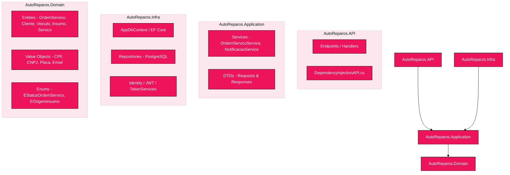
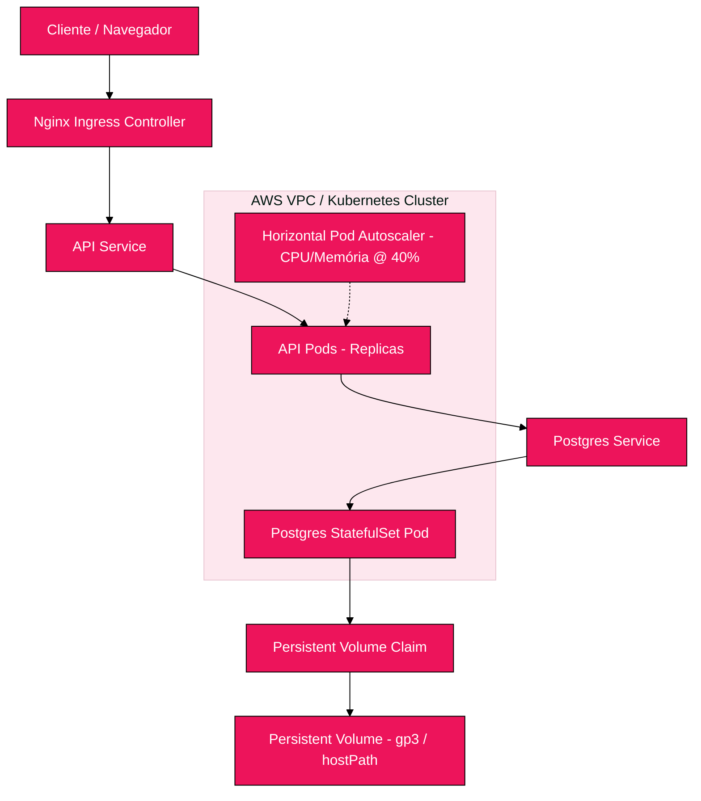
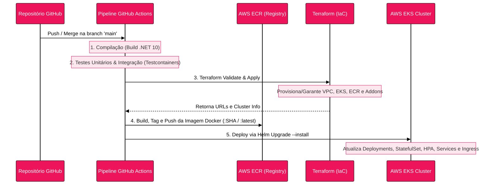

# AutoReparos - Sistema Integrado de Oficina Mecânica

<p align="center">
  
  
  
  
  
  
</p>

Este repositório contém a solução do **AutoReparos**, um Sistema Integrado de Atendimento e Execução de Serviços projetado para modernizar as operações de oficinas mecânicas de médio porte.

Este projeto foi desenvolvido como parte do **Tech Challenge (Fases 1 e 2)** da Pós-Graduação em **Software Architecture** pela **FIAP (SOAT)**.

---

## Sumário

- [🎯 Objetivos e Problema](#objetivos-e-problema)
- [🏗️ Desenho da Arquitetura](#desenho-da-arquitetura)
  - [1. Componentes da Aplicação (Clean Architecture)](#1-componentes-da-aplicação-clean-architecture)
  - [2. Infraestrutura Provisionada (AWS e Kubernetes)](#2-infraestrutura-provisionada-aws-e-kubernetes)
  - [3. Fluxo de Deploy (Pipeline CI/CD)](#3-fluxo-de-deploy-pipeline-cicd)
- [🚀 Funcionalidades da Aplicação](#funcionalidades-da-aplicação)
  - [Fluxo de Ordens de Serviço](#fluxo-de-ordens-de-serviço)
  - [Gestão Administrativa](#gestão-administrativa)
- [▶️ Guia de Execução Local](#guia-de-execução-local)
  - [Pré-requisitos](#pré-requisitos)
  - [Configuração de Credenciais (.env e Secrets)](#configuração-de-credenciais-env-e-secrets)
  - [Execução com Docker Compose](#execução-com-docker-compose)
  - [Execução de Testes Automatizados](#execução-de-testes-automatizados)
- [☸️ Guia de Kubernetes (Deploy Local com Helm)](#guia-de-kubernetes-deploy-local-com-helm)
- [☁️ Guia de Infraestrutura como Código (Terraform na AWS)](#guia-de-infraestrutura-como-código-terraform-na-aws)
- [🔄 Pipeline de CI/CD (GitHub Actions)](#pipeline-de-cicd-github-actions)
- [📊 Qualidade de Código (SonarQube) e Vulnerabilidades](#qualidade-de-código-sonarqube-e-vulnerabilidades)
- [📄 Entregáveis e Links Úteis](#entregáveis-e-links-úteis)
- [👥 Integrantes do Grupo](#integrantes-do-grupo)

---

## Objetivos e Problema

### O Problema (Fase 1)

Originalmente, a oficina mecânica realizava todo o controle de forma manual ou por planilhas rudimentares, resultando em:

- Erros na priorização dos atendimentos.
- Perda de histórico de veículos e clientes.
- Ineficiência no fluxo de aprovação de orçamentos.
- Falhas graves no controle de estoque de peças.

### A Evolução (Fase 2)

Após a implantação do MVP na Fase 1, o foco da Fase 2 passou a ser a **alta disponibilidade, resiliência, automação de infraestrutura e escalabilidade dinâmica**, preparando a aplicação para suportar picos de demanda através de práticas modernas de nuvem e DevOps.

---

## Desenho da Arquitetura

### 1. Componentes da Aplicação (Clean Architecture)

A aplicação está dividida em camadas seguindo os princípios de **Clean Architecture** e **DDD**, garantindo isolamento da lógica de domínio e facilidade de testes.

<div style="background: white; padding: 20px; border-radius: 8px; margin: 15px 0;">



</div>

### 2. Infraestrutura Provisionada (AWS e Kubernetes)

O ambiente em nuvem provisiona uma infraestrutura elástica e resiliente na AWS, contendo os recursos orquestrados descritos abaixo:

<div style="background: white; padding: 20px; border-radius: 8px; margin: 15px 0;">



</div>

### 3. Fluxo de Deploy (Pipeline CI/CD)

O deploy é totalmente automatizado através do GitHub Actions a cada merge na branch `main`:

<div style="background: white; padding: 20px; border-radius: 8px; margin: 15px 0;">



</div>

---

## Funcionalidades da Aplicação

### Fluxo de Ordens de Serviço

1. **Criação da OS (`POST /api/ordem-servico`):** Vincula cliente (CPF/CNPJ), veículo, serviços e insumos na mesma operação transacional.
2. **Acompanhamento de Status:**
   - **Fluxo de Transições:** `Recebida` ➔ `Em Diagnóstico` ➔ `Aguardando Aprovação` ➔ `Em Execução` ➔ `Finalizada` ➔ `Entregue`.
   - **Notificações:** O cliente recebe atualizações por e-mail a cada mudança de status.
3. **Aprovação de Orçamento:** O cliente recebe a lista detalhada do orçamento por e-mail e aprova ou recusa através de links com tokens assinados temporários (sem precisar estar autenticado).
4. **Fila de Trabalho (`GET /api/ordem-servico/fila`):**
   - **Priorização:** Ordenado dinamicamente: `Em Execução` > `Aguardando Aprovação` > `Em Diagnóstico` > `Recebida`.
   - **Antiguidade:** Exibe as ordens mais antigas primeiro dentro de cada prioridade.
   - **Filtro Ativo:** Exclui logicamente ordens já `Finalizadas` ou `Entregues`.

### Gestão Administrativa

- CRUD de Clientes, Veículos, Serviços e Insumos (Peças).

- Controle de estoque mínimo e baixa automática de peças consumidas em OS.
- Monitoramento do tempo médio de execução de cada tipo de serviço para fins analíticos.

---

## Guia de Execução Local

### Pré-requisitos

- [Docker e Docker Compose](https://www.docker.com/) instalados.

- .NET 10 SDK (apenas se quiser compilar fora do Docker).

### Configuração de Credenciais (.env e Secrets)

Crie um arquivo `.env` na raiz do diretório `./AutoReparos` com o seguinte modelo:

```env
# Configurações do Banco de Dados
DB_PASSWORD=admin123

# Configurações de Segurança
JWT_SECRET=FBQOvEaUYAlmdilnGOk7vKzO9xUHiLgb8QCFUrk6af9
JWT_EXPIRY_HOURS=2
SEED_USER_EMAIL=admin@autoreparos.com
SEED_USER_PASSWORD=Admin@123
APROVACAO_TOKEN_SECRET=another_super_secret_key_for_approval_tokens_with_enough_length

# Provedor de Email (SendGrid)
SENDGRID_API_KEY=SG.dummy_key
SENDGRID_FROM_EMAIL=noreply@autoreparos.com
SENDGRID_FROM_NAME=AutoReparos

# Exposição Externa (ngrok/local)
APP_BASE_URL=http://localhost:8080

# Acesso ao pgAdmin
PGADMIN_EMAIL=admin@admin.com
PGADMIN_PASSWORD=admin
ASPNETCORE_ENVIRONMENT=Development
```

> [!TIP]
> Para testar os links de aprovação de orçamento por e-mail em ambiente de desenvolvimento local, você pode utilizar o **ngrok** para expor a porta local da API e preencher a URL gerada na variável `APP_BASE_URL`.

### Execução com Docker Compose

Para subir a API, o banco de dados PostgreSQL e o utilitário pgAdmin localmente, execute na pasta `./AutoReparos`:

```bash
docker-compose up -d --build
```

A API estará disponível em:

- Documentação interativa (Swagger): [http://localhost:8080/swagger](http://localhost:8080/swagger)
- pgAdmin: [http://localhost:5050](http://localhost:5050)

### Execução de Testes Automatizados

Para rodar a suíte completa de testes locais, exporte as variáveis no terminal e execute:

```bash
# Exportando variáveis exigidas pelos testes locais (Linux/macOS)
export ConnectionStrings__DbConnection="Host=localhost;Database=autoreparos_test;Username=admin;Password=admin123"
export Jwt__Secret="FBQOvEaUYAlmdilnGOk7vKzO9xUHiLgb8QCFUrk6af9"
export Jwt__ExpiryHours="2"
export SeedUser__Email="admin@autoreparos.com"
export SeedUser__Password="Admin@123"
export AprovacaoToken__Secret="another_super_secret_key_for_approval_tokens_with_enough_length"
export SendGrid__ApiKey="SG.dummy_key"
export SendGrid__FromEmail="noreply@autoreparos.com"
export SendGrid__FromName="AutoReparos"
export App__BaseUrl="http://localhost:8080"

dotnet test
```

---

## Guia de Kubernetes (Deploy Local com Helm)

A pasta [/k8s](./k8s) contém o Helm Chart completo configurado para orquestração da aplicação.

1. **Habilitar Ingress Controller** (no Kind):

   Aplique o manifesto oficial do Ingress Nginx para clusters Kind:

   ```bash
   kubectl apply -f https://raw.githubusercontent.com/kubernetes/ingress-nginx/main/deploy/static/provider/kind/deploy.yaml
   ```

2. **Configurar os Segredos Locais** criando o arquivo `k8s/values-secrets.yaml` (este arquivo está ignorado no Git por segurança):

   ```yaml
   postgres:
     password: "admin123"
   secrets:
     jwtSecret: "FBQOvEaUYAlmdilnGOk7vKzO9xUHiLgb8QCFUrk6af9"
     seedUserPassword: "Admin@123"
     aprovacaoTokenSecret: "another_super_secret_key_for_approval_tokens_with_enough_length"
     sendGridApiKey: "SG.dummy_key"
   ```

3. **Instalar o Helm Chart**:

   ```bash
   helm upgrade --install autoreparos ./k8s -f k8s/values.yaml -f k8s/values-secrets.yaml
   ```

4. **Mapeamento do DNS local (Ingress)**:
   Como o Kind expõe o Ingress diretamente na porta 80 e 443 do host Docker, mapeie o IP `127.0.0.1` no seu arquivo `/etc/hosts` (ou `hosts` do Windows) apontando para o DNS local:

   ```text
   127.0.0.1 autoreparos.local
   ```

   A aplicação estará acessível em [http://autoreparos.local/swagger](http://autoreparos.local/swagger).

---

## Guia de Infraestrutura como Código (Terraform na AWS)

O diretório [/infra](./infra) contém o provisionamento completo de rede e cluster gerenciado utilizando Terraform:

1. **Criar o bucket S3 prévio** na AWS para armazenar o estado:

   ```bash
   aws s3api create-bucket --bucket meu-bucket-state-autoreparos --region us-east-1
   ```

2. **Inicializar o Terraform** apontando para o bucket dinamicamente:

   ```bash
   cd infra
   terraform init -backend-config="bucket=meu-bucket-state-autoreparos"
   ```

3. **Validar e Aplicar**:

   ```bash
   terraform apply -auto-approve
   ```

*Recursos Criados:* VPC completa (Subnets públicas/privadas, IGW, NAT Gateways), AWS EKS (cluster com Node Groups de instâncias de Worker Nodes escaláveis), repositório privado AWS ECR para imagens Docker e OIDC Provider.

---

## Pipeline de CI/CD (GitHub Actions)

A pipeline é definida no arquivo [.github/workflows/deploy.yml](./.github/workflows/deploy.yml) e executa o seguinte fluxo seguro:

1. **Controle de Concorrência:** Cancela execuções antigas na mesma branch para evitar corrupção de estado remoto do Terraform (State Lock).
2. **Restore & Build** da aplicação em ambiente temporário (.NET 10).
3. **Testes Unitários & Integração:** Roda todos os testes em containers efêmeros via Testcontainers.
4. **Provisionamento IaC (Terraform):** Executa o plan e aplica infraestrutura da AWS S3/EKS automaticamente.
5. **Build & Push Docker:** Gera a imagem otimizada e publica com tags exclusivas baseadas no SHA no AWS ECR.
6. **Helm Deploy:** Realiza o upgrade dos manifestos do Kubernetes apontando a nova imagem para o cluster AWS EKS.

---

## Qualidade de Código (SonarQube) e Vulnerabilidades

### Análise Estática de Qualidade

Para rodar a análise estática e verificar o índice de segurança, bugs, code smells e cobertura de testes localmente com o SonarQube, consulte o guia passo a passo em [SONAR_LOCAL.md](./SONAR_LOCAL.md).

### Relatório de Análise de Vulnerabilidades

O scan de vulnerabilidades de segurança de dependências (SCA) e a análise estática de segurança do código (SAST) fazem parte dos relatórios de qualidade gerados pelo SonarQube e pelos alertas de segurança do GitHub (Dependabot), estando anexados e descritos de forma transparente no documento de entrega da Fase 2.

---

## Entregáveis e Links Úteis

- **Desenho Estratégico (DDD) no Miro:** [Link para o Miro Board](https://miro.com/app/board/uXjVGw2wAXY=/?share_link_id=246372446405) (Event Storming, Linguagem Ubíqua, Diagrama de Domínio).
- **Collection do Postman:** Arquivo localizado na pasta [/Postman/AutoReparos.postman_collection.json](./Postman/AutoReparos.postman_collection.json).
- **Link para o Vídeo Demonstrativo:** *[Adicione aqui o link do vídeo publicado no YouTube/Vimeo de até 15 minutos]*

---

## Integrantes do Grupo

**Grupo 78 - PosTech - 15SOAT (FIAP)**

- 👨‍💻 **Enrico Gollner** - rm370737
- 👨‍💻 **José Dotta** - rm372959
- 👩‍💻 **Júlia Santos** - rm370364
- 👨‍💻 **Lucas Bastos** - rm370749
- 👨‍💻 **Mateus Lecchi** - rm371085
