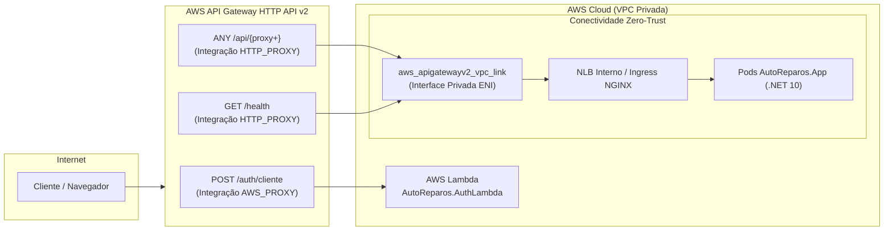

# ADR 001 - Adoção do AWS API Gateway HTTP API v2 com VPC Link Privado

> **Projeto:** AutoReparos - Sistema Integrado de Oficina Mecânica  
> **Fase:** Tech Challenge FIAP SOAT - Fase 3  
> **Status:** Aceito / Implementado  
> **Data da Decisão:** 14/09/2026  
> **Decisores:** Arquiteto de Software & Engenheiro de Infraestrutura Cloud (Grupo 78 SOAT)  
> **Repositório da Implementação:** [`AutoReparos.Infra.K8s`](../../submodules/AutoReparos.Infra.K8s) (Módulo `modules/apigateway`)

---

## 1. Contexto & Problema

Na Fase 3 do projeto **AutoReparos**, a modernização do sistema introduziu uma arquitetura híbrida na nuvem AWS composta por:
1. **Uma Função Serverless (AWS Lambda):** Executando em C# .NET 10 para autenticação e emissão de tokens JWT para clientes da oficina mecânica através do endpoint `POST /auth/cliente`.
2. **Uma Aplicação de Missão Crítica em Contêineres (AWS EKS):** Executando a API operacional da oficina sob os caminhos `/api/*` e sonda de disponibilidade `/health`.

A arquitetura exigia um **Ponto Único de Entrada de Borda** que permitisse:
- Unificar o roteamento da aplicação sob um único domínio e endpoint público.
- Encaminhar tráfego de forma serverless para a Lambda com suporte nativo a payload v2.0 sem servidores intermediários.
- Rotear tráfego de alta vazão para o cluster Kubernetes de forma blindada, sem expor o Load Balancer do EKS diretamente na internet pública (*Zero-Trust*).
- Manter o custo estritamente dentro da faixa econômica de laboratório acadêmico (**Custo Zero / Free Tier**).

---

## 2. Decisão Arquitetural

Decidimos adotar o **AWS API Gateway na modalidade HTTP API (v2)** integrado a um **VPC Link Privado** (`aws_apigatewayv2_vpc_link`) apontando para o Network Load Balancer (NLB) interno do cluster EKS.

---

## 3. Comparativo Quádruplo Formal de Alternativas

Para fundamentar a escolha, avaliamos quatro alternativas de arquitetura de borda sob critérios de custo, latência, segurança e complexidade:

| Critério de Avaliação | Alternativa 1 (Escolhida) **HTTP API v2 + VPC Link** | Alternativa 2 **REST API v1 (API Gateway)** | Alternativa 3 **Ingress NLB Público Direto** | Alternativa 4 **Application Load Balancer (ALB) Público** |
|:---|:---:|:---:|:---:|:---:|
| **Custo por Milhão de Requisições** | **$1.00** (até $0.90 em escala) | **$3.50** (~70% mais caro) | $0.006 por hora/LCU (~$18/mês fixo) | ~$16 a $22 fixos por mês + LCU |
| **Custo Fixo Mensal em Ociosidade** | **$0.00 (Zero)** | **$0.00 (Zero)** | ~$16 a $20/mês | ~$16 a $22/mês |
| **Aderência ao Free Tier / Custo Zero** | **1 milhão de reqs grátis/mês** | 1 milhão de reqs grátis/mês | Cobrança por hora de NLB ativo | Cobrança fixa mandatória |
| **Latência Média Adicional de Borda** | **Baixíssima (~5ms a 10ms)** | Média (~25ms a 40ms) | Mínima (~1ms a 3ms) | Baixa (~5ms a 8ms) |
| **Suporte Nativo a AWS Lambda** | **Sim (Payload Format v2.0)** | Sim (Payload Format v1.0) | Não (exige proxy reverso) | Sim (requer Target Group) |
| **Segurança Perimetral Zero-Trust** | **Total (NLB opera em subnet privada)** | Total (via VPC Link) | **Nula (NLB exposto na internet)** | Parcial (ALB exposto na internet) |
| **Gerenciamento de Certificados TLS** | **Gerenciado pela AWS na borda** | Gerenciado pela AWS | Exige cert-manager / Let's Encrypt | Gerenciado via AWS ACM |
| **Auditoria e Logs Estruturados** | **Access Logs JSON nativo CloudWatch** | CloudWatch Logs | Logs de acesso no contêiner Nginx | Logs no bucket S3 |

### Justificativas de Descarte:
- **Descarte da Alternativa 2 (REST API v1):** A REST API possui sobretaxa de custo de 70%, maior sobrecarga de latência devido ao stack legada de processamento e funcionalidades que não eram necessárias para o nosso domínio (como cache embutido de endpoints e validação rígida de schemas via Request Validators que já são executadas pelo FluentValidation no .NET).
- **Descarte da Alternativa 3 (NLB Público Direto):** Expor diretamente o Network Load Balancer na internet pública viola o princípio de defesa em profundidade e não oferece suporte nativo ao chaveamento de rotas serverless para a AWS Lambda sem implementar um proxy reverso customizado nos pods.
- **Descarte da Alternativa 4 (ALB Público na Borda):** Introduziria custos fixos incompatíveis com a política de custo zero do projeto acadêmico (~$20/mês mesmo com tráfego zero).

---

## 4. Consequências da Decisão

### Consequências Positivas:
1. **Segurança de Borda Robusta (Zero-Trust):** O cluster Kubernetes não possui Load Balancers públicos. As subnets privadas onde rodam a aplicação e o banco permanecem inacessíveis diretamente da internet.
2. **Otimização de Custos e Alinhamento FinOps:** O sistema se enquadra na faixa do **AWS Free Tier (1 milhão de requisições gratuitas por mês)**, atendendo integralmente à premissa de custo zero da pós-graduação.
3. **Auditoria Estruturada em JSON:** Configuração nativa de logs de acesso gravando `requestId`, `sourceIp`, `requestTime`, `httpMethod`, `routeKey`, `status` e `responseLength` diretamente no AWS CloudWatch Logs.
4. **Resolução de Roteamento Inteligente:** A integração implementada no Terraform suporta tanto o ARN do Listener do NLB quanto URLs DNS, permitindo evolução transparente da infraestrutura.

### Trade-offs e Mitigações:
- **Trade-off:** A HTTP API v2 com VPC Link exige que as subnets do link e o NLB estejam na mesma VPC e possuam Security Groups compatíveis.
  - *Mitigação:* O Terraform gerencia e amarra o `aws_security_group.vpc_link` automaticamente às subnets privadas da VPC no módulo [`modules/apigateway`](../../submodules/AutoReparos.Infra.K8s/terraform/modules/apigateway/main.tf).

---

## 5. Mapeamento de Rotas Operacionais

| Rota HTTP API v2 | Tipo de Integração | Destino Técnico |
|:---|:---:|:---|
| `POST /auth/cliente` | `AWS_PROXY` (v2.0) | AWS Lambda `AutoReparos.AuthLambda` |
| `ANY /api/{proxy+}` | `HTTP_PROXY` (VPC_LINK) | NLB Interno Ingress NGINX ➔ Pods `.NET 10 API` |
| `GET /health` | `HTTP_PROXY` (VPC_LINK) | NLB Interno Ingress NGINX ➔ Sonda `/health` (.NET HealthChecks) |

---

## 6. Conclusão

A adoção do **AWS API Gateway HTTP API v2 com VPC Link Privado** consolida a arquitetura corporativa do **AutoReparos**, garantindo separação rígida de rede, alta performance e custos zero, servindo como modelo de referência para sistemas híbridos (Serverless + Kubernetes) na nuvem AWS.
