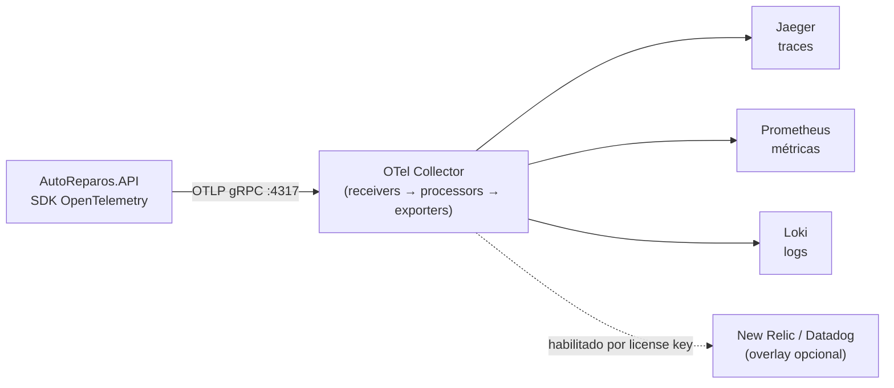

# ADR-003 — Estratégia de Observabilidade Ponta a Ponta com OpenTelemetry

> **Projeto:** AutoReparos — Sistema Integrado de Oficina Mecânica
> **Fase:** Tech Challenge FIAP SOAT — Fase 3
> **Status:** Aceito e implementado
> **Documentos relacionados:** [RFC-003](./RFC-003-serverless-client-authentication.md), [ADR-002](./ADR-002-data-isolation-and-zero-trust-claims.md), [dashboards](../observability/dashboards/), [alertas](../observability/alerts/)

---

## Contexto

O Tech Challenge da Fase 3 exige monitoramento com **dashboards de volume diário de OS,
tempo médio por status e falhas de integração**, além de **logs e traces
correlacionados**, com integração a uma ferramenta de APM de mercado (New Relic ou
Datadog).

A aplicação, porém, roda em dois ambientes muito diferentes: um **stack local em Docker
Compose** usado no desenvolvimento e na gravação da demonstração, e o **EKS na AWS**.
Instrumentar com o agente proprietário de um vendor resolveria o requisito rápido, ao
custo de amarrar o código-fonte a esse fornecedor, exigir uma license key para que a
telemetria funcionasse localmente e obrigar a reinstrumentar tudo em caso de troca.

## Decisão

**Instrumentar a aplicação exclusivamente com o SDK OpenTelemetry (.NET 10) sobre W3C
Trace Context, e concentrar toda a decisão de destino no OTel Collector.** A aplicação
conhece um único endereço — o do Collector — e nunca conhece o vendor.



### 1. Instrumentação na aplicação

`AutoReparos.API/OpenTelemetryExtensions.cs` registra os três sinais com o mesmo
`ResourceBuilder` (`service.name = autoreparos-api`), garantindo que traces, métricas e
logs cheguem correlacionados pelo mesmo recurso:

| Sinal | Fontes instrumentadas |
|---|---|
| **Traces** | ASP.NET Core (com `RecordException`), `HttpClient`, Entity Framework Core (com texto do comando), `Npgsql` |
| **Métricas** | Meter de negócio `AutoReparos.BusinessMetrics`, `Npgsql`, ASP.NET Core, `HttpClient`, runtime e processo |
| **Logs** | Provider OpenTelemetry com `IncludeScopes`, `IncludeFormattedMessage` e `ParseStateValues` |

### 2. Correlação de logs com traces

`Program.cs` ativa o rastreamento de atividade no logger e o console JSON:

```csharp
options.ActivityTrackingOptions = ActivityTrackingOptions.TraceId
    | ActivityTrackingOptions.SpanId
    | ActivityTrackingOptions.ParentId;

builder.Logging.AddJsonConsole(options => { ... UseUtcTimestamp = true; ... });
```

Com isso **toda linha de log carrega `TraceId` e `SpanId`**, e a mesma requisição pode
ser seguida do log (Loki) ao trace (Jaeger) sem instrumentação manual em nenhum handler.
Esse é o requisito de "logs estruturados com correlação" da banca, atendido no formato
JSON exigido.

### 3. Métricas de negócio emitidas pela persistência

As métricas mandatórias de OS não são incrementadas dentro dos use cases, e sim por um
**`SaveChangesInterceptor`** do EF Core
(`AutoReparos.Infra/Data/Interceptors/OrdemServicoMetricsInterceptor.cs`). A razão é que
a transição de status de uma OS já é, por definição, uma escrita no banco: emitir a
métrica no ponto da persistência garante que **nenhum caminho de código consiga alterar
o status sem contabilizar**, e mantém a camada de aplicação livre de telemetria.

Métricas definidas em `AutoReparos.Application/Shared/Metrics/AutoReparosMetrics.cs`:

| Instrumento | Tipo | Uso |
|---|---|---|
| `ordens_servico.criadas` | Counter | Volume diário (Dashboard 1) |
| `ordens_servico.transicoes_status` | Counter (tag `status`) | Volume por status (Dashboard 1) |
| `ordens_servico.tempo_diagnostico` | Histogram (s) | Tempo médio (Dashboard 2) |
| `ordens_servico.tempo_execucao` | Histogram (s) | Tempo médio (Dashboard 2) |
| `ordens_servico.tempo_permanencia` | Histogram (s) | Tempo total na oficina (Dashboard 2) |
| `notificacoes.falhas` | Counter (tags `canal`, `tipo`, `motivo`) | Falhas de integração (Dashboard 3) |

### 4. Destino decidido no Collector, não no código

O `infra/otel/otel-collector-config.yaml` define o caminho local: Jaeger para traces,
Prometheus para métricas, Loki para logs. A exportação para o vendor entra por
**overlay de configuração**, aproveitando o fato de o Collector aceitar múltiplos
`--config` e fazer merge profundo:

```bash
# .env
NEW_RELIC_LICENSE_KEY=<license-key>
OTEL_VENDOR_CONFIG_ARG=--config=/etc/otel-collector-config.vendor.yaml
```

Sem a variável, o `docker-compose.yml` passa o config base duas vezes — um merge
no-op — e o stack sobe normalmente **sem license key nenhuma**. Com ela,
`otel-collector-config.vendor.yaml` acrescenta o exportador `otlp/newrelic` aos três
pipelines, com `retry_on_failure` e `sending_queue` habilitados, **preservando** os
destinos locais. Trocar para Datadog é substituir um bloco de exportador; a aplicação
não muda uma linha.

O mesmo desenho existe no EKS, pelo chart `k8s/charts/observability` do repositório
`AutoReparos.Infra.K8s`, que provisiona Collector, Prometheus, Grafana, Jaeger e Loki.

Como caminho alternativo, `OpenTelemetryExtensions` também aceita uma license key
diretamente na aplicação (`NEW_RELIC_LICENSE_KEY`), passando a enviar OTLP direto ao
endpoint do vendor sem Collector intermediário. É útil para cenários sem Collector, mas
**o caminho recomendado é o overlay**, que mantém o código ignorante quanto ao destino.

---

## Convenções operacionais que valem para qualquer consulta

Duas características desta configuração afetam toda expressão PromQL escrita para estes
dashboards. Ambas foram descobertas em verificação contra o stack real e valem registro
explícito — quem escrever um painel novo sem conhecê-las obterá gráficos vazios.

### Prefixo `autoreparos_`

O exportador Prometheus do Collector está configurado com `namespace: "autoreparos"`.
Toda métrica ganha esse prefixo ao ser exposta: `ordens_servico.criadas` é consultada
como **`autoreparos_ordens_servico_criadas`**. Os nomes de labels HTTP seguem a
convenção estável do OpenTelemetry: `http_response_status_code`, `http_route` e
`http_request_method`.

### Janela mínima de 5 minutos em `rate()` e `increase()`

O SDK OpenTelemetry exporta métricas **a cada 60 segundos**, e o exportador Prometheus
do Collector repassa os timestamps originais (`send_timestamps: true`). Uma janela de
`[1m]` contém, portanto, **uma única amostra** — e `rate()` sobre uma amostra retorna
vazio. **Toda expressão de `rate` ou `increase` sobre estas métricas deve usar `[5m]` ou
mais.**

> Consequência direta para os alertas: a regra de falha de notificação foi escrita com
> `[5m]`, e não com o `[1m]` sugerido originalmente na especificação da Tarefa 3, que
> jamais dispararia.

---

## Alternativas consideradas

| Alternativa | Por que foi descartada |
|---|---|
| **Agente proprietário do New Relic / Datadog** | Entrega APM rico com pouco esforço, mas acopla o código ao vendor, exige license key para haver telemetria local e transforma uma troca de fornecedor em reinstrumentação. |
| **Prometheus puro com `prometheus-net`** | Cobre métricas com competência, mas não resolve traces distribuídos nem correlação com logs — justamente o que a banca pede. |
| **Exportar direto da aplicação para o vendor, sem Collector** | Possível (e o código suporta), mas coloca a decisão de destino no binário da aplicação, elimina o ponto único de batching, retry e enriquecimento, e multiplica conexões de saída por pod. Mantido apenas como caminho alternativo. |
| **Serilog + sinks dedicados** | Bom para logs, mas cria um segundo pipeline paralelo ao OTel e exige correlação manual de `TraceId`. O `AddJsonConsole` com `ActivityTrackingOptions` resolve o requisito sem dependência extra. |

---

## Consequências

### Positivas

- A aplicação não tem nenhuma dependência de vendor: trocar New Relic por Datadog é uma
  alteração de configuração do Collector.
- O stack local é funcionalmente equivalente ao de nuvem — a demonstração e os
  dashboards funcionam sem nenhuma conta em serviço pago.
- Traces, métricas e logs compartilham o mesmo `service.name` e a mesma correlação por
  `TraceId`, permitindo navegar de um sintoma no dashboard até o log da requisição
  específica.
- As métricas de negócio são invioláveis por construção: passam pelo interceptor de
  persistência, não por chamadas espalhadas pelo código.

### Negativas e riscos aceitos

- **O Collector vira um ponto único de falha** da telemetria. Mitigado em produção pelo
  HPA do Collector no chart de observabilidade, mas continua sendo um componente a
  operar.
- **Resolução temporal de 60 segundos.** A configuração é adequada para métricas de
  negócio de uma oficina, mas inadequada para detecção de incidentes em janelas curtas.
  É a origem da restrição de `[5m]` documentada acima.
- **`SetDbStatementForText = true`** nos traces de EF Core registra o texto dos comandos
  SQL. Excelente para diagnóstico, mas os spans passam a conter estrutura de consulta —
  aceitável nesta fase (parâmetros não são capturados), exigiria revisão com dados
  sensíveis sob regime regulatório.
- **A Lambda de autenticação está fora do trace distribuído.** Ela registra apenas via
  `ILambdaContext`, de modo que o trace começa efetivamente no backend; o salto
  Portal → API Gateway → Lambda não aparece no Jaeger. É a principal lacuna conhecida
  desta estratégia.

---

## Validação dos painéis de erro (executada)

Os dois painéis de 5xx do `dashboard_erros_integracoes.json` foram exercitados contra o
stack local com **erro de servidor real**, derrubando o container do PostgreSQL com a API
no ar. O teste serve para verificar três suposições que, se erradas, deixariam os painéis
permanentemente vazios sem nenhum sinal de falha:

| Suposição | Resultado observado |
|---|---|
| A API devolve `5xx` com o banco fora | **`500` em 18/18 requisições** (12 em `/api/clientes/`, 6 em `/api/ordem-servico/kanban`) |
| A métrica chega ao Prometheus com o nome esperado | `autoreparos_http_server_request_duration_seconds_count` presente, contagens 12 e 6 batendo exatamente com o tráfego enviado |
| O label existe com esse nome e formato | `http_response_status_code="500"` (string), ao lado de `http_route` e `http_request_method` |

Ambas as expressões dos painéis retornaram dados: o **Painel 3** discriminado por
`http_route`, e o **Painel 4** com 100% durante o incidente, caindo para 24,57% depois de
tráfego bem-sucedido novo.

> **Cuidado ao apresentar o Painel 4.** Ele mede a razão dentro da janela de 5 minutos.
> Com tráfego esparso, as requisições bem-sucedidas saem da janela antes dos erros e o
> painel exibe **100% de erro** — aritmeticamente correto, mas facilmente lido como uma
> falha total que não existe. Em demonstrações, gere tráfego contínuo antes de exibi-lo.

---

## Provisionamento dos dashboards

Os três dashboards mandatórios vivem em `docs/observability/dashboards/` e essa é a
**fonte única** — nenhuma cópia é mantida em paralelo. Os dois ambientes a consomem:

- **Stack local:** o `docker-compose.yml` monta o diretório em
  `/etc/grafana/provisioning/dashboards/json/mandatorios`, onde o provider de arquivos
  do Grafana os encontra.
- **EKS:** os JSON são embutidos no ConfigMap
  `autoreparos-grafana-dashboards-configmap.yaml` do chart de observabilidade.

Dois detalhes que quebram silenciosamente quem mexer nisso:

1. **Escape das chaves duplas do Helm.** As legendas usam o formato `{{status}}`, e o
   Helm interpreta `{{` como início de ação. No ConfigMap elas precisam virar
   `{{ "{{" }}status}}` — a chave de fechamento fica intacta. Um JSON copiado cru
   quebra a renderização do chart inteiro.
2. **`uid` explícito nas datasources.** Os dashboards referenciam
   `"datasource": { "uid": "Prometheus" }`. Se o provisionamento não declarar `uid`, o
   Grafana gera um automaticamente (`PBFA97CFB590B2093` e similares) e **nenhuma dessas
   referências resolve** — os painéis sobem vazios, sem erro visível. Por isso o `uid` é
   fixado igual ao nome nos dois ambientes.

Verificado no Grafana 10.4.1 do stack local: quatro dashboards provisionados, datasources
expondo `uid` `Prometheus`/`Jaeger`/`Loki`, e consulta bem-sucedida via
`/api/datasources/proxy/uid/Prometheus`.

---

## Pendências de validação

Uma única pendência em aberto:

1. **Envio real ao New Relic nunca exercitado.** O caminho está implementado e o stack
   sobe com o overlay, mas ninguém rodou com uma license key válida. O requisito de
   integração com APM de mercado só fecha quando alguém confirmar a chegada dos dados.
