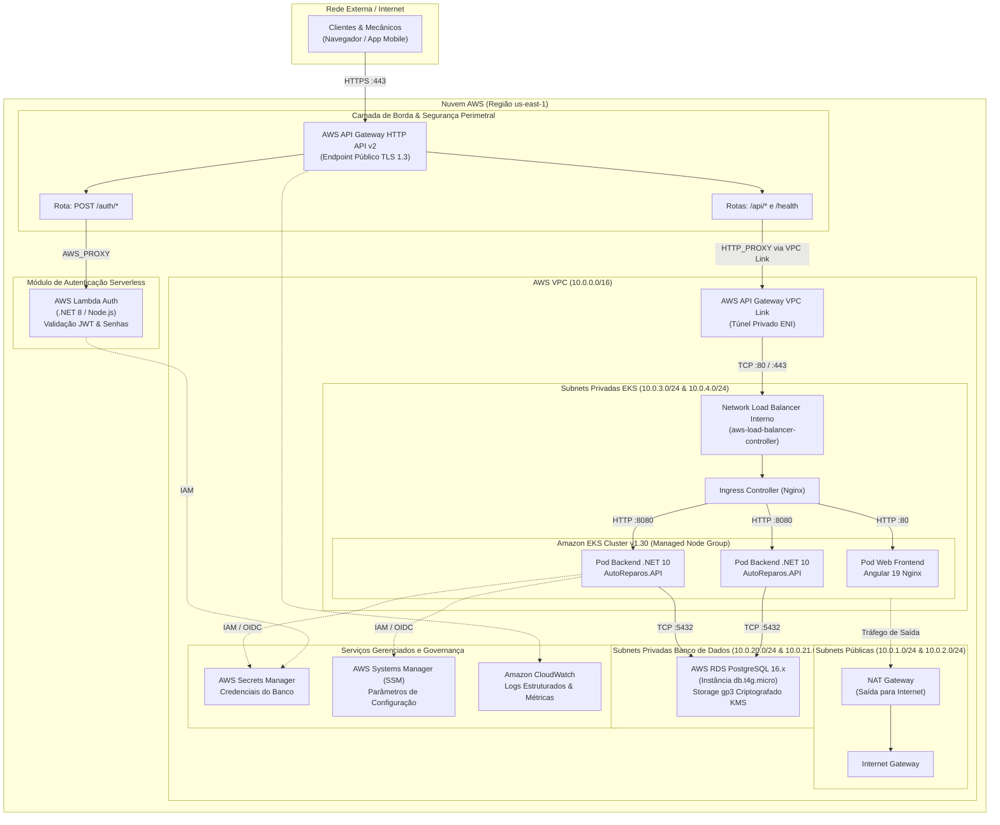

# AutoReparos - Arquitetura de Nuvem e Decisões Técnicas (Fase 3)

> **Projeto:** AutoReparos - Sistema Integrado de Oficina Mecânica  
> **Programa:** FIAP Tech Challenge - SOAT (Fase 3)  
> **Escopo:** Infraestrutura Cloud AWS, Segregação em Repositórios Autônomos, Banco Gerenciado e Gateway de Borda  
> **Status Geral:** Aprovado & Implementado  

---

## 1. Visão Geral da Arquitetura

Na **Fase 3** do projeto AutoReparos, a infraestrutura evoluiu de um modelo monolítico com persistência *in-cluster* no Kubernetes para uma **arquitetura de nuvem desacoplada, resiliente, segura e orientada a microsserviços/serviços gerenciados** na AWS.

O repositório principal atua como um **Hub Unificado de Orquestração e Governança**, conectando os repositórios satélites através de Git Submodules e centralizando a documentação formal de engenharia.

```
┌──────────────────────────────────────────────────────────────────────────────────┐
│                         AutoReparos (Repositório Hub)                            │
│                 Governança Central, Documentação RFC/ADR & Local Dev             │
└──────────────┬───────────────────┬───────────────────┬───────────────────┬───────┘
               │                   │                   │                   │
               ▼                   ▼                   ▼                   ▼
    ┌──────────────────────┐ ┌───────────┐   ┌───────────────────┐ ┌───────────────┐
    │  AutoReparos.App     │ │ AuthLambda│   │ Infra.Database    │ │ Infra.K8s     │
    │  Backend .NET 10     │ │ Serverless│   │ RDS PostgreSQL 16 │ │ EKS + Ingress │
    │  & Frontend Angular  │ │ JWT Auth  │   │ SSM + Subnets     │ │ + API Gateway │
    └──────────────────────┘ └───────────┘   └───────────────────┘ └───────────────┘
```

---

## 2. Diagrama Macro de Componentes Cloud (End-to-End)

O fluxo completo de requisições externas para os serviços da plataforma segue o modelo *Zero-Trust*, onde os serviços computacionais e de banco de dados residem exclusivamente em subnets privadas sem qualquer IP público atribuído:



---

## 3. Matriz de Portas, Protocolos e Roteamento de Segurança

A tabela abaixo define os limites de tráfego, protocolos e os Security Groups (SG) aplicados entre cada camada da topologia:

| Origem | Destino | Porta / Protocolo | Finalidade | Regra de Segurança / SG |
|:---|:---|:---:|:---|:---|
| **Internet Pública** | API Gateway v2 | `TCP 443 (HTTPS)` | Ponto único de entrada para requisições web e móveis. | Gerenciado nativamente pela AWS (WAF / TLS termination). |
| **API Gateway v2** | Lambda de Autenticação | `Internal Invoke` | Execução de fluxos serverless de login e emissão de tokens. | Permissão IAM via `AWS_PROXY` (`lambda:InvokeFunction`). |
| **API Gateway v2** | VPC Link | `Encapsulamento VPC` | Entrada segura na VPC através de Elastic Network Interfaces. | `sg-apigw-vpclink` (restrito às subnets privadas EKS). |
| **VPC Link** | NLB Interno | `TCP 80 / 443 (HTTP/S)` | Encaminhamento do tráfego corporativo para o balanceador do cluster. | `sg-nlb-internal` permite apenas conexões vindas do `sg-apigw-vpclink`. |
| **NLB Interno** | Ingress Nginx | `TCP 80 / 443` | Distribuição L7 interna para os serviços Kubernetes. | `sg-eks-nodes` permite tráfego roteado pelas ENIs do NLB. |
| **Ingress Nginx** | Pods .NET 10 | `TCP 8080 (HTTP)` | Chamadas para a API operacional do AutoReparos. | Rede interna do Kubernetes (CNI AWS-VPC). |
| **Ingress Nginx** | Pods Angular 19 | `TCP 80 (HTTP)` | Entrega dos assets estáticos do Frontend SPA. | Rede interna do Kubernetes (CNI AWS-VPC). |
| **Pods .NET 10** | RDS PostgreSQL 16 | `TCP 5432 (PostgreSQL)` | Persistência transacional do sistema de oficina. | `sg-rds-postgres` permite entrada **apenas** do `sg-eks-nodes`. |
| **Pods .NET 10** | AWS Secrets Manager / SSM | `TCP 443 (HTTPS)` | Resolução de segredos de conexão e variáveis dinâmicas. | VPC Endpoints privados ou NAT Gateway com IAM Roles for Service Accounts (IRSA). |
| **EKS Nodes (Privados)** | Internet Externa | `TCP 80 / 443 (HTTP/S)` | Download de imagens, pacotes e telemetria externa. | Roteamento padrão via NAT Gateway nas subnets públicas. |

---

## 4. Estrutura dos 4 Repositórios Satélites e Repositório Pai

A segregação do sistema em quatro repositórios autônomos garante desacoplamento de ciclo de vida, esteiras de integração contínua independentes e contenção de risco operacional:

```
Grupo78-PosTech-15SOAT/
├── AutoReparos                    (Repositório Pai / Hub de Orquestração & Documentação)
├── AutoReparos.App                (Backend .NET 10, Frontend Angular 19 & Testes de Integração)
├── AutoReparos.AuthLambda         (Função Serverless de Autenticação & Emissão de JWT)
├── AutoReparos.Infra.Database     (Terraform para RDS PostgreSQL 16, Subnets DB, Secrets & SSM)
└── AutoReparos.Infra.K8s          (Terraform para EKS v1.30, VPC Link, API Gateway & Helm Charts)
```

### Quadro Executivo de Responsabilidades

| Repositório | Escopo Técnico | Ferramentas & Tecnologias | Estratégia de Deploy / CI/CD |
|:---|:---|:---|:---|
| [`AutoReparos`](../../) | Hub de Governança, Documentação Centralizada (RFCs/ADRs) e ambiente de execução local. | Git Submodules, Docker Compose, Shell Scripts de Governança. | Validação de submódulos, testes de regressão de integração e documentação. |
| [`AutoReparos.App`](https://github.com/Grupo78-PosTech-15SOAT/AutoReparos.App) | Regras de negócio, APIs RESTful, interface web rica com Signals e persistência EF Core. | C# .NET 10, Angular 19, Entity Framework Core, xUnit, Moq, Testcontainers. | GitHub Actions: Build, testes unitários, análise SonarQube e geração de imagem OCI (ECR). |
| [`AutoReparos.AuthLambda`](https://github.com/Grupo78-PosTech-15SOAT/AutoReparos.AuthLambda) | Microsserviço Serverless de autenticação, hashing de senhas e geração de claims JWT. | .NET 8 / Node.js, AWS Lambda, AWS Secrets Manager. | GitHub Actions: Testes unitários e deploy automatizado via AWS SAM / Terraform. |
| [`AutoReparos.Infra.Database`](https://github.com/Grupo78-PosTech-15SOAT/AutoReparos.Infra.Database) | Provisionamento da camada de dados corporativa gerenciada e orquestração de parâmetros. | Terraform, AWS RDS PostgreSQL 16, AWS SSM Parameter Store. | GitHub Actions: `terraform fmt`, `terraform validate` e `terraform apply` em `main`. |
| [`AutoReparos.Infra.K8s`](https://github.com/Grupo78-PosTech-15SOAT/AutoReparos.Infra.K8s) | Infraestrutura computacional elástica, ingress, borda de rede e charts de deploy. | Terraform, AWS EKS v1.30, AWS API Gateway v2, Helm 3. | GitHub Actions: Validação de código HCL, lint de Helm charts e provisionamento de cluster. |

---

## 5. Índice de Decisões e Especificações Formais

A plataforma mantém seu acervo de decisões arquiteturais estruturado sob os padrões RFC (*Request for Comments*) e ADR (*Architecture Decision Record*):

* **[RFC-001: Arquitetura Cloud AWS e Segregação em 4 Repositórios Autônomos](./RFC-001-cloud-architecture-and-repo-segregation.md)**  
  *Justificativa do modelo multi-repo, abordagem híbrida orquestradora, topologia detalhada da VPC (Multi-AZ, subnets e blocos CIDR), diagramas de sequência de tráfego e matriz RACI de responsabilidades.*

* **[RFC-002: Estratégia de Banco de Dados Gerenciado (AWS RDS vs StatefulSet)](./RFC-002-managed-database-strategy-rds.md)**  
  *Análise multidimensional comparativa fundamentando a transição do StatefulSet in-cluster da Fase 2 para o AWS RDS PostgreSQL 16 na Fase 3. Avaliação de SLA (99.95%), RPO/RTO contínuo via PITR, criptografia KMS e adequação estrita ao Free Tier da AWS (`db.t4g.micro`, 20 GiB).*

* **[RFC-003: Autenticação Serverless de Clientes via CPF e E-mail](./RFC-003-serverless-client-authentication.md)**  
  *Desenho da autenticação do portal do cliente via AWS Lambda sem poluição da base Identity, emissão de JWT efêmero com role restrita e comparativo de alternativas.*

* **[ADR-001: Adoção do AWS API Gateway HTTP API v2 com VPC Link](./ADR-001-adoption-aws-api-gateway.md)**  
  *Registro formal da decisão arquitetural de borda através de um comparativo quádruplo formal: (1) HTTP API v2 + VPC Link, (2) REST API v1, (3) Ingress Nginx exposto publicamente e (4) Application Load Balancer (ALB). Fundamentação de latência p99, custo reduzido ($1.00/milhão), integração serverless e conformidade Zero-Trust.*

* **[ADR-002: Isolamento de Dados e Política Zero-Trust no Portal do Cliente](./ADR-002-data-isolation-and-zero-trust-claims.md)**  
  *Garantia estrita contra vulnerabilidade BOLA (OWASP API Security), extração do titular via claims e bloqueio de vazamento de dados.*

* **[ADR-003: Estratégia de Observabilidade Ponta a Ponta com OpenTelemetry](./ADR-003-end-to-end-observability-strategy.md)**  
  *Instrumentação vendor-agnostic baseada em W3C TraceContext e OpenTelemetry SDK (.NET 10), exportação OTLP e integração com New Relic/Datadog.*

* **[Seleção de Banco de Dados e Modelo de Dados](./database-selection-and-data-model.md)**  
  *Justificativa do PostgreSQL 16 (ACID, integridade referencial com Restrict/Cascade), modelo ER completo em Mermaid e dicionário das 8 tabelas.*

* **[Diagrama de Sequência End-to-End](./diagrams/sequence_portal_auth_and_query.md)**  
  *Fluxo completo de autenticação e consulta de veículos e histórico de ordens de serviço.*

---

## 6. Governança e Diretrizes de Versionamento

Conforme alinhado na sessão de refinamento arquitetural, todas as alterações de código e infraestrutura nos repositórios satélites e no repositório pai seguem padrões rígidos de qualidade:

1. **Proteção da Branch `main`:** Nenhum push direto é permitido na branch `main`. Toda alteração deve tramitar obrigatoriamente via Pull Request com validação de status check de CI verde.
2. **Estratégia de Branching dos Submódulos:** Mudanças que afetem submódulos devem ser desenvolvidas em branches com o mesmo nome da branch do repositório pai (`feat/fase3-track-a-cloud-iac`), garantindo paridade de versionamento.
3. **Padrão de Mensagens de Commit:** Uso obrigatório do padrão Gitmoji com descrição concisa em português (ex.: `✨ Adicionando parâmetros SSM no RDS`, `📝 Atualizando documentação de arquitetura`).
4. **Caminhos Estritamente Relativos:** Todos os links de documentação utilizam referências relativas (`./` ou `../`), assegurando portabilidade e integridade cross-plataforma.
