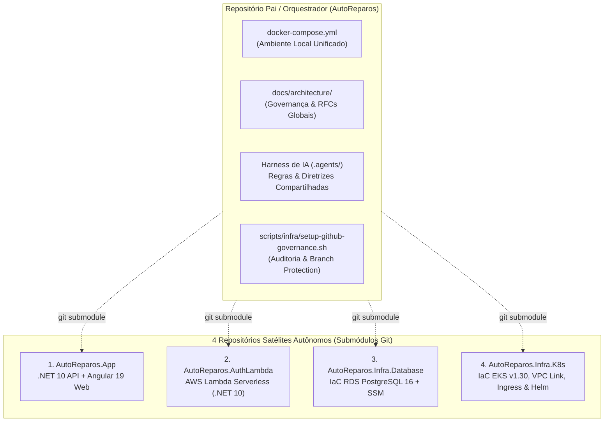
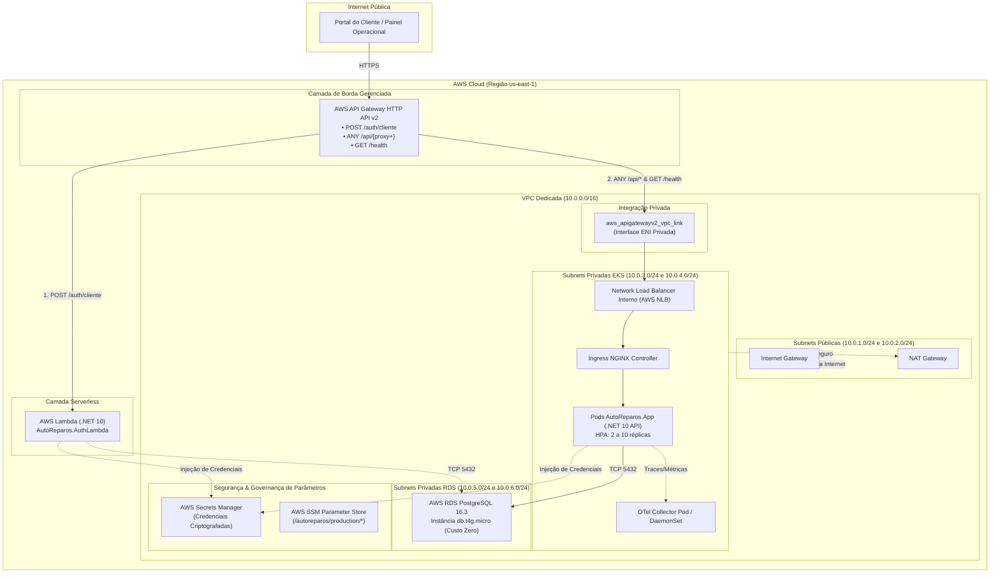
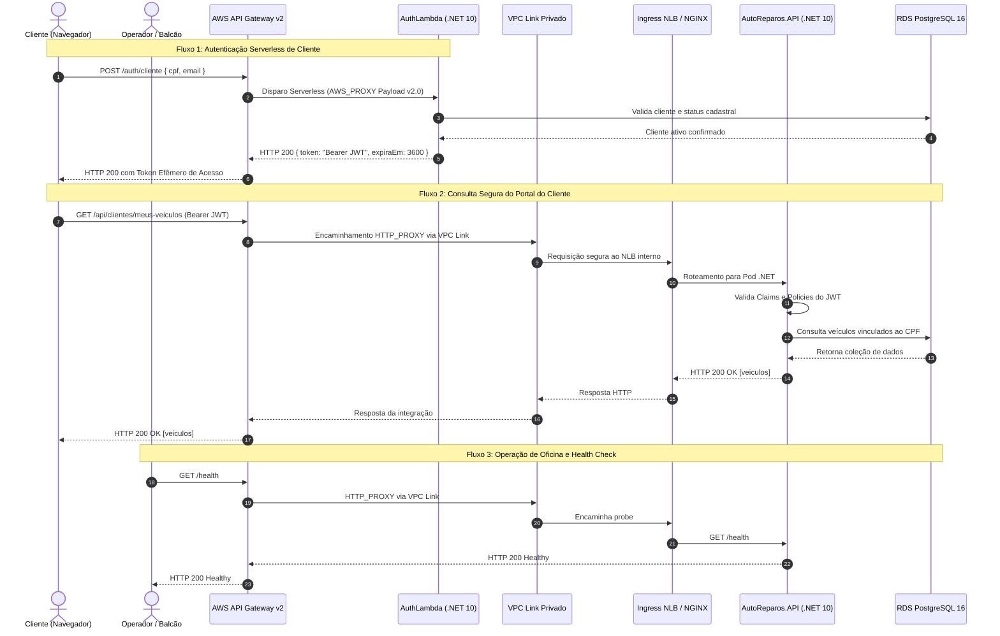

# RFC 001 - Arquitetura Cloud AWS e Segregação em 4 Repositórios Git Autônomos

> **Projeto:** AutoReparos - Sistema Integrado de Oficina Mecânica  
> **Fase:** Tech Challenge FIAP SOAT - Fase 3  
> **Status:** Aprovado / Implementado  
> **Data:** 14/09/2026  
> **Autores:** Grupo 78 - Pós-Tech Software Architecture (15SOAT / 13SOAT)  
> **Repositórios Envolvidos:**
> - Repositório Orquestrador: [`AutoReparos`](../../)
> - Repositório Aplicação: [`AutoReparos.App`](../../submodules/AutoReparos.App)
> - Repositório Serverless: [`AutoReparos.AuthLambda`](../../submodules/AutoReparos.AuthLambda)
> - Repositório Banco de Dados: [`AutoReparos.Infra.Database`](../../submodules/AutoReparos.Infra.Database)
> - Repositório Kubernetes & Borda: [`AutoReparos.Infra.K8s`](../../submodules/AutoReparos.Infra.K8s)

---

## 1. Sumário Executivo

Esta RFC (*Request for Comments*) documenta formalmente a decisão arquitetural e o desenho de engenharia adotados para a **segregação do sistema AutoReparos em quatro repositórios Git independentes**, orquestrados por um repositório pai central via submódulos Git, em conjunto com a **topologia de nuvem AWS VPC Multi-AZ**.

Essa transformação arquitetural atende com rigor aos requisitos mandatórios da **Fase 3 do Tech Challenge FIAP SOAT**, desacoplando os ciclos de vida de software, isolando o *blast radius* de falhas operacionais e estabelecendo esteiras autônomas de Integração e Entrega Contínua (CI/CD).

---

## 2. Contexto & Motivação (Evolução da Fase 2 para Fase 3)

Na Fase 2 do projeto, o AutoReparos operava sob um modelo de repositório monolítico (monorepo), onde o código-fonte da API, a camada de dados, os manifests Kubernetes e os scripts de infraestrutura residiam na mesma árvore de diretórios.

Embora esse modelo tenha facilitado a prototipagem inicial no MVP da Fase 1 e 2, ele gerou gargalos operacionais significativos à medida que o sistema amadureceu:
1. **Acoplamento de Ciclo de Vida:** Qualquer ajuste no código da API forçava o reprocessamento de validações de IaC e vice-versa.
2. **Blast Radius Ampliado:** Falhas ou regressões em scripts de infraestrutura bloqueavam a entrega de correções urgentes no domínio de negócio da oficina mecânica.
3. **Conflitos de Concorrência de PRs:** Múltiplas frentes de trabalho (devs backend, engenheiros de dados e DevOps) disputavam branches e arquivos de configuração centralizados.
4. **Fragilidade de Governança e Permissões:** Impossibilidade de aplicar políticas de controle de acesso granulares por perfil técnico na organização do GitHub.

---

## 3. Arquitetura Multi-Repo: Abordagem Híbrida Orquestradora

Para conciliar a necessidade de autonomia de deploy com a governança centralizada exigida por uma plataforma corporativa, adotamos a **Abordagem Híbrida Orquestradora**:

### 3.1. Responsabilidades dos 4 Repositórios Oficiais

| Repositório | Escopo Técnico | Ciclo de Deploy | Esteira CI/CD |
|:---|:---|:---|:---|
| **`AutoReparos.App`** | Aplicação principal (Clean Architecture + DDD em .NET 10) e Frontend Web (Angular 19 com Signals e Standalone Components). | Deploy de aplicação via Helm no cluster AWS EKS. | Compilação .NET/Yarn, testes unitários e de integração com Testcontainers, geração de imagem Docker e push no AWS ECR. |
| **`AutoReparos.AuthLambda`** | Função serverless em .NET 10 responsável pelo fluxo de autenticação pública e segura de clientes via CPF e e-mail. | Deploy serverless na AWS Lambda acionada pelo API Gateway. | Restauração, build e testes unitários .NET 10, empacotamento e deploy condicional. |
| **`AutoReparos.Infra.Database`** | Infraestrutura como Código (Terraform) dedicada ao banco relacional gerenciado AWS RDS PostgreSQL 16, Subnet Groups privados, Secrets Manager e SSM. | Deploy de banco gerenciado com janelas de manutenção controladas. | `terraform fmt`, `validate`, `plan` e `apply` condicional à branch `main` e credenciais AWS. |
| **`AutoReparos.Infra.K8s`** | Infraestrutura como Código (Terraform) para a VPC Multi-AZ, cluster AWS EKS v1.30, Ingress Controller NGINX (NLB interno), AWS API Gateway HTTP v2 com VPC Link e Helm Charts da plataforma. | Deploy de infraestrutura de borda, orquestração e rede. | `terraform fmt`, `validate`, `helm lint` e `plan`/`apply` condicional à branch `main` e credenciais AWS. |

### 3.2. Papel do Repositório Pai (`AutoReparos`)
O repositório pai não contém código de implementação direta de regras de negócio, atuando como:
- **Hub Unificado de Documentação e Especificações:** Centraliza a visão arquitetural (`docs/architecture/`), especificações de fase e relatórios acadêmicos.
- **Ambiente de Desenvolvimento Local Rápido:** Fornece um `docker-compose.yml` raiz que agrega PostgreSQL 16, API .NET 10, Web Angular 19 e stack de observabilidade (OTel Collector, Prometheus, Jaeger, Loki e Grafana) para onboarding sem atritos.
- **Harness e Governança de IA:** Mantém as regras corporativas (`.agents/rules/`), diretrizes de branching e scripts de conformidade de infraestrutura.

---

## 4. Topologia de Nuvem AWS VPC Multi-AZ

A infraestrutura em nuvem foi desenhada para a região `us-east-1`, contemplando alta disponibilidade em duas Zonas de Disponibilidade (`us-east-1a` e `us-east-1b`) e segregação rigorosa de camadas de rede.

### 4.1. Tabela de Subnets e Endereçamento CIDR

| Subnet | Zona (AZ) | Tipo | Bloco CIDR | Propósito / Cargas de Trabalho | Tags de Descoberta K8s |
|:---|:---:|:---:|:---:|:---|:---|
| `public-1a` | `us-east-1a` | Pública | `10.0.1.0/24` | Internet Gateway, NAT Gateway 1a | `kubernetes.io/role/elb = 1` |
| `public-1b` | `us-east-1b` | Pública | `10.0.2.0/24` | Internet Gateway, NAT Gateway 1b | `kubernetes.io/role/elb = 1` |
| `private-k8s-1a` | `us-east-1a` | Privada | `10.0.3.0/24` | Worker Nodes do EKS, Pods .NET API, Ingress NLB Interno, VPC Link | `kubernetes.io/role/internal-elb = 1` |
| `private-k8s-1b` | `us-east-1b` | Privada | `10.0.4.0/24` | Worker Nodes do EKS, Pods .NET API, Ingress NLB Interno, VPC Link | `kubernetes.io/role/internal-elb = 1` |
| `private-db-1a` | `us-east-1a` | Privada | `10.0.5.0/24` | Instância Primária AWS RDS PostgreSQL 16 | `Name = autoreparos-db-1a` |
| `private-db-1b` | `us-east-1b` | Privada | `10.0.6.0/24` | Standby / Failover RDS PostgreSQL Multi-AZ | `Name = autoreparos-db-1b` |

### 4.2. Diagrama de Topologia de Rede e Borda Zero-Trust

---

## 5. Diagrama de Sequência: Fluxo de Requisição da Borda ao Backend

---

## 6. Matriz de Responsabilidade Arquitetural (RACI)

| Atribuição / Responsabilidade | Repositório Pai (`AutoReparos`) | `AutoReparos.App` | `AutoReparos.AuthLambda` | `AutoReparos.Infra.Database` | `AutoReparos.Infra.K8s` |
|:---|:---:|:---:|:---:|:---:|:---:|
| **Domínio Central & Casos de Uso (DDD)** | I | **A / R** | C | I | I |
| **Frontend Web (Angular 19 Signals)** | I | **A / R** | I | I | I |
| **Autenticação Serverless de Clientes** | I | C | **A / R** | I | C |
| **Provisionamento do RDS PostgreSQL 16** | I | I | I | **A / R** | C |
| **Provisionamento de VPC, EKS e Ingress** | I | I | I | C | **A / R** |
| **Roteamento no AWS API Gateway** | I | C | C | I | **A / R** |
| **Governança de Branch & Setup de CI/CD** | **A / R** | C | C | C | C |
| **Orquestração de Ambiente Local (Compose)** | **A / R** | C | C | C | C |

*Legenda: **R** = Responsible (Executor); **A** = Accountable (Aprovador/Dono); **C** = Consulted (Consultado); **I** = Informed (Informado).*

---

## 7. Políticas de Governança de Branches e Versionamento

Conforme alinhado e parametrizado pelo script de automação [`scripts/infra/setup-github-governance.sh`](../../scripts/infra/setup-github-governance.sh):

1. **Branch Protection na `main` dos 4 Repositórios:**
   - Bloqueio estrito de *direct push* (`allow_force_pushes = false` e `allow_deletions = false`).
   - Obrigatoriedade de abertura de Pull Request com pelo menos 1 aprovação formal de code review (`required_approving_review_count = 1`).
   - Validação de esteira de integração contínua verde antes do merge (`required_status_checks.strict = true`).
   - Regras inegociáveis para todos os colaboradores (`enforce_admins = true`).

2. **Disciplina de Branches nos Submódulos:**
   - Qualquer modificação nos submódulos deve obrigatoriamente ser realizada em uma branch com o **mesmo nome da branch do repositório pai** (ex: `feat/fase3-track-a-cloud-iac`).
   - Padrão de PR nos submódulos: `develop` abre PR para `main`; branches de feature criam PR para `develop`.
   - Commits nos submódulos seguem rigorosamente o padrão Gitmoji + Descrição em Português.

---

## 8. Conclusão

A segregação em quatro repositórios autônomos somada à topologia de nuvem AWS com VPC Link Privado confere ao **AutoReparos** a maturidade arquitetural esperada para ambientes corporativos:
- **Segurança Zero-Trust:** O cluster Kubernetes e o banco de dados permanecem completamente blindados em subnets privadas.
- **Eficiência de Custos:** Adoção do perfil Free Tier (`db.t4g.micro`, 20 GiB gp3) garantindo **custo zero** durante o ciclo acadêmico da pós-graduação.
- **Isolamento de Falhas:** Manutenções e deploys de infraestrutura, serverless e backend ocorrem de maneira totalmente desacoplada e independente.
