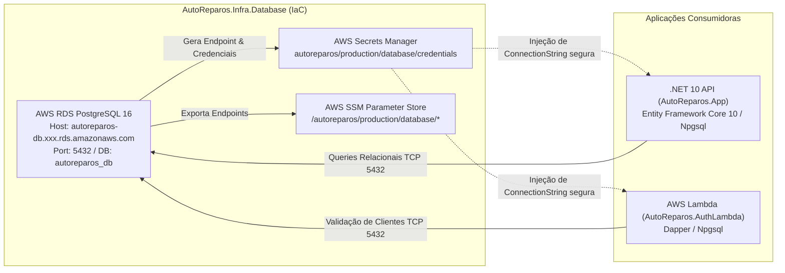

# RFC 002 - Estratégia de Banco de Dados Gerenciado: Adoção do AWS RDS PostgreSQL 16 vs StatefulSet in-cluster

> **Projeto:** AutoReparos - Sistema Integrado de Oficina Mecânica  
> **Fase:** Tech Challenge FIAP SOAT - Fase 3  
> **Status:** Aprovado / Implementado  
> **Data:** 14/09/2026  
> **Autores:** Grupo 78 - Pós-Tech Software Architecture (15SOAT / 13SOAT)  
> **Repositórios Envolvidos:**
> - Repositório Banco de Dados: [`AutoReparos.Infra.Database`](../../submodules/AutoReparos.Infra.Database)
> - Repositório Aplicação: [`AutoReparos.App`](../../submodules/AutoReparos.App)
> - Repositório Serverless: [`AutoReparos.AuthLambda`](../../submodules/AutoReparos.AuthLambda)

---

## 1. Sumário Executivo

Esta RFC documenta o racional técnico, operacional e financeiro que fundamentou a **substituição do banco de dados relacional PostgreSQL executado como `StatefulSet` in-cluster no Kubernetes (Fase 2) pelo serviço de banco gerenciado AWS RDS PostgreSQL versão 16 (Fase 3)**.

A migração atende diretamente ao **Requisito 4 do Tech Challenge FIAP SOAT**, proporcionando à oficina mecânica integridade transacional estrita (ACID), disponibilidade contratual (SLA 99.95%), recuperação contra desastres com *Point-in-Time Recovery* (PITR) e redução drástica da sobrecarga operacional (*toil*), mantendo conformidade total com o orçamento **Free Tier (Custo ZERO)**.

---

## 2. Contexto Histórico: O PostgreSQL na Fase 2

Na Fase 2 do projeto, o PostgreSQL 16 era implantado dentro do cluster Kubernetes por meio de um `StatefulSet` Helm (`charts/database`), utilizando `PersistentVolumeClaims` (PVC) provisionados dinamicamente via driver AWS EBS CSI (`gp3`).

Embora funcional para validação do pipeline inicial, a operação de um banco relacional stateful dentro de nós efêmeros do Kubernetes apresentou fragilidades críticas:
1. **Fragilidade de Ciclo de Vida do Nó:** Qualquer rotação de nós worker no EKS (seja por drenagem manual, atualização de versão do Kubernetes ou falha de hardware da instância EC2) provocava interrupção imediata das conexões da oficina mecânica até que o pod fosse rescheduling e o volume EBS reanexado (processo que levava de 3 a 5 minutos).
2. **Ausência de Backups Incrementais Contínuos:** O modelo exigia *CronJobs* customizados dentro do cluster executando `pg_dump`. Esses dumps consumiam CPU da aplicação durante o expediente e geravam risco de perda de dados (*RPO* de até 24 horas).
3. **Complexidade de Alta Disponibilidade:** Configurar replicação primário/réplica (ex: Patroni ou Stolon) dentro de pods no Kubernetes adiciona camadas complexas de orquestração, eleição de líderes e risco de *split-brain*.
4. **Sobrecarga Operacional (Toil):** A equipe de engenharia precisava gerenciar patches de segurança do sistema operacional da imagem Docker, cuidar do resizing de PVCs e monitorar corrupção de tabelas manualmente.

---

## 3. Análise Comparativa Multidimensional: RDS vs StatefulSet

A tabela matricial abaixo contrasta rigorosamente as duas abordagens sob as perspectivas de arquitetura, resiliência, segurança e governança:

| Dimensão Técnica | StatefulSet in-cluster (Fase 2) | AWS RDS PostgreSQL 16 (Fase 3) | Ganho Arquitetural / Impacto no Negócio |
|:---|:---|:---|:---|
| **Disponibilidade & SLA** | ~99.0% (dependente da integridade dos nós EC2 do EKS e reanexação de EBS). | **99.95%** (SLA formal AWS em arquitetura Multi-AZ gerenciada). | Alta disponibilidade real para recepção de clientes e faturamento da oficina. |
| **Recuperação de Desastres (RPO)** | **RPO de 24 horas** (baseado na frequência do último `pg_dump` diário). | **RPO < 5 minutos** (gravação contínua de transações nos logs WAL no S3). | Quase zero perda de ordens de serviço ou movimentações de estoque em caso de desastre. |
| **Tempo de Recuperação (RTO)** | **RTO de 2 a 4 horas** (tempo para subir novo pod, reidratar volume e restaurar dump). | **RTO < 15 minutos** (restauração automatizada ou failover automático em segundos). | Redução drástica de tempo de inatividade da oficina. |
| **Point-in-Time Recovery (PITR)** | Inexistente (restaura apenas o estado do dump fechado). | **Suporte Nativo a PITR até o segundo exato** nos últimos 7 dias. | Permite reverter falhas humanas ou erros de aplicação para um timestamp específico. |
| **Segurança e Segredos** | Credenciais em `Secret` Kubernetes codificadas em base64 no etcd. | **AWS Secrets Manager nativo com KMS** e geração de senha forte via Terraform. | Conformidade com normas de segurança e proteção contra vazamento em logs ou repositórios. |
| **Criptografia em Repouso** | Dependente de StorageClass com KMS configurado manualmente no PVC. | **Criptografia nativa AES-256 via KMS** em discos gp3 e em todos os snapshots. | Proteção integral dos dados cadastrais de clientes (CPF/CNPJ e contatos). |
| **Patches e Manutenção** | Manual: equipe precisa rebuildar imagens Docker e aplicar rolling restarts. | **Janelas de Manutenção Automatizadas** pela AWS com aplicação de patches críticos. | Manutenção preventiva transparente sem indisponibilidade no horário comercial. |
| **Isolamento de Recursos** | Disputa CPU, memória e I/O com os pods da API e ferramentas de observabilidade. | **Instância de computação dedicada e isolada** em subnets privadas de banco. | Previne que picos de uso da API degradem a performance de escrita no banco. |
| **Sobrecarga Operacional (Toil)** | Alta (gestão de PVC, locks de EBS, monitoramento de espaço em disco no nó). | **Mínima / Gerenciada** (auto-scaling de storage e métricas CloudWatch nativas). | Foco total da equipe no produto de software automotivo. |

---

## 4. Alinhamento FinOps & Perfil de Custo Zero (Free Tier)

Para atender estritamente à política de **Custo Zero** do projeto acadêmico da FIAP, a parametrização do Terraform em `submodules/AutoReparos.Infra.Database/terraform/variables.tf` foi blindada com os seguintes padrões:

```hcl
# Configurações de Custo Zero no AWS RDS
instance_class        = "db.t4g.micro"   # Elegível no Free Tier AWS (Graviton2, 2 vCPUs, 1GB RAM)
allocated_storage     = 20               # 20 GiB de armazenamento gp3 (dentro da cota de 20GB grátis)
max_allocated_storage = 20               # Trava de segurança: impede autoscaling de disco não intencional
multi_az              = false            # Single-AZ para dev/avaliação (toggle rápido para true em prod real)
backup_retention_period = 7              # 7 dias de retenção de snapshots automatizados
storage_encrypted     = true             # Criptografia habilitada sem custo adicional de licença
deletion_protection   = false            # Facilita limpeza do ambiente ao término da avaliação
skip_final_snapshot   = true             # Permite 'terraform destroy' limpo sem cobrança de snapshot órfão
```

---

## 5. Integração com a Aplicação (.NET 10 EF Core) e Lambda

O banco de dados provisionado comunica-se com as camadas de software de forma totalmente desacoplada através do **AWS Secrets Manager** e **AWS SSM Parameter Store**:



### 5.1. Formato da Connection String Injetada
As credenciais são persistidas no Secrets Manager e exportadas no seguinte formato padronizado para consumo do `Npgsql.EntityFrameworkCore.PostgreSQL`:
```text
Host=${address};Port=5432;Database=autoreparos_db;Username=autoreparos_admin;Password=${secret};SSL Mode=Prefer;
```

---

## 6. Conclusão e Decisão Final

A transição para o **AWS RDS PostgreSQL 16** representa um salto qualitativo indispensável para a governança da oficina mecânica AutoReparos:
- **Garantia de Negócio:** Eliminação de riscos de perda transacional em ordens de serviço e controle de insumos.
- **Restauração Cirúrgica (PITR):** Capacidade de recuperar o banco para qualquer segundo dos últimos 7 dias.
- **Eficiência Financeira:** Operação configurada dentro do **AWS Free Tier**, viabilizando custos zero durante todo o ciclo avaliativo do Tech Challenge.
