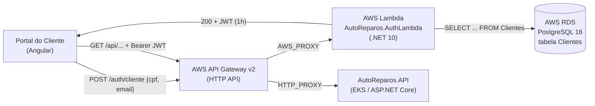

# RFC-003 — Autenticação Serverless de Clientes via CPF e E-mail

> **Projeto:** AutoReparos — Sistema Integrado de Oficina Mecânica
> **Fase:** Tech Challenge FIAP SOAT — Fase 3
> **Status:** Aceito e implementado
> **Autor:** Track B — Engenharia de Software, Observabilidade & Arquitetura
> **Repositório de referência:** [`AutoReparos.AuthLambda`](https://github.com/Grupo78-PosTech-15SOAT/AutoReparos.AuthLambda)
> **Documentos relacionados:** [ADR-002](./ADR-002-data-isolation-and-zero-trust-claims.md), [ADR-003](./ADR-003-end-to-end-observability-strategy.md), [Diagrama de sequência](./diagrams/sequence_portal_auth_and_query.md)

---

## 1. Sumário

Clientes finais da oficina precisam acompanhar o andamento do seu veículo e consultar
o histórico de serviços pela internet. Esta RFC propõe — e registra como implementada —
a autenticação desses clientes por meio de uma **função serverless dedicada**
(`AutoReparos.AuthLambda`) que valida **CPF + e-mail** contra o cadastro já existente
e devolve um **JWT efêmero de 1 hora** com a claim `Role: Cliente`, **sem criar
contas no ASP.NET Core Identity**.

---

## 2. Problema

O backend operacional do AutoReparos autentica os funcionários da oficina
(`Administrador`, `Atendente`, `Mecanico`) via ASP.NET Core Identity, com senha
persistida em `AspNetUsers`. Estender esse mesmo mecanismo ao cliente final traria
três problemas concretos:

1. **Atrito de adoção.** Exigir cadastro com senha de um cliente que vai consultar o
   status do carro duas ou três vezes por serviço faz o portal deixar de ser usado.
   O dado que autentica o cliente (CPF e e-mail) **já está no cadastro da oficina**,
   coletado na abertura da Ordem de Serviço.
2. **Poluição do modelo de identidade.** Milhares de clientes em `AspNetUsers`
   misturados com uma dezena de operadores torna a tabela de identidade — que governa
   o acesso privilegiado às rotas operacionais — um alvo maior e uma superfície de
   auditoria pior. Um erro de atribuição de role passaria a ter consequência direta
   sobre dados de terceiros.
3. **Acoplamento e escala.** O pico de acesso do portal do cliente é desalinhado com o
   da operação da oficina (clientes consultam à noite e no fim de semana). Escalar o
   backend operacional no EKS para absorver picos de *login* de clientes é caro e
   desnecessário.

**Restrição adicional da Fase 3:** o Tech Challenge exige explicitamente uma função
serverless no desenho de nuvem. A autenticação do cliente é o caso de uso que melhor
se encaixa: sem estado, de execução curta, com tráfego irregular e fronteira de
segurança clara.

---

## 3. Solução proposta

### 3.1. Topologia



As duas rotas convivem sob o mesmo domínio de borda, declaradas em
`submodules/AutoReparos.Infra.K8s/terraform/modules/apigateway/main.tf`:

| Rota | Integração | Destino |
|---|---|---|
| `POST /auth/cliente` | `AWS_PROXY` | Lambda de autenticação |
| `ANY /api/{proxy+}` | `HTTP_PROXY` | Ingress do EKS |

### 3.2. Fluxo de validação na Lambda

Implementado em `src/Functions/ClienteAuthFunction.cs`. A ordem das verificações é
deliberada — o trabalho barato acontece antes de tocar o banco:

1. **Preflight CORS.** `OPTIONS` responde `200` imediatamente.
2. **Corpo e contrato.** Corpo vazio, JSON malformado ou ausência de `cpf`/`email`
   retornam `400`.
3. **Sanitização do e-mail.** `Trim()` e `ToLowerInvariant()`; o formato mínimo é
   verificado antes de qualquer I/O.
4. **Validação matemática do CPF (módulo 11).** `CpfValidationService` normaliza para
   11 dígitos, rejeita sequências homogêneas (`111.111.111-11`) e confere os dois
   dígitos verificadores. **Um CPF sintaticamente inválido nunca chega ao banco**, o
   que elimina uma classe inteira de sondagem barata contra o RDS.
5. **Consulta parametrizada ao PostgreSQL.** `ClienteAuthDatabaseService` executa via
   Npgsql, reaproveitando o `NpgsqlDataSource` entre invocações quentes:

   ```sql
   SELECT "Id", "Nome", "Documento", "Email", "InativoEm"
   FROM "Clientes"
   WHERE "Documento" = @cpf AND LOWER("Email") = LOWER(@email)
   LIMIT 1;
   ```

   A Lambda lê **apenas cinco colunas de uma única tabela**. Não há `DbContext`, não há
   migrations e não existe caminho de escrita — o princípio do menor privilégio é
   estrutural, não apenas uma configuração de IAM.

6. **Decisão.**

   | Situação | Resposta |
   |---|---|
   | Par CPF+e-mail não encontrado | `401 — Cliente não localizado ou dados divergentes.` |
   | Cliente com `InativoEm` preenchido | `403 — Cadastro do cliente encontra-se inativo.` |
   | Cliente ativo | `200` + JWT |
   | Exceção não prevista | `500` genérico, com o detalhe apenas no log da Lambda |

   A mensagem de `401` é **idêntica** para "CPF não existe" e "e-mail não confere", de
   modo a não transformar o endpoint em um oráculo de enumeração de cadastro.

### 3.3. O token emitido

`TokenGenerationService` assina com **HMAC-SHA256** sobre um segredo de no mínimo 32
caracteres (validado no construtor) e emite as claims:

| Claim | Conteúdo | Uso a jusante |
|---|---|---|
| `nameidentifier` / `sub` | `Cliente.Id` (GUID) | Chave do isolamento de dados (ADR-002) |
| `name` | Nome do cliente | Exibição no portal |
| `email` | E-mail do cliente | Exibição e contato |
| `cpf` | CPF normalizado | Auditoria |
| `role` | `Cliente` | Casa com a `ClientePolicy` do backend |

**Expiração: 1 hora** (`expiryHours: 1`, devolvida ao portal em `expiresIn: 3600`).
Não há *refresh token*: expirou, o cliente reapresenta CPF e e-mail. Para uma sessão de
consulta esporádica, a simplicidade vale mais do que a conveniência de renovação, e
reduz a janela de exposição de um token vazado.

O backend no EKS valida esse token no mesmo esquema `JwtBearer` usado pelos operadores
(`AutoReparos.API/DependencyInjectionAPI.cs`), com a `IssuerSigningKey` derivada do
**mesmo segredo simétrico**. A separação entre cliente e operador não vem do emissor —
vem exclusivamente da role, checada pelas políticas `ClientePolicy` e `OperadorOficina`.

---

## 4. Alternativas consideradas

| Alternativa | Por que foi descartada |
|---|---|
| **Cadastro do cliente no ASP.NET Core Identity** | Resolve a autenticação, mas reintroduz os três problemas da seção 2: atrito de senha, poluição da tabela que governa acesso privilegiado e acoplamento de escala com o backend operacional. |
| **Amazon Cognito User Pool** | Serviço robusto e a escolha natural fora do contexto acadêmico. Descartado aqui porque (a) exige provisionar e sincronizar um diretório de usuários paralelo ao cadastro `Clientes`, que já é a fonte da verdade; (b) o fluxo de *sign-up* do Cognito pressupõe senha ou OTP, restaurando o atrito; (c) acrescenta um serviço gerenciado inteiro ao escopo sem demonstrar a competência serverless exigida pela banca. |
| **Magic link / OTP por e-mail** | Segurança melhor que CPF+e-mail, porque prova posse da caixa postal. Descartado nesta fase por colocar a entregabilidade de e-mail no caminho crítico do login e por adicionar estado (o código pendente) a um fluxo que se queria sem estado. **Registrado como evolução recomendada** — seção 6. |
| **Autorizador JWT nativo do API Gateway** | O API Gateway v2 sabe validar JWT antes de encaminhar. Não foi adotado porque o segredo é simétrico (HMAC) e o autorizador nativo espera um emissor OIDC com JWKS público. Migrar para chave assimétrica (RS256) é pré-requisito dessa mudança. |

---

## 5. Consequências

### Positivas

- O cliente acessa o portal com dados que já forneceu na recepção; zero cadastro novo.
- `AspNetUsers` continua contendo **apenas operadores da oficina**, mantendo pequena e
  auditável a tabela que governa acesso privilegiado.
- O login escala de forma independente do backend operacional e custa próximo de zero
  quando ocioso.
- A Lambda tem acesso de leitura a cinco colunas de uma tabela — a superfície de
  comprometimento é mínima por construção.
- Requisito de função serverless do Tech Challenge atendido com um caso de uso
  legítimo, não artificial.

### Negativas e riscos aceitos

- **CPF + e-mail é um fator de conhecimento fraco.** Quem conhece ambos os dados de um
  cliente entra no portal. A mitigação atual é o escopo do token: ele só abre rotas de
  **leitura dos próprios dados** (ADR-002); não há ação financeira irreversível atrás
  dele.
- **Segredo simétrico compartilhado** entre a Lambda e o backend. O comprometimento do
  segredo em qualquer um dos lados permite forjar tokens para os dois, e exige rotação
  coordenada via AWS Secrets Manager.
- **`Access-Control-Allow-Origin: *`** na resposta da Lambda. Aceitável enquanto o
  endpoint não usa cookies e o token volta no corpo da resposta, mas deve ser
  restringido ao domínio do portal antes de um uso produtivo real.
- **Ausência de rate limiting específico** na rota de autenticação. A validação de
  módulo 11 barra sondagem aleatória barata, mas não substitui *throttling* no API
  Gateway.
- Sem *refresh token*, o cliente reautentica a cada hora.

---

## 6. Evolução recomendada

1. **Throttling dedicado** na rota `POST /auth/cliente` no API Gateway v2, com bloqueio
   progressivo por CPF após tentativas malsucedidas consecutivas.
2. **Segundo fator por OTP de e-mail** para ações de maior impacto (aprovação de
   orçamento), preservando CPF+e-mail para consulta.
3. **Migração para RS256** com chave assimétrica em Secrets Manager, o que habilita o
   autorizador JWT nativo do API Gateway e elimina o segredo compartilhado.
4. **CORS restrito** ao domínio do portal.
5. **Instrumentação OpenTelemetry da Lambda** — hoje ela registra apenas via
   `ILambdaContext`, lacuna de rastreamento apontada no [ADR-003](./ADR-003-end-to-end-observability-strategy.md).
