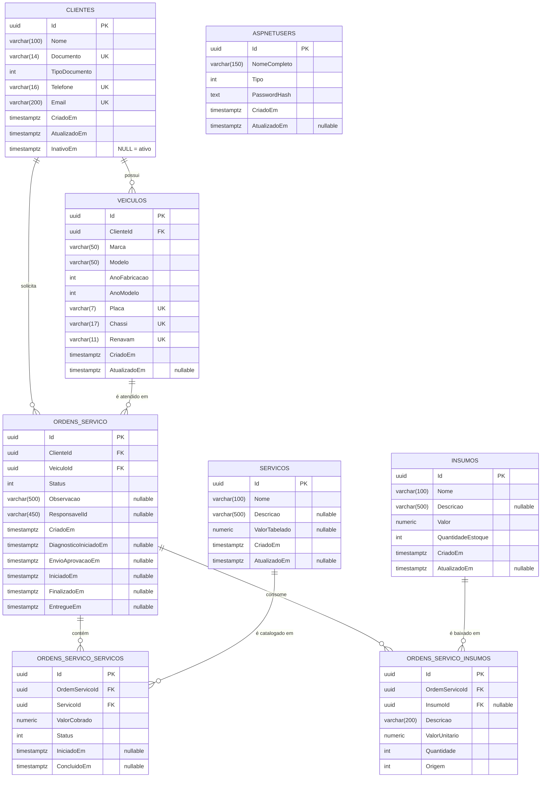

# Seleção de Banco de Dados e Modelo de Dados

> **Projeto:** AutoReparos — Sistema Integrado de Oficina Mecânica
> **Fase:** Tech Challenge FIAP SOAT — Fase 3
> **Motor adotado:** PostgreSQL 16 (`postgres:16` no stack local, AWS RDS `postgres 16.3` em nuvem)
> **ORM:** Entity Framework Core 10 + Npgsql
> **Documentos relacionados:** [RFC-003](./RFC-003-serverless-client-authentication.md), [ADR-002](./ADR-002-data-isolation-and-zero-trust-claims.md)

---

## Parte I — Justificativa da escolha

### 1. Transações ACID sobre estoque e valores

O momento mais sensível do domínio é a **aprovação de uma Ordem de Serviço**: naquele
instante o sistema muda o status da OS, consome peças do estoque e consolida o valor
cobrado. `Insumo.RemoverEstoque()` lança exceção se a quantidade for insuficiente, e
essa verificação só tem valor se a leitura do saldo e a baixa ocorrerem na mesma
transação — caso contrário, dois atendentes aprovando OS simultaneamente para a mesma
peça produzem estoque negativo.

O PostgreSQL entrega isso nativamente: transações ACID com isolamento MVCC, sem
necessidade de implementar compensação na camada de aplicação.

### 2. Integridade referencial declarada no banco

O modelo é fortemente relacional — `Cliente 1:N Veiculo 1:N OrdemServico N:M Servico` —
e as regras de deleção estão declaradas nas *foreign keys*, não apenas no código:

- **`Restrict`** em Cliente, Veículo, Serviço e Insumo: **não é possível apagar um
  cliente que tenha veículos, nem um serviço que já figure em uma OS**. O histórico da
  oficina é imutável por construção, e esse é exatamente o motivo pelo qual a inativação
  do cliente é feita por `InativoEm` (soft delete) e não por `DELETE`.
- **`Cascade`** apenas de OS para seus itens (`OrdensServicoServicos`,
  `OrdensServicoInsumos`), que são partes do agregado e não existem isoladamente.

Essa consistência é validada pelo banco mesmo se um caminho de código futuro esquecer de
verificá-la.

### 3. Recursos e operação

- **Índices únicos parciais e compostos** sustentam as regras de unicidade do domínio
  (documento, e-mail, telefone, placa, chassi, renavam) diretamente no motor.
- **`timestamp with time zone`** para todos os marcos temporais da OS, com a aplicação
  gravando sempre em UTC (`DateTime.UtcNow`) — pré-requisito para as métricas de tempo
  médio do [ADR-003](./ADR-003-end-to-end-observability-strategy.md) serem comparáveis.
- **`numeric(18,2)`** para valores monetários, sem os erros de arredondamento de ponto
  flutuante.
- **Compatibilidade com AWS RDS**, incluindo Multi-AZ, backups automatizados e
  *pooling* via PgBouncer, sem alteração de código.
- O mesmo motor roda idêntico em contêiner local e em RDS — o que elimina a classe de
  bugs "funciona na minha máquina" em consultas SQL.

### 4. Comparativo com as alternativas

| Critério | **PostgreSQL 16** | MongoDB | MySQL 8 |
|---|---|---|---|
| Transações multi-documento/tabela | Nativas e maduras | Existem desde a 4.0, mas exigem replica set e são um caminho secundário do motor | Nativas com InnoDB |
| Integridade referencial declarativa | FKs com `Restrict`/`Cascade` no motor | Inexistente — precisaria ser reimplementada em código | FKs suportadas |
| Adequação ao modelo | Domínio altamente relacional, com joins frequentes entre Cliente, Veículo, OS, Serviço e Insumo | Documentos aninhados forçariam duplicar cliente e veículo em cada OS, ou reintroduzir joins na aplicação | Adequado |
| Tipos e recursos analíticos | `numeric` exato, `timestamptz`, CTEs, window functions, índices parciais e `jsonb` | Agregações potentes, mas sem garantia de consistência transacional simples | Window functions desde a 8.0; índices parciais ausentes |
| Serviço gerenciado AWS | RDS / Aurora PostgreSQL | DocumentDB (compatibilidade parcial) ou Atlas | RDS / Aurora MySQL |

**MongoDB foi descartado** porque o núcleo do problema é consistência de estoque e
dinheiro sobre um modelo naturalmente relacional — exatamente onde um banco de
documentos exige mais trabalho para oferecer menos garantia.

**MySQL seria viável.** A escolha do PostgreSQL sobre ele foi por margem, e não por
impedimento: índices parciais, tipos mais ricos, melhor suporte a consultas analíticas
(úteis no `DashboardQueryService`) e o ecossistema Npgsql, que já expõe métricas e
traces OpenTelemetry nativamente — aproveitado no painel de latência de banco do
dashboard de integrações.

---

## Parte II — Modelo Entidade-Relacionamento

> **`AspNetUsers` aparece sem relacionamento** com o restante do modelo, e isso é
> intencional: ela guarda **apenas operadores da oficina**. Clientes nunca têm registro
> de identidade — autenticam-se pela Lambda contra a própria tabela `Clientes`
> ([RFC-003](./RFC-003-serverless-client-authentication.md)). O vínculo entre uma OS e o
> mecânico responsável é feito por `OrdensServico.ResponsavelId`, uma referência textual
> deliberadamente **não** declarada como FK, para que o histórico da OS sobreviva à
> remoção de um funcionário.

---

## Parte III — Dicionário de dados

Todas as chaves primárias são `uuid` geradas pela aplicação (`Guid.NewGuid()` na classe
base `Entity`), e não pelo banco. Todos os campos temporais são
`timestamp with time zone` gravados em UTC.

### `Clientes`

| Coluna | Tipo | Nulo | Regra / Observação |
|---|---|---|---|
| `Id` | `uuid` | Não | PK |
| `Nome` | `varchar(100)` | Não | Obrigatório, máx. 100 caracteres |
| `Documento` | `varchar(14)` | Não | CPF (11) ou CNPJ (14), **somente dígitos**; validado por módulo 11 no VO `Documento`. Único: `IX_Clientes_Documento` |
| `TipoDocumento` | `integer` | Não | `1 = CPF`, `2 = CNPJ`; derivado do tamanho do documento |
| `Telefone` | `varchar(16)` | Não | VO `Telefone`. Único: `IX_Clientes_Telefone` |
| `Email` | `varchar(200)` | Não | VO `Email`, normalizado para minúsculas. Único: `IX_Clientes_Email` |
| `CriadoEm` | `timestamptz` | Não | Definido na construção |
| `AtualizadoEm` | `timestamptz` | Não | Atualizado por `Atualizar()`, `Inativar()` e `Reativar()` |
| `InativoEm` | `timestamptz` | **Sim** | **`NULL` significa cliente ativo.** A propriedade `Ativo` é calculada (`!InativoEm.HasValue`) e não persistida |

> `Documento`, `Telefone` e `Email` são *owned types* do EF Core: moram na mesma tabela,
> em colunas com os nomes acima, mas no domínio são Value Objects auto-validados.
> `InativoEm` é a coluna lida pela Lambda de autenticação para negar acesso com `403`.

### `Veiculos`

| Coluna | Tipo | Nulo | Regra / Observação |
|---|---|---|---|
| `Id` | `uuid` | Não | PK |
| `ClienteId` | `uuid` | Não | FK → `Clientes.Id`, `ON DELETE RESTRICT`. **Chave do isolamento do ADR-002** |
| `Marca` | `varchar(50)` | Não | Obrigatória |
| `Modelo` | `varchar(50)` | Não | Obrigatório |
| `AnoFabricacao` | `integer` | Não | Entre 1900 e o ano corrente + 1 |
| `AnoModelo` | `integer` | Não | Não pode ser menor que `AnoFabricacao` |
| `Placa` | `varchar(7)` | Não | VO `Placa`. Único: `IX_Veiculos_Placa` |
| `Chassi` | `varchar(17)` | Não | VO `Chassi`. Único: `IX_Veiculos_Chassi` |
| `Renavam` | `varchar(11)` | Não | VO `Renavam`. Único: `IX_Veiculos_Renavam` |
| `CriadoEm` | `timestamptz` | Não | |
| `AtualizadoEm` | `timestamptz` | Sim | `NULL` até a primeira alteração |

### `OrdensServico`

| Coluna | Tipo | Nulo | Regra / Observação |
|---|---|---|---|
| `Id` | `uuid` | Não | PK, gerada pela aplicação (`ValueGeneratedNever`) |
| `ClienteId` | `uuid` | Não | FK → `Clientes.Id`, `RESTRICT` |
| `VeiculoId` | `uuid` | Não | FK → `Veiculos.Id`, `RESTRICT` |
| `Status` | `integer` | Não | `1 Recebida`, `2 EmDiagnostico`, `3 AguardandoAprovacao`, `4 EmExecucao`, `5 Finalizada`, `6 Entregue` |
| `Observacao` | `varchar(500)` | Sim | |
| `ResponsavelId` | `varchar(450)` | Sim | Mecânico do diagnóstico; **sem FK** (ver nota do modelo ER) |
| `CriadoEm` | `timestamptz` | Não | Início do tempo de permanência |
| `DiagnosticoIniciadoEm` | `timestamptz` | Sim | Gravado em `IniciarDiagnostico()`, com `??=` — **preservado se a OS voltar ao diagnóstico após uma recusa** |
| `EnvioAprovacaoEm` | `timestamptz` | Sim | Gravado em `AguardarAprovacao()`; fim do tempo de diagnóstico |
| `IniciadoEm` | `timestamptz` | Sim | Gravado em `Aprovar()`; início do tempo de execução |
| `FinalizadoEm` | `timestamptz` | Sim | Gravado quando **todos** os serviços da OS ficam concluídos |
| `EntregueEm` | `timestamptz` | Sim | Gravado em `Entregar()`; fim do tempo de permanência |

**Tempos derivados** (calculados no domínio, nunca persistidos):

| Métrica | Fórmula | Nulo quando |
|---|---|---|
| Tempo de diagnóstico | `EnvioAprovacaoEm − DiagnosticoIniciadoEm` | Qualquer um dos dois ausente |
| Tempo de execução | `FinalizadoEm − IniciadoEm` | Qualquer um dos dois ausente |
| Finalização até entrega | `EntregueEm − FinalizadoEm` | Qualquer um dos dois ausente |
| `ValorTotal` | Soma de `ValorCobrado` dos serviços + `ValorTotal` dos insumos | Nunca (zero sem itens) |

### `OrdensServicoServicos`

| Coluna | Tipo | Nulo | Regra / Observação |
|---|---|---|---|
| `Id` | `uuid` | Não | PK, `ValueGeneratedNever` |
| `OrdemServicoId` | `uuid` | Não | FK → `OrdensServico.Id`, **`ON DELETE CASCADE`** |
| `ServicoId` | `uuid` | Não | FK → `Servicos.Id`, `RESTRICT` |
| `ValorCobrado` | `numeric(18,2)` | Não | Deve ser maior que zero; pode divergir do valor tabelado |
| `Status` | `integer` | Não | `1 Pendente`, `2 EmExecucao`, `3 Concluido` |
| `IniciadoEm` | `timestamptz` | Sim | |
| `ConcluidoEm` | `timestamptz` | Sim | Quando o último serviço conclui, a OS passa a `Finalizada` |

### `OrdensServicoInsumos`

| Coluna | Tipo | Nulo | Regra / Observação |
|---|---|---|---|
| `Id` | `uuid` | Não | PK, `ValueGeneratedNever` |
| `OrdemServicoId` | `uuid` | Não | FK → `OrdensServico.Id`, **`ON DELETE CASCADE`** |
| `InsumoId` | `uuid` | **Sim** | FK → `Insumos.Id`, `RESTRICT`. `NULL` é permitido **apenas** quando `Origem = CompraEspecifica` |
| `Descricao` | `varchar(200)` | Não | Descrição registrada no momento do uso |
| `ValorUnitario` | `numeric(18,2)` | Não | Maior que zero; **congelado no momento do uso**, não segue alterações futuras do cadastro |
| `Quantidade` | `integer` | Não | Maior que zero |
| `Origem` | `integer` | Não | `1 Estoque`, `2 CompraEspecifica` |

> Insumos de estoque adicionados repetidamente à mesma OS **são consolidados em uma
> única linha** com a quantidade somada (`AdicionarInsumo` → `AdicionarQuantidade`).
> Itens de compra específica não são consolidados, por poderem ter preços diferentes.

### `Servicos`

| Coluna | Tipo | Nulo | Regra / Observação |
|---|---|---|---|
| `Id` | `uuid` | Não | PK |
| `Nome` | `varchar(100)` | Não | Obrigatório |
| `Descricao` | `varchar(500)` | Sim | |
| `ValorTabelado` | `numeric(18,2)` | Sim | Se informado, deve ser maior que zero. É referência de catálogo — o valor efetivo fica em `OrdensServicoServicos.ValorCobrado` |
| `CriadoEm` | `timestamptz` | Não | |
| `AtualizadoEm` | `timestamptz` | Sim | |

### `Insumos`

| Coluna | Tipo | Nulo | Regra / Observação |
|---|---|---|---|
| `Id` | `uuid` | Não | PK |
| `Nome` | `varchar(100)` | Não | Obrigatório |
| `Descricao` | `varchar(500)` | Sim | |
| `Valor` | `numeric(18,2)` | Não | Preço corrente de catálogo |
| `QuantidadeEstoque` | `integer` | Não | Movimentado por `AdicionarEstoque()` / `RemoverEstoque()`; baixa acima do saldo lança exceção de domínio |
| `CriadoEm` | `timestamptz` | Não | |
| `AtualizadoEm` | `timestamptz` | Sim | |

### `AspNetUsers` e demais tabelas do Identity

Geradas pelo ASP.NET Core Identity (`IdentityDbContext<UsuarioIdentity, IdentityRole<Guid>, Guid>`),
com chaves `Guid`. Colunas próprias do projeto na `AspNetUsers`:

| Coluna | Tipo | Nulo | Observação |
|---|---|---|---|
| `NomeCompleto` | `varchar(150)` | Não | |
| `Tipo` | `integer` | Não | `1 Administrador`, `2 Atendente`, `3 Mecanico` |
| `CriadoEm` | `timestamptz` | Não | |
| `AtualizadoEm` | `timestamptz` | Sim | |
| `PasswordHash` | `text` | Não | Obrigatório — **apenas operadores têm senha** |

Acompanham as tabelas padrão `AspNetRoles`, `AspNetUserRoles`, `AspNetUserClaims`,
`AspNetRoleClaims`, `AspNetUserLogins` e `AspNetUserTokens`.

---

## Parte IV — Evolução do schema

O schema é versionado por migrations do EF Core, aplicadas na inicialização
(`DbInitializer`). Histórico:

| Migration | Conteúdo |
|---|---|
| `v1_clientes` | Tabela `Clientes` com os Value Objects e índices únicos |
| `v2_veiculos` | `Veiculos`, com placa, chassi e renavam únicos |
| `v3_servicos_ordens_pecas` | Catálogo de serviços, peças e as ordens de serviço |
| `v4_usuarios` | Tabelas do ASP.NET Core Identity |
| `v5_renomeando_peca_para_insumo` | Renomeação do conceito de *Peça* para *Insumo* |
| `v6_desacoplando_usuario_identity` | Separação do `Usuario` de domínio em relação ao `UsuarioIdentity` de infraestrutura |
| `v7_responsavel_e_envio_aprovacao_os` | `ResponsavelId` e `EnvioAprovacaoEm` na OS |
| `v8_cliente_inativo_e_os_diagnostico` | `Clientes.InativoEm` e `OrdensServico.DiagnosticoIniciadoEm` — colunas que sustentam, respectivamente, o bloqueio de cliente inativo na Lambda e a métrica de tempo de diagnóstico |

As duas colunas da `v8` são exatamente o que liga este modelo aos outros dois documentos
desta pasta: `InativoEm` é lida pela autenticação serverless
([RFC-003](./RFC-003-serverless-client-authentication.md)) e `DiagnosticoIniciadoEm`
alimenta o histograma `ordens_servico.tempo_diagnostico`
([ADR-003](./ADR-003-end-to-end-observability-strategy.md)).
