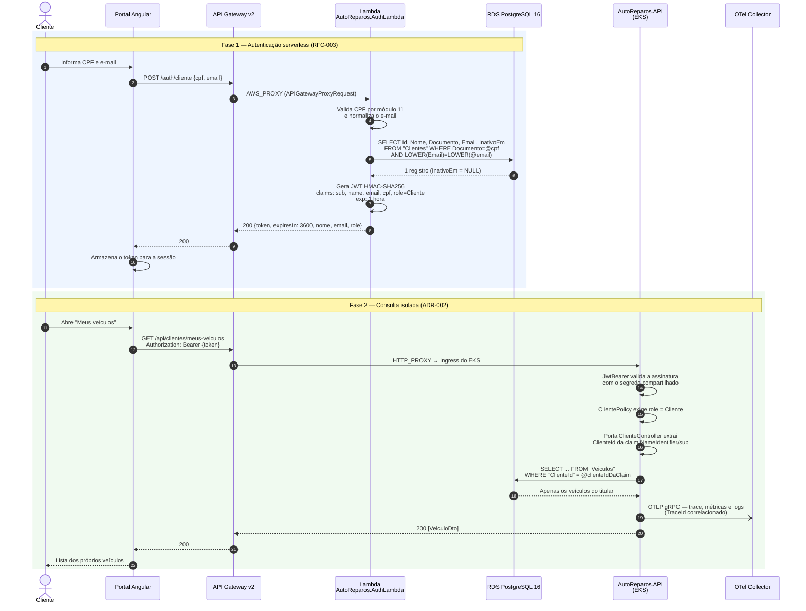
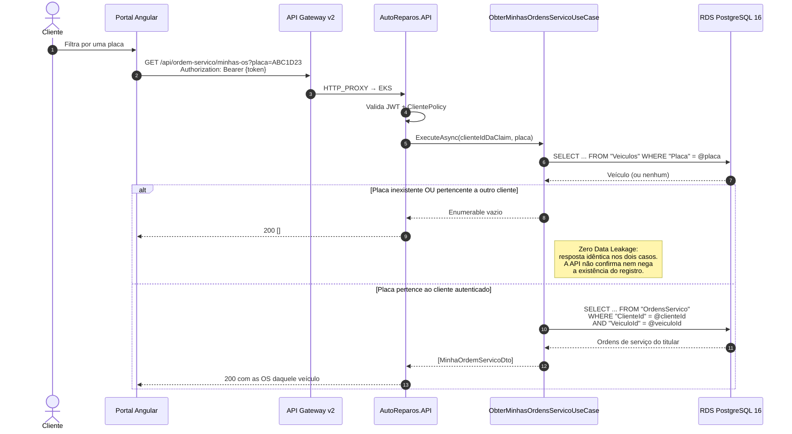
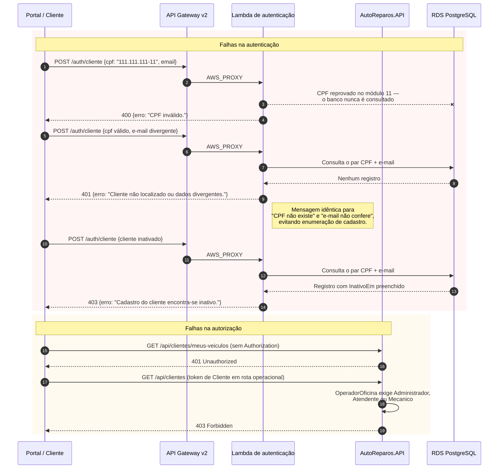
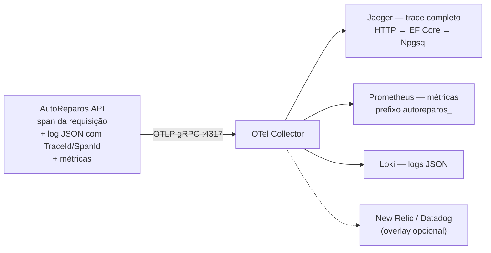

# Diagrama de Sequência — Autenticação e Consulta no Portal do Cliente

> **Projeto:** AutoReparos — Sistema Integrado de Oficina Mecânica
> **Fase:** Tech Challenge FIAP SOAT — Fase 3
> **Documentos relacionados:** [RFC-003](../RFC-003-serverless-client-authentication.md), [ADR-002](../ADR-002-data-isolation-and-zero-trust-claims.md), [ADR-003](../ADR-003-end-to-end-observability-strategy.md)

Este documento detalha o fluxo completo do portal do cliente, do login com CPF e e-mail
até a consulta isolada dos próprios dados — o caminho demonstrado ao vivo no vídeo de
entrega.

---

## 1. Fluxo principal (caminho feliz)



**O ponto que a banca precisa ver no passo 17:** o `ClienteId` usado na cláusula `WHERE`
vem da **claim do token**, não da requisição. Não existe parâmetro no contrato do
endpoint capaz de alterá-lo.

---

## 2. Consulta de ordens de serviço com filtro por placa

O filtro opcional por placa é onde o isolamento Zero-Trust fica visível, porque três
situações diferentes convergem para **a mesma resposta**.



---

## 3. Caminhos de exceção



---

## 4. Como a telemetria acompanha o fluxo

Durante todo o trecho que roda no EKS, o SDK OpenTelemetry emite os três sinais para o
Collector, que os distribui ([ADR-003](../ADR-003-end-to-end-observability-strategy.md)):



Na prática, isso permite partir de um pico no dashboard, abrir o trace correspondente no
Jaeger e chegar à linha de log exata daquela requisição no Loki, pelo mesmo `TraceId`.

**Lacuna conhecida:** a Lambda de autenticação **não** está instrumentada com
OpenTelemetry — ela registra apenas via `ILambdaContext`. O trace distribuído começa,
efetivamente, na chegada ao backend; o salto Portal → API Gateway → Lambda não aparece
no Jaeger.

---

## 5. Roteiro de reprodução local

Para exercitar o fluxo sem AWS, com o stack de observabilidade completo:

```bash
cp .env.example .env            # preencher as senhas
docker compose up -d postgres otel-collector prometheus jaeger loki
dotnet build AutoReparos.slnx
dotnet run --project submodules/AutoReparos.App/AutoReparos.API
```

Pontos que costumam custar tempo:

- O PostgreSQL do compose é publicado em **`5433`** no host, não em `5432`.
- O `launchSettings.json` sobrepõe `ASPNETCORE_URLS`: a API sobe em **`http://localhost:5137`**.
- O usuário operacional de seed é **`admin@autoreparos.com`**.
- Métricas recém-emitidas levam **até 60 segundos** para aparecer no Prometheus, e
  qualquer `rate()`/`increase()` sobre elas exige janela de **`[5m]`** ou maior.
