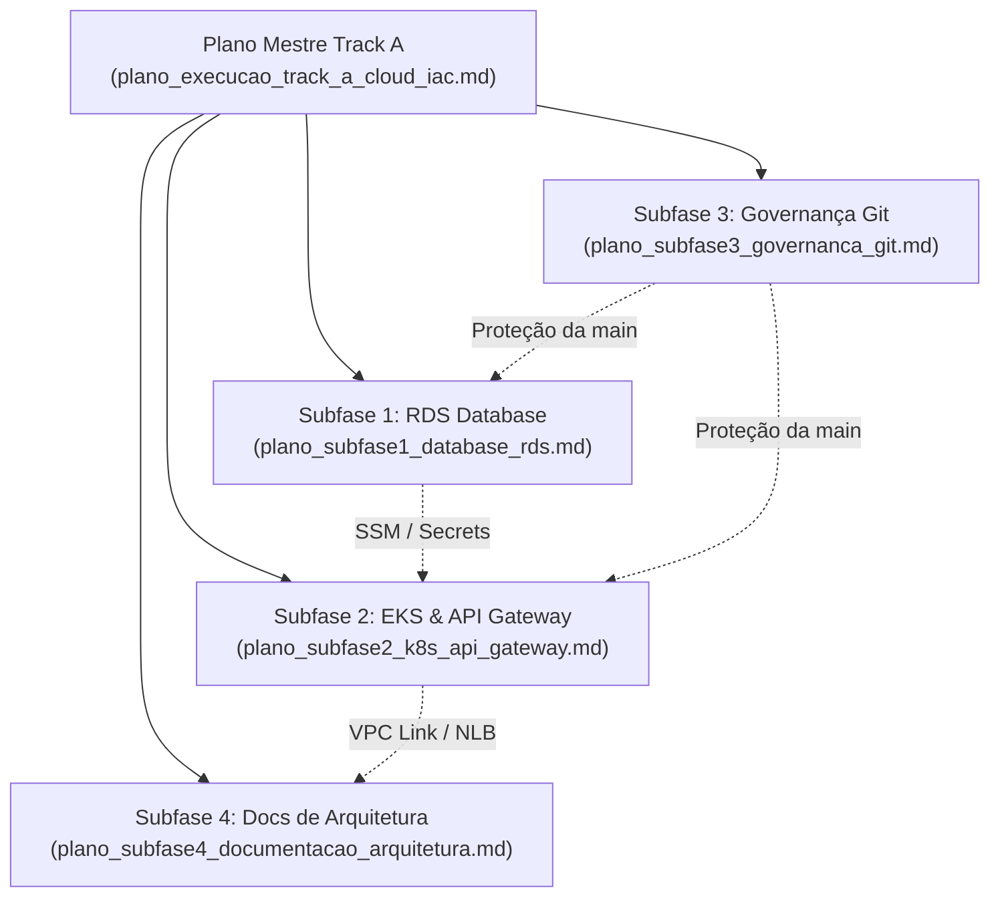

# Índice de Planos Detalhados - Track A: Infraestrutura Cloud & DevOps

> **Projeto:** AutoReparos - Sistema Integrado de Oficina Mecânica  
> **Fase:** Tech Challenge FIAP SOAT - Fase 3  
> **Especificação Base:** [`../fase3_spec_track_a_cloud_iac.md`](../fase3_spec_track_a_cloud_iac.md)  
> **Plano Mestre de Execução:** [`../plano_execucao_track_a_cloud_iac.md`](../plano_execucao_track_a_cloud_iac.md)  
> **Status:** Aprovado / Pronto para Execução Paralela  

---

## 1. Visão Geral da Suíte de Planos Detalhados

Para viabilizar a implementação técnica do **Track A** com máxima previsibilidade, conformidade arquitetural e aderência aos requisitos da banca examinadora da FIAP, o escopo foi decomposto em quatro planos de subfases dedicados.

Cada plano aborda a fundo as dimensões de negócio, arquitetura técnica, segurança, gestão de custos (perfil Free Tier / Custo Zero), esteiras de CI/CD automatizadas, procedimentos de rollback e critérios empíricos de aceitação (DoD).

---

## 2. Mapa dos Planos das Subfases

---

## 3. Detalhamento dos Planos por Subfase

| Subfase | Título do Plano | Repositório / Escopo | Principais Entregáveis | Status |
|:---|:---|:---|:---|:---:|
| **Subfase 1** | [`plano_subfase1_database_rds.md`](./plano_subfase1_database_rds.md) | `AutoReparos.Infra.Database` | AWS RDS PostgreSQL 16 (`db.t4g.micro`), AWS SSM Parameter Store, Subnet Groups privados, Secrets Manager e GitHub Actions CI/CD. | **Concluído** (`1dede09`) |
| **Subfase 2** | [`plano_subfase2_k8s_api_gateway.md`](./plano_subfase2_k8s_api_gateway.md) | `AutoReparos.Infra.K8s` | AWS API Gateway HTTP v2 com VPC Link Privado, rotas `/auth/cliente`, `/api/*`, `/health`, EKS v1.30, Ingress NGINX e Helm Charts. | **Concluído** (`8fc46e9`) |
| **Subfase 3** | [`plano_subfase3_governanca_git.md`](./plano_subfase3_governanca_git.md) | Repositório Pai (`scripts/infra/`) | Automação de Branch Protection Rules na `main` dos 4 repositórios via GitHub CLI (`gh api`), auditoria e bloqueio de push direto. | **Concluído** (`980065c`) |
| **Subfase 4** | [`plano_subfase4_documentacao_arquitetura.md`](./plano_subfase4_documentacao_arquitetura.md) | `docs/architecture/` | Redação de RFC-001 (Multi-Repo & Cloud), RFC-002 (RDS vs StatefulSet), ADR-001 (API Gateway HTTP v2) e Diagrama Geral de Componentes Cloud. | **Concluído** (`5032ea0`) |

---

## 4. Diretrizes de Navegação e Execução

- **Ordem Recomendada de Execução:** Subfase 1 ➔ Subfase 2 ➔ Subfase 3 ➔ Subfase 4.
- **Portabilidade & Conformidade de Links:** Todos os documentos foram redigidos com caminhos estritamente relativos (`./`, `../`), atendendo aos padrões de portabilidade e regras do projeto.
