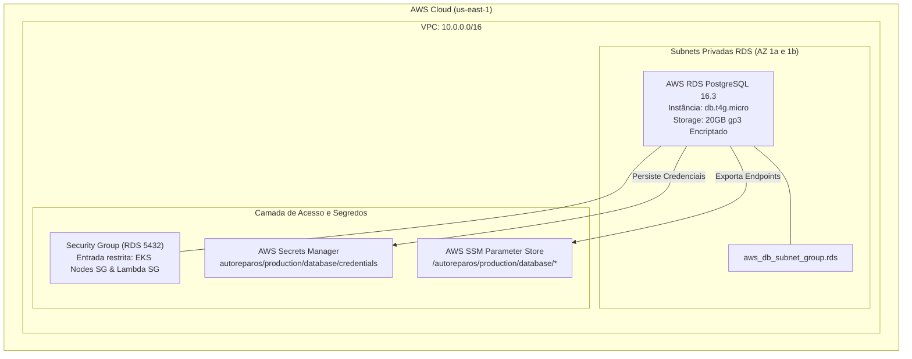

# Plano Detalhado de Implementação - Subfase 1: Banco de Dados Gerenciado (AWS RDS PostgreSQL 16 & SSM)

> **Projeto:** AutoReparos - Sistema Integrado de Oficina Mecânica  
> **Fase:** Tech Challenge FIAP SOAT - Fase 3 (Track A - Infraestrutura Cloud)  
> **Repositório Alvo:** [`submodules/AutoReparos.Infra.Database`](../../../../../submodules/AutoReparos.Infra.Database)  
> **Documento Mestre:** [`../plano_execucao_track_a_cloud_iac.md`](../plano_execucao_track_a_cloud_iac.md)  
> **Responsável:** Engenheiro de Infraestrutura Cloud & DevOps  
> **Status:** Concluído e Validado (Commit `1dede09` no submódulo)  

---

## 1. Contexto de Negócio & Justificativa

### 1.1. O Desafio de Negócio na Oficina Mecânica
Na operação diária do **AutoReparos**, o banco de dados é a espinha dorsal de todo o fluxo operacional e financeiro:
- **Integridade Transacional (ACID):** Cada movimentação de Ordem de Serviço (OS) envolve transições de estado rígidas (ex: *Orçamento Aprovado* ➔ *Em Execução*), baixa atômica de insumos em estoque para evitar vendas fantasmas (*overselling*) e histórico financeiro imutável.
- **Risco de StatefulSets in-cluster:** Na Fase 2, o PostgreSQL operava via `StatefulSet` com volumes EBS montados diretamente nos nós do Kubernetes. Essa abordagem introduzia fragilidades operacionais: interrupções de serviço durante recriação de pods, ausência de backups incrementais automatizados (*Point-in-Time Recovery*), risco de *split-brain* e sobrecarga operacional (*toil*) da equipe de sustentação.
- **Transição para Banco Gerenciado (Fase 3):** A substituição do banco in-cluster pelo **AWS RDS PostgreSQL 16** terceiriza a governança de hardware, replicação, patches e snapshots para a AWS, elevando o SLA para **99.95%** sem custos adicionais de gerenciamento manual.

### 1.2. Alinhamento com os Requisitos da Banca (FIAP SOAT)
- Atendimento direto ao **Requisito 4 do Tech Challenge Fase 3**: "Banco de dados relacional gerenciado em nuvem (ex: RDS PostgreSQL)".
- **Meta Orçamentária Rigorosa:** Configuração ajustada para o perfil **Free Tier / Acadêmico (Custo ZERO)** com desligamento programado e dimensionamento enxuto (`db.t4g.micro`, 20 GiB de armazenamento gp3).

---

## 2. Especificações Técnicas & Arquitetura Alvo

### 2.1. Topologia de Rede & Isolamento de Segurança



### 2.2. Recursos Terraform a Provisionar e Refinar

| Recurso HCL | Tipo | Finalidade Técnica |
|:---|:---|:---|
| `aws_db_subnet_group.rds` | Rede | Agrupa 2 subnets privadas em AZs distintas para failover seguro. |
| `aws_security_group.rds` | Segurança | Bloqueia tráfego na porta 5432, liberando estritamente os Security Groups dos nós EKS e da Lambda. |
| `aws_db_parameter_group.pg16` | Tuning | Otimiza parâmetros do PostgreSQL 16 (`log_min_duration_statement = 1000`, `log_connections = 1`). |
| `aws_db_instance.postgres` | Banco | PostgreSQL 16.3, `db.t4g.micro`, storage gp3 de 20 GiB, KMS habilitado, backup de 7 dias. |
| `aws_secretsmanager_secret` | Segredos | Persiste a connection string completa e credenciais em JSON seguro. |
| `aws_ssm_parameter` (novos) | Desacoplamento | Expõe `endpoint`, `address`, `name` e `secret_arn` no Parameter Store para consumo desacoplado. |
| `random_password.master_password` | Segurança | Gera senha randômica com 24 caracteres caso não seja informada via `var.db_password`. |

---

## 3. Mapeamento de Arquivos e Alterações

```
submodules/AutoReparos.Infra.Database/
├── .github/
│   └── workflows/
│       └── ci.yml                     # [ATUALIZAR] Adicionar steps de plan e apply condicionais
├── terraform/
│   ├── main.tf                        # [ATUALIZAR] Adicionar parâmetros SSM e validação de SGs
│   ├── variables.tf                   # [ATUALIZAR] Defaults alinhados a Free Tier e descrições
│   ├── outputs.tf                     # [VERIFICAR] Conferir conformidade dos outputs
│   ├── providers.tf                   # [OK] Configuração AWS Provider ~> 5.0 e tags padrão
│   └── terraform.tfvars.example       # [ATUALIZAR] Exemplo completo e documentado
└── README.md                          # [ATUALIZAR] Documentação técnica com comandos e troubleshooting
```

---

## 4. Passo a Passo Detalhado de Implementação

### Passo 1.1: Adicionar Parâmetros SSM no `terraform/main.tf`
Incluir no final de `submodules/AutoReparos.Infra.Database/terraform/main.tf` a exportação para o AWS SSM Parameter Store:

```hcl
# 7. AWS SSM Parameter Store para Desacoplamento Multi-Repo
resource "aws_ssm_parameter" "db_endpoint" {
  name        = "/autoreparos/${var.environment}/database/endpoint"
  description = "Endpoint completo do AWS RDS PostgreSQL (host:porta)"
  type        = "String"
  value       = aws_db_instance.postgres.endpoint
  overwrite   = true

  tags = {
    Environment = var.environment
  }
}

resource "aws_ssm_parameter" "db_address" {
  name        = "/autoreparos/${var.environment}/database/address"
  description = "Endereco DNS puro do AWS RDS PostgreSQL"
  type        = "String"
  value       = aws_db_instance.postgres.address
  overwrite   = true

  tags = {
    Environment = var.environment
  }
}

resource "aws_ssm_parameter" "db_name" {
  name        = "/autoreparos/${var.environment}/database/name"
  description = "Nome do banco de dados relacional principal"
  type        = "String"
  value       = var.db_name
  overwrite   = true

  tags = {
    Environment = var.environment
  }
}

resource "aws_ssm_parameter" "db_secret_arn" {
  name        = "/autoreparos/${var.environment}/database/secret_arn"
  description = "ARN do segredo no Secrets Manager contendo as credenciais do banco"
  type        = "String"
  value       = aws_secretsmanager_secret.db_credentials.arn
  overwrite   = true

  tags = {
    Environment = var.environment
  }
}
```

### Passo 1.2: Refinar Valores Padrão em `terraform/variables.tf`
Garantir que as seguintes variáveis estejam estritamente parametrizadas para o perfil acadêmico:
- `instance_class`: default `"db.t4g.micro"` (ou fallback `"db.t3.micro"` se a região exigir x86).
- `allocated_storage`: default `20` (GiB).
- `max_allocated_storage`: default `20` (limitar auto-scaling desnecessário no laboratório).
- `multi_az`: default `false`.
- `deletion_protection`: default `false`.
- `skip_final_snapshot`: default `true` (evita custos residuais de snapshots após o `terraform destroy`).

### Passo 1.3: Atualizar Esteira de CI/CD em `.github/workflows/ci.yml`
Implementar a esteira com validação sintática obrigatória e execução condicional de `plan` e `apply`:

```yaml
name: CI/CD - AutoReparos.Infra.Database

concurrency:
  group: ${{ github.workflow }}-${{ github.ref }}
  cancel-in-progress: true

on:
  push:
    branches: [ main, develop ]
    paths:
      - 'terraform/**'
      - '.github/workflows/ci.yml'
  pull_request:
    branches: [ main, develop ]
    paths:
      - 'terraform/**'
      - '.github/workflows/ci.yml'

jobs:
  validate:
    name: Validação Sintática IaC
    runs-on: ubuntu-latest
    defaults:
      run:
        working-directory: ./terraform

    steps:
      - name: Checkout Code
        uses: actions/checkout@11bd71901bbe5b1630ceea73d27597364c9af683 # v4.2.2

      - name: Setup Terraform
        uses: hashicorp/setup-terraform@b9cd54a3c349d3f38e8881555d616ced269862dd # v3.1.2
        with:
          terraform_version: 1.8.0

      - name: Terraform Format Check
        run: terraform fmt -check -diff

      - name: Terraform Init (no backend)
        run: terraform init -backend=false

      - name: Terraform Validate
        run: terraform validate

  plan-and-apply:
    name: Terraform Plan & Apply
    needs: validate
    runs-on: ubuntu-latest
    defaults:
      run:
        working-directory: ./terraform
    # Executa apenas se credenciais AWS estiverem cadastradas como Secrets
    if: ${{ secrets.AWS_ACCESS_KEY_ID != '' && secrets.AWS_SECRET_ACCESS_KEY != '' }}

    steps:
      - name: Checkout Code
        uses: actions/checkout@11bd71901bbe5b1630ceea73d27597364c9af683 # v4.2.2

      - name: Setup Terraform
        uses: hashicorp/setup-terraform@b9cd54a3c349d3f38e8881555d616ced269862dd # v3.1.2
        with:
          terraform_version: 1.8.0

      - name: Configure AWS Credentials
        uses: aws-actions/configure-aws-credentials@e3ddf14f329da44ef5b750c8fb86e6b66ad4ce60 # v4.0.2
        with:
          aws-access-key-id: ${{ secrets.AWS_ACCESS_KEY_ID }}
          aws-secret-access-key: ${{ secrets.AWS_SECRET_ACCESS_KEY }}
          aws-region: us-east-1

      - name: Terraform Init
        run: terraform init

      - name: Terraform Plan
        id: plan
        run: terraform plan -no-color

      - name: Terraform Apply (somente na branch main)
        if: github.ref == 'refs/heads/main' && github.event_name == 'push'
        run: terraform apply -auto-approve
```

---

## 5. Estratégia de Testes & Validação Empírica

Para validar a integridade técnica sem custos de nuvem:

```bash
cd submodules/AutoReparos.Infra.Database/terraform

# 1. Checagem de formatação de código
terraform fmt -check -diff

# 2. Inicialização em modo isolado (sem backend remoto)
terraform init -backend=false

# 3. Validação estática de tipagem e recursos
terraform validate
# Saída esperada: "Success! The configuration is valid."

# 4. Verificação de sintaxe do workflow GitHub Actions
# Pode ser validado via actionlint se disponível localmente
```

---

## 6. Gestão de Riscos, Mitigações e Rollback

| Risco Identificado | Severidade | Probabilidade | Mitigação Arquitetural | Procedimento de Rollback |
|:---|:---:|:---:|:---|:---|
| Exclusão acidental da base em ambiente de produção | Alta | Baixa | Snapshot automático diário (`backup_retention_period = 7`) e tags de proteção. | Restaurar a partir do snapshot point-in-time mais recente via console/CLI. |
| Vazamento de credenciais do banco em logs de CI | Crítica | Baixa | Utilização de `random_password`, anotação `sensitive = true` em todas as variáveis/outputs de senha e persistência exclusiva no Secrets Manager. | Rotacionar imediatamente a secret no AWS Secrets Manager e reiniciar os pods da API. |
| Incompatibilidade de AZs no Subnet Group | Média | Baixa | Forçar mínimo de 2 subnets em zonas distintas (`us-east-1a`, `us-east-1b`). | Ajustar `private_subnet_ids` no `terraform.tfvars`. |
| Custo residual após avaliação | Alta | Média | Definir `skip_final_snapshot = true` em dev/laboratório para permitir `terraform destroy` limpo sem cobrança de armazenamento órfão. | Executar `terraform destroy -auto-approve` ao término dos testes. |

---

## 7. Critérios de Aceite & Definition of Done (DoD)

- [x] Recursos `aws_ssm_parameter` criados para expor os 4 metadados do banco.
- [x] Defaults em `variables.tf` garantindo perfil de **Custo Zero** (`db.t4g.micro`, 20 GiB, Single-AZ).
- [x] Pipeline de CI/CD `.github/workflows/ci.yml` configurada com validação e steps condicionais (push na `main`).
- [x] Execução limpa de `terraform fmt -check`, `terraform init -backend=false`, `terraform validate` e `terraform plan` local sem erros.
- [x] Arquivo `terraform.tfvars.example` documentado e README atualizado.
