# Especificação Técnica Individual: Tarefas Restantes do Track B (Software, Observabilidade & Documentação)

> **Projeto:** AutoReparos - Sistema Integrado de Oficina Mecânica  
> **Fase:** Tech Challenge FIAP SOAT - Fase 3  
> **Responsável:** **Engenheiro de Software, Observabilidade & Arquitetura (Dev 2 / Track B)**  
> **Repositório Principal de Trabalho:** [`submodules/AutoReparos.App`](https://github.com/Grupo78-PosTech-15SOAT/AutoReparos.App) e Repositório Central de Documentação  
> **Status do Documento:** **Pronto para Execução Imediata**  
> **Arquivo:** `docs/specs/fase3/observabilidade/fase3_track_b_tarefas_restantes_spec.md`

---

## 1. Contexto & Escopo Específico do Track B

Enquanto o **Track A** foca exclusivamente no provisionamento de nuvem AWS (Terraform RDS, EKS, API Gateway v2 e CI/CD de infraestrutura), o **Track B** é responsável por fechar os **12% restantes da aplicação, telemetria, dashboards e evidências acadêmicas exigidas pela banca**.

### Baseline Atual (O que já está pronto e testado):
- [x] Regras de negócio de inativação de cliente (`InativoEm`, `Ativo`, `Inativar()`, `Reativar()`).
- [x] Métricas temporais de OS (`DiagnosticoIniciadoEm`, `TempoDiagnostico`, `TempoExecucao`, correção do bug de `Recusar()`).
- [x] Endpoints e use cases de consulta restrita do cliente (`GET /api/clientes/meus-veiculos` e `GET /api/ordem-servico/minhas-os`) com isolamento Zero-Trust.
- [x] Métricas de dashboard no backend (`DashboardQueryService.cs` com volume diário e tempos médios).
- [x] 343 testes automatizados (113 Domain, 123 Application, 40 Lambda, 67 Integration com Testcontainers PostgreSQL) passando com 100% de sucesso.

---

## 2. Mapa Detalhado das Tarefas Restantes

```mermaid
flowchart TD
    subgraph Bloco1 ["1. Telemetria & Métricas de Negócio"]
        T1["Instrumentar AutoReparosMetrics no backend"]
        T2["Adicionar contador 'notificacoes.falhas' em NotificacaoService"]
        T3["Criar testes unitários para falhas de notificação"]
    end

    subgraph Bloco2 ["2. Observabilidade Nuvem (New Relic / Datadog)"]
        T4["Configurar suporte a License Key no OpenTelemetryExtensions.cs"]
        T5["Configurar exportador OTLP para New Relic/Datadog no OTel Collector"]
        T6["Logs estruturados JSON com correlação TraceId e SpanId"]
    end

    subgraph Bloco3 ["3. Dashboards Mandatórios & Alertas"]
        T7["Dashboard 1: Volume Diário de OS (JSON)"]
        T8["Dashboard 2: Tempo Médio por Status (JSON)"]
        T9["Dashboard 3: Erros e Falhas de Integrações (JSON)"]
        T10["Alertas automatizados: Latência p95 e Taxa de Erro"]
    end

    subgraph Bloco4 ["4. Arquitetura & Documentação Formal"]
        T11["RFC-003: Autenticação Serverless CPF+Email sem Identity"]
        T12["ADR-002: Isolamento Zero-Trust de Dados do Cliente"]
        T13["ADR-003: Estratégia de Observabilidade OTel Vendor-Agnostic"]
        T14["Justificativa do PostgreSQL 16 + Modelo ER e Dicionário de Dados"]
        T15["Diagrama de Sequência End-to-End"]
    end

    subgraph Bloco5 ["5. Consolidação da Entrega"]
        T16["Roteiro detalhado para o Vídeo Demonstrativo (até 15 min)"]
        T17["Minuta consolidada do PDF de submissão do Portal FIAP"]
    end

    Bloco1 --> Bloco2 --> Bloco3 --> Bloco4 --> Bloco5
```



---

## 3. Guia de Implementação Técnica Passo a Passo

---

### Tarefa 1: Instrumentação de Métricas de Negócio e Tratamento de Falhas

#### 1.1. Criar a Classe Central de Métricas de Negócio
* **Arquivo:** `submodules/AutoReparos.App/AutoReparos.Application/Shared/Metrics/AutoReparosMetrics.cs`
* **Código:**
```csharp
using System.Diagnostics.Metrics;

namespace AutoReparos.Application.Shared.Metrics
{
    public static class AutoReparosMetrics
    {
        public const string MeterName = "AutoReparos.BusinessMetrics";
        public const string MeterVersion = "1.0.0";

        public static readonly Meter Meter = new(MeterName, MeterVersion);

        /// <summary>
        /// Contador de falhas no envio de notificações externas (ex: SendGrid).
        /// Requisito mandatória da Fase 3 para detecção e alerta de falhas de integração.
        /// </summary>
        public static readonly Counter<long> NotificacoesFalhas = 
            Meter.CreateCounter<long>(
                name: "notificacoes.falhas",
                unit: "{falhas}",
                description: "Registra falhas no processamento e envio de notificações para clientes");

        /// <summary>
        /// Contador de ordens de serviço geradas por status e tipo.
        /// </summary>
        public static readonly Counter<long> OrdensServicoCriadas = 
            Meter.CreateCounter<long>(
                name: "ordens_servico.criadas",
                unit: "{ordens}",
                description: "Volume de ordens de serviço criadas");
    }
}
```

#### 1.2. Atualizar o `NotificacaoService.cs` para Registrar a Métrica
* **Arquivo:** `submodules/AutoReparos.App/AutoReparos.Infra/Services/NotificacaoService.cs`
* **Implementação:**
No método `EnviarOrcamento` e `EnviarAtualizacaoStatus`, envolver a chamada HTTP do SendGrid em bloco try-catch e incrementar o contador quando a resposta não for sucesso ou disparar exceção:

```csharp
// Em EnviarOrcamento:
try
{
    var response = await client.SendEmailAsync(msg);
    if (!response.IsSuccessStatusCode)
    {
        _logger.LogWarning("Falha ao enviar e-mail de orçamento via SendGrid. StatusCode: {StatusCode}", response.StatusCode);
        AutoReparosMetrics.NotificacoesFalhas.Add(1, 
            new KeyValuePair<string, object?>("canal", "email"),
            new KeyValuePair<string, object?>("tipo", "orcamento"),
            new KeyValuePair<string, object?>("status_code", (int)response.StatusCode));
    }
    else
    {
        _logger.LogInformation("E-mail de orçamento enviado com sucesso. StatusCode: {StatusCode}", response.StatusCode);
    }
}
catch (Exception ex)
{
    _logger.LogError(ex, "Erro de integração externa ao disparar e-mail de orçamento para {Email}", emailDestinatario);
    AutoReparosMetrics.NotificacoesFalhas.Add(1, 
        new KeyValuePair<string, object?>("canal", "email"),
        new KeyValuePair<string, object?>("tipo", "orcamento"),
        new KeyValuePair<string, object?>("motivo", ex.GetType().Name));
}
```

#### 1.3. Registrar o `Meter` no OpenTelemetry
* **Arquivo:** `submodules/AutoReparos.App/AutoReparos.API/OpenTelemetryExtensions.cs`
* **Alteração:** Adicionar `.AddMeter("AutoReparos.BusinessMetrics")` na configuração do `WithMetrics`:
```csharp
metrics
    .SetResourceBuilder(resourceBuilder)
    .AddMeter("AutoReparos.BusinessMetrics") // <-- Adicionar aqui
    .AddAspNetCoreInstrumentation()
    .AddHttpClientInstrumentation()
    .AddRuntimeInstrumentation()
    .AddProcessInstrumentation()
    .AddOtlpExporter(options =>
    {
        options.Endpoint = new Uri(otelEndpoint);
    });
```

#### 1.4. Criar Teste Unitário para Validar a Métrica
* **Arquivo:** `submodules/AutoReparos.App/AutoReparos.Application.Tests/Shared/BusinessMetricsTests.cs`
* **Objetivo:** Verificar se o contador `notificacoes.falhas` é devidamente instanciado e aceita tags contextuais.

---

### Tarefa 2: Conexão OTLP com New Relic / Datadog & Logs JSON Estruturados

#### 2.1. Suporte a Cabeçalhos OTLP no Backend
* **Arquivo:** `submodules/AutoReparos.App/AutoReparos.API/OpenTelemetryExtensions.cs`
* **Implementação:** Permitir que o backend envie dados diretamente para o endpoint do New Relic (`https://otlp.nr-data.net:4317`) ou Collector com a chave de licença:
```csharp
var newRelicLicenseKey = configuration["NEW_RELIC_LICENSE_KEY"] ?? configuration["OpenTelemetry:NewRelicLicenseKey"];

Action<OpenTelemetry.Exporter.OtlpExporterOptions> configureOtlp = options =>
{
    options.Endpoint = new Uri(otelEndpoint);
    if (!string.IsNullOrWhiteSpace(newRelicLicenseKey))
    {
        options.Headers = $"api-key={newRelicLicenseKey}";
    }
};

// Aplicar configureOtlp tanto no AddOtlpExporter de tracing quanto no de metrics
```

#### 2.2. Configuração do OTel Collector para Exportação para New Relic
* **Arquivo:** `infra/otel/otel-collector-config.yaml`
* **Configuração:**
```yaml
receivers:
  otlp:
    protocols:
      grpc:
        endpoint: 0.0.0.0:4317
      http:
        endpoint: 0.0.0.0:4318

processors:
  batch:
    timeout: 1s
    send_batch_size: 256

exporters:
  otlp/newrelic:
    endpoint: otlp.nr-data.net:4317
    headers:
      api-key: ${NEW_RELIC_LICENSE_KEY}
  prometheus:
    endpoint: 0.0.0.0:8889
  logging:
    loglevel: debug

service:
  pipelines:
    traces:
      receivers: [otlp]
      processors: [batch]
      exporters: [logging, otlp/newrelic]
    metrics:
      receivers: [otlp]
      processors: [batch]
      exporters: [prometheus, logging, otlp/newrelic]
    logs:
      receivers: [otlp]
      processors: [batch]
      exporters: [logging, otlp/newrelic]
```

#### 2.3. Logs Estruturados em JSON no ASP.NET Core
* **Arquivo:** `submodules/AutoReparos.App/AutoReparos.API/Program.cs`
* **Implementação:** Garantir que o formatter JSON está ativado no Console:
```csharp
builder.Logging.ClearProviders();
builder.Logging.AddJsonConsole(options =>
{
    options.IncludeScopes = true;
    options.TimestampFormat = "yyyy-MM-ddTHH:mm:ss.fffZ ";
    options.JsonWriterOptions = new System.Text.Json.JsonWriterOptions { Indented = false };
});
```

---

### Tarefa 3: Os 3 Dashboards Mandatórios & Políticas de Alerta

Criar a pasta `docs/observability/dashboards/` contendo as especificações e definições em JSON para importação no Grafana ou New Relic:

#### 3.1. Dashboard 1: Volume Diário de Ordens de Serviço
* **Arquivo:** `docs/observability/dashboards/dashboard_volume_diario.json`
* **Conteúdo:**
  - Painel 1: **Total de Ordens nos Últimos 30 Dias** (Single Stat).
  - Painel 2: **Volume Diário por Status** (Bar Chart / Time Series agrupado por dia e discriminado por `Recebida`, `EmDiagnostico`, `AguardandoAprovacao`, `EmExecucao`, `Finalizada`).
  - Fonte de Dados: PromQL `sum(rate(ordens_servico_criadas[1d]))` ou consulta SQL agregada no PostgreSQL.

#### 3.2. Dashboard 2: Tempo Médio por Status da Ordem de Serviço
* **Arquivo:** `docs/observability/dashboards/dashboard_tempo_medio_status.json`
* **Conteúdo:**
  - Painel 1: **Tempo Médio de Diagnóstico** (Gauge em horas): `EnvioAprovacaoEm - DiagnosticoIniciadoEm`.
  - Painel 2: **Tempo Médio de Execução** (Gauge em horas): `FinalizadoEm - IniciadoEm`.
  - Painel 3: **Tempo Total de Permanência da OS** (Gauge em horas/dias).
  - Painel 4: **Evolução dos Tempos de Atendimento** (Time Series de médias móveis semanais).

#### 3.3. Dashboard 3: Erros e Falhas nas Integrações
* **Arquivo:** `docs/observability/dashboards/dashboard_erros_integracoes.json`
* **Conteúdo:**
  - Painel 1: **Taxa de Falhas de Notificação** (Time Series): `rate(notificacoes_falhas[5m])`.
  - Painel 2: **Falhas por Canal e Motivo** (Pie Chart): Tag `canal` (email) e tag `motivo` (SendGridException, Timeout).
  - Painel 3: **Respostas HTTP 5xx na API** (Time Series de erros de servidor).
  - Painel 4: **Latência de Comunicação com Banco e Serviços Externos**.

#### 3.4. Definições de Alertas Automatizados
* **Arquivo:** `docs/observability/alerts/alert_policies.json`
* **Regra 1 - Falhas em Integrações de Notificação:**
  - *Condição:* `rate(notificacoes.falhas[1m]) > 0` durante 3 minutos consecutivos.
  - *Severidade:* CRITICAL.
  - *Notificação:* E-mail / Slack da equipe de suporte da oficina.
* **Regra 2 - Latência Excessiva nas APIs:**
  - *Condição:* Percentil 95 de latência HTTP (`http.server.duration p95`) > 2000 ms durante 5 minutos.
  - *Severidade:* WARNING.

---

### Tarefa 4: Documentação Formal de Arquitetura de Software & Dados

Criar os seguintes arquivos em `docs/architecture/`:

#### 4.1. `RFC-003-serverless-client-authentication.md`
- **Título:** Autenticação Serverless de Clientes via CPF e E-mail sem Criação de Contas de Operador.
- **Problema:** Clientes da oficina precisam acompanhar status de veículos e aprovar orçamentos online, mas exigir senha e cadastro prévio causa atrito severo e polui o banco Identity (`AspNetUsers`).
- **Solução:** Function Serverless desacoplada (`AutoReparos.AuthLambda`) que valida CPF matematicamente (Módulo 11), consulta status ativo no PostgreSQL gerenciado e emite JWT efêmero (1 hora) com claim `Role: Cliente`.

#### 4.2. `ADR-002-data-isolation-and-zero-trust-claims.md`
- **Título:** Isolamento de Dados e Política Zero-Trust para Consultas do Portal do Cliente.
- **Contexto:** Garantir que um cliente autenticado jamais consiga consultar veículos ou histórico de OS de terceiros, mesmo manipulando parâmetros de requisição.
- **Decisão:** Extração do `ClienteId` e `CPF` diretamente das claims do JWT validado. Filtros por placa alheia retornam lista vazia `[]` com HTTP 200, sem expor existência de registros (Zero Data Leakage).

#### 4.3. `ADR-003-end-to-end-observability-strategy.md`
- **Título:** Estratégia de Observabilidade Distribuída com OpenTelemetry e Exportação Vendor-Agnostic.
- **Decisão:** Instrumentação nativa baseada em W3C TraceContext e OpenTelemetry SDK (.NET 10), desacoplando a aplicação de bibliotecas proprietárias e exportando via OTLP gRPC para o OTel Collector e New Relic.

#### 4.4. `database-selection-and-data-model.md`
- **Justificativa Formal do PostgreSQL 16:**
  1. *Transações ACID:* Garantia estrita de consistência no débito e reserva de peças de estoque durante a aprovação de ordens de serviço.
  2. *Integridade Referencial:* Relacionamento 1:N mandatória entre Clientes, Veículos e Histórico de Ordens.
  3. *Performance e Extensibilidade:* Suporte a índices parciais, tipos de dados ricos e compatibilidade com AWS RDS e PgBouncer.
  4. *Comparativo de Mercado:* Análise contra MongoDB (inadequado para consistência financeira e estoque) e MySQL (inferior em recursos analíticos e tipos avançados).
- **Modelo Entidade-Relacionamento (Mermaid ER):** Diagrama completo atualizado incluindo `Cliente.InativoEm` e `OrdemServico.DiagnosticoIniciadoEm`, com dicionário de tipos e chaves.

#### 4.5. Diagrama de Sequência Detalhado
* **Arquivo:** `docs/architecture/diagrams/sequence_portal_auth_and_query.md`
* Diagrama Mermaid cobrindo o fluxo:
  Cliente -> API Gateway -> Lambda -> RDS -> JWT Retornado -> Consulta Meus Veículos -> API Gateway -> EKS Backend -> Resposta 200 OK.

---

### Tarefa 5: Pacote de Consolidação da Entrega Final

#### 5.1. Roteiro Cronometrado para o Vídeo de 15 Minutos
* **Arquivo:** `docs/entrega/roteiro_video_demonstracao_15min.md`
* **Divisão de Tempo Obrigatória Conforme Critérios da Banca:**
  1. **[00:00 - 02:00] Apresentação & Arquitetura:** Apresentação da equipe, contexto da oficina e topologia dos 4 repositórios no GitHub.
  2. **[02:00 - 05:00] CI/CD & Deploy Automatizado:** Demonstração da execução das pipelines no GitHub Actions (build, testes, terraform plan e deploy automático).
  3. **[05:00 - 07:30] Autenticação Serverless com CPF:** Demonstração ao vivo da chamada à Lambda via API Gateway, validação de CPF e devolução do JWT efêmero.
  4. **[07:30 - 10:00] Consumo de Rotas Protegidas:** Uso do token gerado para consultar `/api/clientes/meus-veiculos` e `/api/ordem-servico/minhas-os`, demonstrando o isolamento de dados e bloqueio 403 Forbidden para rotas operacionais.
  5. **[10:00 - 13:00] Dashboards de Monitoramento:** Apresentação dos 3 painéis ao vivo (Volume diário de OS, Tempos médios por status e Falhas de integração).
  6. **[13:00 - 15:00] Logs e Traces Distribuídos:** Demonstração de logs estruturados em JSON com correlação de `TraceId` e rastreamento de requisições no APM/Jaeger.

#### 5.2. Minuta do Documento PDF de Entrega para o Portal FIAP
* **Arquivo:** `docs/entrega/template_entrega_portal_fiap.md`
* **Estrutura Pronta para Compilação em PDF:**
  - Capa com dados do grupo (13SOAT / Grupo 78).
  - Tabela com os links oficiais dos 4 repositórios no GitHub:
    1. Aplicação Principal: `https://github.com/Grupo78-PosTech-15SOAT/AutoReparos.App`
    2. Lambda Serverless: `https://github.com/Grupo78-PosTech-15SOAT/AutoReparos.AuthLambda`
    3. Infraestrutura Database: `https://github.com/Grupo78-PosTech-15SOAT/AutoReparos.Infra.Database`
    4. Infraestrutura Kubernetes: `https://github.com/Grupo78-PosTech-15SOAT/AutoReparos.Infra.K8s`
  - Link público ou não-listado do vídeo demonstrativo (YouTube ou Vimeo) de até 15 minutos.
  - Links para os documentos de arquitetura (RFCs, ADRs e Modelo ER).
  - Evidência documental e prints da adição do usuário **`soat-architecture`** com acesso de colaborador aos 4 repositórios.

---

## 4. Comandos de Validação e Critérios de Aceite (Definition of Done)

Para declarar o Track B 100% finalizado, o Dev 2 deve executar:

```bash
# 1. Compilar toda a solução sem erros
dotnet build AutoReparos.slnx

# 2. Executar a suíte completa de testes unitários e de integração
dotnet test AutoReparos.slnx
# Critério: 100% de testes aprovados (mínimo de 344 testes incluindo o novo teste de métricas)

# 3. Subir a stack local de observabilidade
docker-compose up -d --build

# 4. Validar os endpoints de métricas de negócio e health
curl -i http://localhost:8080/health
curl -i http://localhost:8080/api/dashboard/metricas/volume-diario
curl -i http://localhost:8080/api/dashboard/metricas/tempo-medio

# 5. Conferir se todos os arquivos de documentação foram criados
ls -la docs/architecture/
ls -la docs/observability/dashboards/
ls -la docs/entrega/
```
