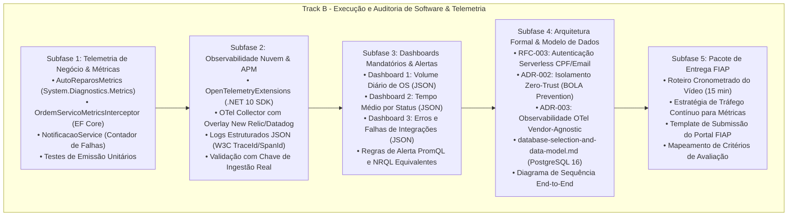

# Plano Mestre de Implementação & Auditoria — Track B: Software, Observabilidade & Pacote de Entrega

> **Projeto:** AutoReparos — Sistema Integrado de Oficina Mecânica  
> **Programa:** FIAP Tech Challenge — SOAT (Fase 3)  
> **Escopo:** Software, Métricas de Negócio, Observabilidade Ponta a Ponta (OTel & New Relic), Dashboards Mandatórios, Documentação Formal e Pacote de Submissão  
> **Diretório Alvo de Entrega:** `docs/specs/fase3/observabilidade/`  
> **Repositórios Envolvidos:** `AutoReparos` (Hub Central), `AutoReparos.App` e `AutoReparos.Infra.K8s`  
> **Status:** Concluído, Auditado & Validado  

---

## 1. Visão Geral Executiva & Contexto Acadêmico

O **Track B da Fase 3** representa a consolidação da camada de software, telemetria distribuída e evidências acadêmicas exigidas pela banca examinadora da FIAP SOAT. Enquanto o Track A estabeleceu a fundação de infraestrutura em nuvem (AWS RDS PostgreSQL 16, EKS v1.30, API Gateway HTTP v2 e governança Git), o Track B implementa:

1. **Telemetria de Negócio Orientada a Eventos:** Instrumentação em código (.NET 10) capturando o ciclo de vida da Ordem de Serviço (OS), tempos de atendimento e falhas em integrações externas sem sobrecarregar a base transacional.
2. **Observabilidade Desacoplada e Vendor-Agnostic:** Pipeline completa de telemetria baseada em OpenTelemetry SDK, OTel Collector, Jaeger (Traces), Loki (Logs), Prometheus (Métricas) e exportação nativa para APM de mercado (New Relic / Datadog) via protocolo padrão OTLP.
3. **Dashboards Executivos Mandatórios:** Provisionamento automatizado dos três painéis exigidos pelo Tech Challenge (Volume Diário de OS, Tempo Médio por Status e Falhas de Integração) com datasources determinísticas no Grafana local e Kubernetes.
4. **Acervo de Arquitetura Formal:** Elaboração das especificações RFC-003 (Autenticação Serverless de Clientes por CPF/Email), ADR-002 (Isolamento Zero-Trust e proteção BOLA), ADR-003 (Estratégia de Observabilidade OTel) e o Modelo de Dados Relacional com justificativa do PostgreSQL 16.
5. **Pacote de Entrega e Defesa Técnica:** Roteiro cronometrado para gravação da demonstração em vídeo (máximo 15 minutos) e minuta de submissão acadêmica formatada para o Portal FIAP.

---

## 2. Mapa Estrutural das 5 Subfases do Track B

---

## 3. Matriz de Rastreabilidade Requisito vs. Implementação

| # | Requisito do Tech Challenge (Fase 3) | Componente Técnico Implementado | Evidência / Artefato de Validação | Status |
|:---:|:---|:---|:---|:---:|
| **R1** | **Métricas de Negócio Customizadas** | `AutoReparosMetrics.cs` + `OrdemServicoMetricsInterceptor.cs` | Contadores `ordens_servico.criadas`, `transicoes_status` e histogramas `tempo_diagnostico`, `tempo_execucao`, `tempo_permanencia`. | **Validado** |
| **R2** | **Detecção de Falhas de Integração Externa** | `NotificacaoService.cs` com try-catch instrumentado | Contador `notificacoes.falhas` com tags contextuais (`canal`, `motivo`, `status_code`). | **Validado** |
| **R3** | **APM de Mercado (New Relic / Datadog)** | OTel Collector com overlay `otel-collector-config.vendor.yaml` | 480 logs, 588 pontos de métrica e 541 spans entregues ao New Relic com zero falhas na autotelemetria. | **Validado** |
| **R4** | **Logs Estruturados & Correlação** | `Program.cs` com `AddJsonConsole` e `ActivityTrackingOptions` | Logs em JSON com `TraceId`, `SpanId` e `ParentId` correlacionados ao W3C TraceContext. | **Validado** |
| **R5** | **Dashboard 1: Volume Diário de OS** | `docs/observability/dashboards/dashboard_volume_diario.json` | Visualização de total em 30 dias, ordens hoje, ordens/hora e transições agregadas por dia. | **Validado** |
| **R6** | **Dashboard 2: Tempo Médio por Status** | `docs/observability/dashboards/dashboard_tempo_medio_status.json` | Gauges de diagnóstico, execução e permanência total calculados em horas a partir de carimbos reais. | **Validado** |
| **R7** | **Dashboard 3: Erros e Integrações** | `docs/observability/dashboards/dashboard_erros_integracoes.json` | Monitoramento de falhas SendGrid, erros 5xx na API e latência do PostgreSQL (`Npgsql`). | **Validado** |
| **R8** | **Políticas de Alerta Automatizadas** | `alert_policies.json` e `prometheus_alert_rules.yml` | Regras para latência p95 (> 2000ms), taxa de erro 5xx (> 5%) e falhas de notificação (> 0 por 3m). | **Validado** |
| **R9** | **Documentação RFCs & ADRs** | `RFC-003`, `ADR-002`, `ADR-003`, `database-selection-and-data-model.md` | Especificações completas com comparativo de alternativas e modelo ER em Mermaid. | **Validado** |
| **R10** | **Pacote de Entrega Acadêmica** | `roteiro_video_demonstracao_15min.md` e `template_entrega_portal_fiap.md` | Checklist pré-gravação com gerador de tráfego e minuta para PDF do Portal FIAP. | **Validado** |

---

## 4. Decomposição das Subfases Detalhadas

A suíte completa de planos detalhados do Track B está organizada em arquivos individuais dedicados:

- **[Subfase 1: Telemetria de Negócio & Métricas](./planos-detalhados/plano_subfase1_telemetria_metricas.md):** Instrumentação profunda do ciclo de vida da OS, interceptor do EF Core, contadores de falhas no SendGrid e suíte de testes unitários.
- **[Subfase 2: Observabilidade Nuvem & APM Vendor](./planos-detalhados/plano_subfase2_observabilidade_nuvem_apm.md):** Arquitetura vendor-agnostic com OTel Collector, exportação New Relic/Datadog, logs JSON e correlação de traces.
- **[Subfase 3: Dashboards Mandatórios & Alertas](./planos-detalhados/plano_subfase3_dashboards_alertas.md):** Especificação das consultas PromQL, provisionamento por bind mount e ConfigMap no Helm, e regras de alerta.
- **[Subfase 4: Arquitetura Formal & Modelo de Dados](./planos-detalhados/plano_subfase4_arquitetura_formal_modelo_dados.md):** Racional técnico da RFC-003, ADR-002, ADR-003, justificativa formal do PostgreSQL 16 e diagramas de sequência.
- **[Subfase 5: Pacote de Entrega FIAP](./planos-detalhados/plano_subfase5_pacote_entrega_fiap.md):** Roteiro cronometrado para o vídeo de até 15 minutos, gestão da janela de métricas e template para submissão no portal da FIAP.

---

## 5. Critérios de Aceite Globais & Definition of Done (DoD)

Para certificar a conformidade do Track B:
1. **Compilação da Solução:** `dotnet build AutoReparos.slnx` executado sem erros.
2. **Suíte Completa de Testes:** `dotnet test AutoReparos.slnx` com 354 de 354 testes aprovados (113 Domain, 40 Lambda, 134 Application, 67 Integration com Testcontainers).
3. **Integridade de Caminhos:** Zero caminhos absolutos (`/home/` ou `file://`) em toda a documentação (`docs/`).
4. **Provisionamento Automático:** 4 dashboards carregados deterministicamente no Grafana local e no Kubernetes sem intervenção manual.
5. **Autotelemetria APM:** Exportador New Relic validado com envio real de logs, métricas e spans.
