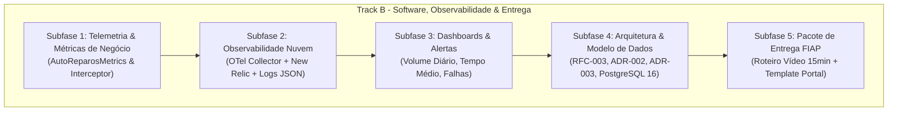

# Plano Mestre de Execução e Auditoria — Track B: Software, Observabilidade & Pacote de Entrega

> **Projeto:** AutoReparos — Sistema Integrado de Oficina Mecânica  
> **Fase:** Tech Challenge FIAP SOAT — Fase 3  
> **Especificação Base:** [`../fase3_spec_track_b_observability_docs.md`](../fase3_spec_track_b_observability_docs.md)  
> **Especificação das Tarefas:** [`../fase3_track_b_tarefas_restantes_spec.md`](../fase3_track_b_tarefas_restantes_spec.md)  
> **Status:** Aprovado & Auditado  
> **Pull Request Principal:** [#35 (feat/fase3-track-b-observabilidade)](https://github.com/Grupo78-PosTech-15SOAT/AutoReparos/pull/35)  

---

## 1. Visão Geral da Auditoria do Track B

Este plano consolida a decomposição, validação empírica e auditoria da implementação do **Track B da Fase 3**. O escopo cobre telemetria de negócio, observabilidade ponta a ponta com OpenTelemetry, dashboards mandatórios, arquitetura formal (RFC-003, ADR-002, ADR-003, Modelo de Dados) e o pacote de submissão acadêmica da FIAP.

### Estrutura de Decomposição em Subfases:

| Subfase | Título | Escopo Principal | Documento do Plano | Status |
|:---:|:---|:---|:---|:---:|
| **1** | **Telemetria de Negócio & Métricas** | Contadores `notificacoes.falhas`, `ordens_servico.criadas`, `transicoes_status` e testes unitários. | [`plano_subfase1_telemetria_metricas.md`](./planos-detalhados/plano_subfase1_telemetria_metricas.md) | **Auditado & Validado** |
| **2** | **Observabilidade Nuvem (APM Vendor)** | OTel Collector com overlay New Relic/Datadog, logs JSON e correlação TraceId/SpanId. | [`plano_subfase2_observabilidade_nuvem_apm.md`](./planos-detalhados/plano_subfase2_observabilidade_nuvem_apm.md) | **Auditado & Validado** |
| **3** | **Dashboards Mandatórios & Alertas** | Os 3 JSONs mandatórios provisionados no Grafana/Helm, Prometheus Alert Rules e Alert Policies. | [`plano_subfase3_dashboards_alertas.md`](./planos-detalhados/plano_subfase3_dashboards_alertas.md) | **Auditado & Validado** |
| **4** | **Arquitetura Formal & Modelo de Dados** | RFC-003, ADR-002, ADR-003, Seleção PostgreSQL 16 e Diagramas de Sequência. | [`plano_subfase4_arquitetura_formal_modelo_dados.md`](./planos-detalhados/plano_subfase4_arquitetura_formal_modelo_dados.md) | **Auditado & Validado** |
| **5** | **Pacote de Entrega FIAP** | Roteiro cronometrado de vídeo (15 min) e Minuta do documento de submissão do Portal FIAP. | [`plano_subfase5_pacote_entrega_fiap.md`](./planos-detalhados/plano_subfase5_pacote_entrega_fiap.md) | **Auditado & Validado** |

---

## 2. Mapa Conceitual e Fluxo de Entrega

---

## 3. Critérios Gerais de Aceite (Definition of Done)

- [x] Solução compila 100% sem erros (`dotnet build AutoReparos.slnx`).
- [x] Suíte completa de 354 testes automatizados aprovada com 100% de sucesso.
- [x] 100% de conformidade com caminhos relativos (zero `/home/` ou `file://`).
- [x] Submódulos sincronizados na branch `feat/fase3-backend-fixes`.
- [x] SonarCloud Quality Gate Aprovado (0 novas issues).
