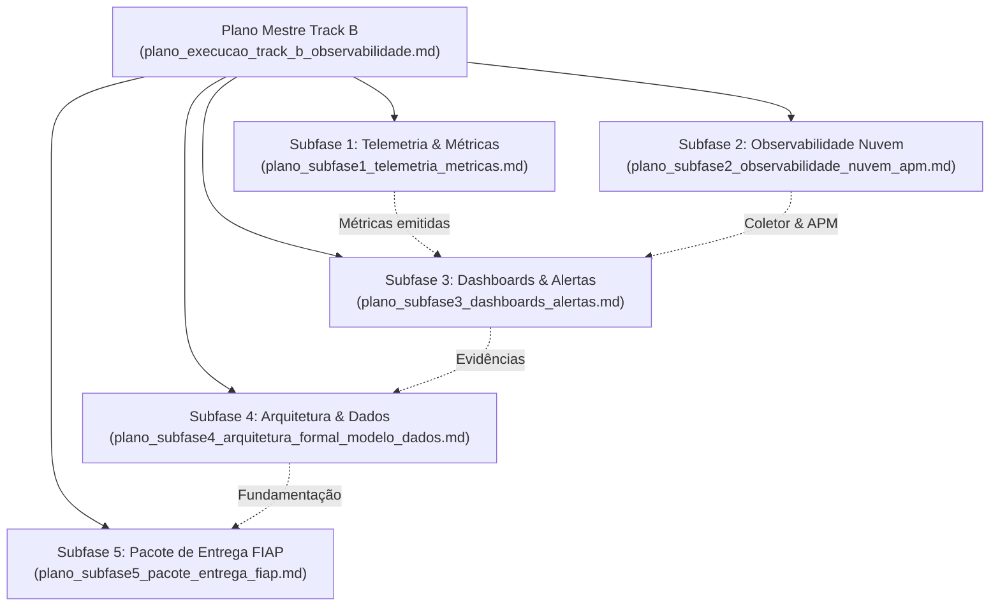

# Índice da Suíte de Planos Detalhados — Track B: Software, Observabilidade & Entrega

> **Projeto:** AutoReparos — Sistema Integrado de Oficina Mecânica  
> **Programa:** FIAP Tech Challenge — SOAT (Fase 3)  
> **Plano Mestre de Execução:** [`../plano_execucao_track_b_observabilidade.md`](../plano_execucao_track_b_observabilidade.md)  
> **Especificação Técnica Base:** [`../fase3_track_b_tarefas_restantes_spec.md`](../fase3_track_b_tarefas_restantes_spec.md)  
> **Status:** Concluído, Auditado & Validado  

---

## 1. Visão Geral da Decomposição do Track B

Para assegurar o mesmo nível de rigor analítico, rastreabilidade técnica e governança estabelecido no Track A, o **Track B** foi decomposto em cinco planos detalhados independentes. Cada plano cobre exaustivamente a fundamentação de engenharia, arquitetura de software, especificação linha a linha de código e configuração, matriz de testes automatizados, análise de riscos e procedimentos de contingência/rollback.

---

## 2. Mapa dos Planos das Subfases

---

## 3. Matriz Executiva dos Planos por Subfase

| Subfase | Título do Plano | Repositório / Diretório | Entregáveis Centrais | Status de Auditoria |
|:---:|:---|:---|:---|:---:|
| **Subfase 1** | [`plano_subfase1_telemetria_metricas.md`](./plano_subfase1_telemetria_metricas.md) | `AutoReparos.App` | Classe central `AutoReparosMetrics`, `OrdemServicoMetricsInterceptor` do EF Core, contador de falhas em `NotificacaoService.cs` e suíte de testes unitários com `MeterListener`. | **Auditado & Aprovado** |
| **Subfase 2** | [`plano_subfase2_observabilidade_nuvem_apm.md`](./plano_subfase2_observabilidade_nuvem_apm.md) | `AutoReparos.App` / Docker | OpenTelemetry SDK (.NET 10), OTel Collector com overlay multi-config para New Relic/Datadog, logs estruturados em JSON com `TraceId`/`SpanId` e validação com chave real. | **Auditado & Aprovado** |
| **Subfase 3** | [`plano_subfase3_dashboards_alertas.md`](./plano_subfase3_dashboards_alertas.md) | `docs/observability/` | Os 3 dashboards mandatórios em JSON (Volume Diário, Tempo Médio por Status, Falhas nas Integrações), provisionamento automático local/EKS e regras de alerta em PromQL e NRQL. | **Auditado & Aprovado** |
| **Subfase 4** | [`plano_subfase4_arquitetura_formal_modelo_dados.md`](./plano_subfase4_arquitetura_formal_modelo_dados.md) | `docs/architecture/` | Redação de RFC-003 (Auth Serverless CPF/Email), ADR-002 (Isolamento Zero-Trust e proteção BOLA), ADR-003 (Observabilidade OTel), Seleção do PostgreSQL 16 e Diagramas de Sequência. | **Auditado & Aprovado** |
| **Subfase 5** | [`plano_subfase5_pacote_entrega_fiap.md`](./plano_subfase5_pacote_entrega_fiap.md) | `docs/entrega/` | Roteiro cronometrado para o vídeo de até 15 minutos (com script de tráfego contínuo) e minuta do documento PDF de submissão formatada com o checklist da banca examinadora. | **Auditado & Aprovado** |

---

## 4. Diretrizes de Governança e Portabilidade

1. **Caminhos Estritamente Relativos:** Todos os links entre os planos e arquivos do repositório utilizam `./` ou `../`, garantindo portabilidade entre diferentes ambientes e cumprindo a Regra 8 do `AGENTS.md`.
2. **Integração Contínua & Testes:** Nenhuma alteração é homologada sem a aprovação integral da suíte de 354 testes da solução (`dotnet test AutoReparos.slnx`).
3. **Padrão de Commits:** Utilização rigorosa do padrão Gitmoji com descrições em português.
