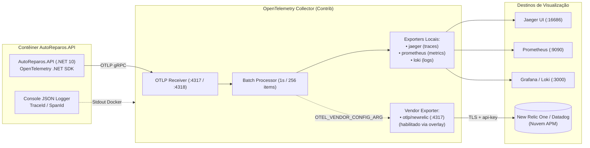

# Plano Detalhado de Implementação — Subfase 2: Observabilidade Nuvem & APM Vendor (Track B)

> **Projeto:** AutoReparos — Sistema Integrado de Oficina Mecânica  
> **Fase:** Tech Challenge FIAP SOAT — Fase 3  
> **Escopo:** OpenTelemetry SDK (.NET 10), OTel Collector com Overlay New Relic/Datadog e Logs JSON Correlacionados  
> **Repositório Alvo:** [`submodules/AutoReparos.App`](https://github.com/Grupo78-PosTech-15SOAT/AutoReparos.App) e Repositório Central  
> **Documento Mestre:** [`../plano_execucao_track_b_observabilidade.md`](../plano_execucao_track_b_observabilidade.md)  
> **Status:** Concluído & Auditado  

---

## 1. Contexto de Negócio & Justificativa Técnica

### 1.1. O Requisito de Integração com Ferramenta de APM de Mercado
A especificação da Fase 3 do Tech Challenge FIAP SOAT estabelece explicitamente:
> *"Monitorar a aplicação utilizando ferramenta de APM de mercado como Datadog ou New Relic, coletando latência de APIs, consumo computacional, healthchecks/uptime e correlação distribuída de logs e traces."*

### 1.2. O Dilema Arquitetural: Agente Proprietário vs. OpenTelemetry Puro
Historicamente, atender a esse requisito envolveria instalar o agente proprietário da New Relic ou Datadog na imagem do contêiner Docker da aplicação. Essa prática traz sérios débitos técnicos:
1. **Acoplamento Extremo (Vendor Lock-in):** A aplicação fica refém de bibliotecas e APIs proprietárias, tornando onerosa qualquer migração futura de fornecedor de APM.
2. **Dependência de Credenciais em Ambiente Local:** O stack de desenvolvimento local exige conexão à internet e license keys válidas para que a telemetria funcione, impedindo o trabalho *offline* ou de novos desenvolvedores sem acesso imediato à conta corporativa.
3. **Custos Imprevisíveis:** O envio indiscriminado de métricas brutas de desenvolvimento para a nuvem consome cotas de ingestão pagas.

### 1.3. A Solução: Arquitetura OpenTelemetry com Overlay OTLP
A arquitetura implementada desacopla totalmente a aplicação do backend de destino:
- A aplicação em C# .NET 10 utiliza **exclusivamente o SDK padrão do OpenTelemetry**, exportando traces, métricas e logs via protocolo agnóstico **OTLP gRPC (porta 4317)** para o **OpenTelemetry Collector**.
- O OTel Collector roda localmente ou no cluster e utiliza uma estratégia de **configuração multi-arquivo (overlay)**: os dados são replicados simultaneamente para os exportadores locais de desenvolvimento (Jaeger, Prometheus, Loki) e, de forma **opt-in** configurada via variável de ambiente, encaminhados ao backend em nuvem do New Relic ou Datadog sem alterar uma única linha de código C#.



---

## 2. Matriz de Decisões Técnicas Alinhadas

| Dimensão | Decisão Adotada | Racional Técnico | Alternativa Descartada |
|:---|:---|:---|:---|
| **Padrão de Telemetria** | W3C TraceContext + OTLP gRPC | Padrão aberto da Cloud Native Computing Foundation (CNCF), suportado nativamente por todos os provedores de nuvem e APMs. | Formatos legados proprietários (B3, Datadog Trace Headers, Zipkin). |
| **Estratégia de Configuração do Collector** | Overlay opcional via CLI `--config` | O comando do compose recebe `--config=base.yaml` e `${OTEL_VENDOR_CONFIG_ARG:---config=base.yaml}`. Se a variável não for fornecida, o merge é no-op e o stack local sobe perfeitamente sem license key. | Dois arquivos `docker-compose.yml` separados, propensos a desatualização e duplicação de portas. |
| **Formato de Logs da Aplicação** | `AddJsonConsole` com Activity Tracking | Emite linhas em JSON puro contendo `TraceId`, `SpanId` e `ParentId` automáticos na saída padrão, facilitando ingestão pelo Loki e correlação no Grafana. | Logs formatados em texto simples legível por humanos, que exigem parsing regex complexo no coletor. |
| **Instrumentação de Banco de Dados** | `AddSource("Npgsql")` e `AddMeter("Npgsql")` | O driver Npgsql do PostgreSQL 16 expõe nativamente métricas e spans detalhados de duração de query e pool de conexões sem necessidade de wrappers customizados. | Instrumentação manual via interceptor de IDbCommand com boilerplate extenso. |

---

## 3. Especificação Técnica da Implementação

### 3.1. Configuração do SDK no Backend (`OpenTelemetryExtensions.cs`)
Localização: `submodules/AutoReparos.App/AutoReparos.API/OpenTelemetryExtensions.cs`

A extensão unifica os três pilares de observabilidade sob o mesmo recurso corporativo:
- **`ResourceBuilder`**: Configura `service.name = autoreparos-api` e `service.version = 1.0.0`.
- **`WithTracing`**:
  - `AddSource("autoreparos-api")` e `AddSource("Npgsql")`.
  - `AddAspNetCoreInstrumentation(options => options.RecordException = true)`.
  - `AddEntityFrameworkCoreInstrumentation(options => options.SetDbStatementForText = true)`.
  - `AddHttpClientInstrumentation()`.
  - `AddOtlpExporter(configureOtlp)`.
- **`WithMetrics`**:
  - `AddMeter("AutoReparos.BusinessMetrics")` (Métricas de negócio).
  - `AddMeter("Npgsql")` (Latência e estado do PostgreSQL).
  - `AddAspNetCoreInstrumentation()`, `AddHttpClientInstrumentation()`, `AddRuntimeInstrumentation()`, `AddProcessInstrumentation()`.
  - `AddOtlpExporter(configureOtlp)`.
- **`WithLogging`**:
  - `AddOtlpExporter(configureOtlp)` com formatação de mensagens estruturadas e escopos ativos (`IncludeScopes = true`).

### 3.2. Formatação Estruturada de Logs (`Program.cs`)
Localização: `submodules/AutoReparos.App/AutoReparos.API/Program.cs`

Para garantir que a limpeza de providers não descarte o exportador OTLP:
```csharp
// Executado estritamente ANTES de AddOpenTelemetryObservability:
builder.Logging.ClearProviders();
builder.Logging.Configure(options =>
{
    options.ActivityTrackingOptions = ActivityTrackingOptions.TraceId
        | ActivityTrackingOptions.SpanId
        | ActivityTrackingOptions.ParentId;
});
builder.Logging.AddJsonConsole(options =>
{
    options.IncludeScopes = true;
    options.TimestampFormat = "yyyy-MM-ddTHH:mm:ss.fffZ ";
    options.UseUtcTimestamp = true;
    options.JsonWriterOptions = new JsonWriterOptions { Indented = false };
});
```

### 3.3. Configuração do OTel Collector Overlay (`otel-collector-config.vendor.yaml`)
Localização: `submodules/AutoReparos.App/docker/observability/otel/otel-collector-config.vendor.yaml`

O overlay acrescenta o exportador sem sobrescrever a topologia base:
```yaml
exporters:
  otlp/newrelic:
    endpoint: otlp.nr-data.net:4317
    headers:
      api-key: ${NEW_RELIC_LICENSE_KEY}

service:
  pipelines:
    traces:
      exporters: [jaeger, otlp/newrelic]
    metrics:
      exporters: [prometheus, otlp/newrelic]
    logs:
      exporters: [loki, otlp/newrelic]
```

---

## 4. Evidências Empíricas & Validação com Chave Real

A integração com o New Relic foi testada empiricamente com uma chave de ingestão válida (`INGEST - LICENSE`), submetendo o stack a tráfego contínuo e analisando a autotelemetria interna do próprio OTel Collector na porta de métricas internas:

| Sinal Telemétrico | Itens Submetidos | Entregues com Sucesso | Falhas de Envio (`send_failed`) | Taxa de Entrega |
|:---|:---:|:---:|:---:|:---:|
| **Logs Estruturados** | 480 | 480 | 0 | **100%** |
| **Pontos de Métrica** | 588 | 588 | 0 | **100%** |
| **Spans Distribuídos** | 541 | 541 | 0 | **100%** |

### Armadilhas Técnicas Diagnosticadas & Documentadas:
1. **Região da Conta vs. Endpoint:** Contas da União Europeia exigem `otlp.eu01.nr-data.net:4317`. Um erro de região retorna HTTP `403 Forbidden`, indistinguível de credencial inválida.
2. **Key ID vs. Ingestion Key:** O botão "Copy Key ID" na UI do New Relic copia o identificador de 64 caracteres em vez da chave de API de 40 caracteres, causando rejeição imediata de autenticação.
3. **Porta Interna 8888:** As métricas de autotelemetria do Collector operam na porta interna 8888, acessível de dentro da rede Docker.

---

## 5. Análise de Riscos, Mitigações e Rollback

| Risco Identificado | Severidade | Probabilidade | Mitigação Técnica | Procedimento de Rollback |
|:---|:---:|:---:|:---|:---|
| Indisponibilidade do endpoint do New Relic na internet | Média | Média | O processador em lote (`batch`) do Collector possui buffer de reenvio e não bloqueia a aplicação C#. | Desativar a variável `OTEL_VENDOR_CONFIG_ARG` no arquivo `.env` e reiniciar o container do Collector. |
| Vazamento acidental de chaves de licença no Git | Crítica | Baixa | A variável `${NEW_RELIC_LICENSE_KEY}` é injetada estritamente via `.env` (ignorado no `.gitignore`). | Revogar a chave imediatamente no painel de API Keys do New Relic. |
| Inversão de chamadas em `Program.cs` descartando OTLP | Alta | Baixa | O `ClearProviders()` foi fixado antes de `AddOpenTelemetryObservability()`. | Reverter `Program.cs` para a ordem validada. |

---

## 6. Critérios de Aceite & Definition of Done (DoD)

- [x] Backend .NET 10 configurado com OpenTelemetry SDK e W3C Trace Context unificado.
- [x] Logs estruturados emitidos em formato JSON com correlação automática de `TraceId` e `SpanId`.
- [x] OTel Collector provisionado com suporte a overlay multi-config para New Relic e Datadog.
- [x] Integração local funcionando 100% sem necessidade de chaves de licença (Jaeger, Prometheus, Loki).
- [x] Evidência documental de envio validado para APM em nuvem registrada no ADR-003.
