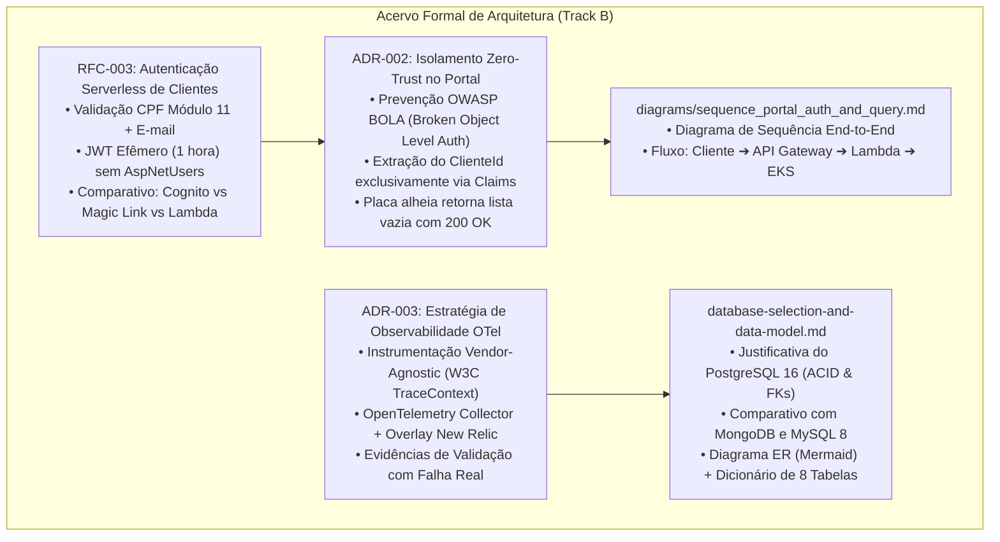

# Plano Detalhado de Implementação — Subfase 4: Arquitetura Formal & Modelo de Dados (Track B)

> **Projeto:** AutoReparos — Sistema Integrado de Oficina Mecânica  
> **Fase:** Tech Challenge FIAP SOAT — Fase 3  
> **Escopo:** Documentos Formais de Arquitetura (RFC-003, ADR-002, ADR-003), Justificativa do PostgreSQL 16 e Modelo ER  
> **Diretório Alvo:** `docs/architecture/`  
> **Documento Mestre:** [`../plano_execucao_track_b_observabilidade.md`](../plano_execucao_track_b_observabilidade.md)  
> **Status:** Concluído & Auditado  

---

## 1. Contexto de Negócio & Justificativa Técnica

### 1.1. O Papel da Documentação Formal de Engenharia
Na avaliação da banca examinadora da FIAP SOAT, a excelência arquitetural é aferida tanto pela robustez do software quanto pela fundamentação teórica das escolhas técnicas tomadas.
- **Rastreabilidade Histórica:** As **RFCs** (*Requests for Comments*) delineiam a visão estratégica e funcional de novas capacidades, enquanto os **ADRs** (*Architecture Decision Records*) documentam os trade-offs e consequências de decisões técnicas estruturantes.
- **Isolamento de Segurança e LGPD:** A autenticação de clientes externos sem senha e a proteção contra vazamento de dados de terceiros exigem demonstração matemática e arquitetural comprovada.
- **Fundamentação de Armazenamento:** A seleção do PostgreSQL 16 gerenciado deve ser contrastada com tecnologias alternativas (NoSQL vs Relacional) com base nos requisitos transacionais do negócio.

---

## 2. Mapa dos Documentos Formais Produzidos no Track B

---

## 3. Especificação Detalhada por Documento

### 3.1. `RFC-003-serverless-client-authentication.md`
- **Problema de Negócio:** Funcionários operacionais (`Mecanico`, `Atendente`, `Admin`) utilizam login e senha persistidos em `AspNetUsers`. O cliente final precisa apenas consultar status e aprovar orçamentos 2 a 3 vezes por serviço. Exigir senha causa abandono de uso e polui a tabela de controle de acesso privilegiado.
- **Decisão:** Criação de uma função serverless desacoplada (`AutoReparos.AuthLambda`) executando em AWS Lambda.
- **Mecanismo de Validação:**
  1. Valida o algoritmo do CPF matematicamente (dígitos verificadores via Módulo 11).
  2. Consulta a existência e o status ativo do cliente na tabela `Clientes` do PostgreSQL 16 via Npgsql.
  3. Compara o e-mail informado com o e-mail cadastrado (case-insensitive).
  4. Emite um token JWT assinado simetricamente com validade de 1 hora, contendo `ClaimTypes.NameIdentifier = Cliente.Id` e `ClaimTypes.Role = "Cliente"`.
- **Alternativas Rejeitadas:**
  - *AWS Cognito:* Descartado pelo custo fixo desnecessário, dependência de infraestrutura proprietária e complexidade de integração com os dados transacionais já existentes.
  - *Magic Link por E-mail:* Descartado pelo tempo de espera e dependência da entrega do provedor de e-mail para consultas imediatas.

### 3.2. `ADR-002-data-isolation-and-zero-trust-claims.md`
- **Contexto:** As rotas do portal do cliente (`/api/clientes/meus-veiculos` e `/api/ordem-servico/minhas-os`) rodam na mesma API e consultam as mesmas tabelas do sistema operacional.
- **Risco Principal:** *Broken Object Level Authorization* (BOLA / IDOR). Se o `clienteId` fosse aceito como parâmetro de querystring ou rota, qualquer usuário autenticado poderia iterar GUIDs e ler o histórico de manutenções de terceiros.
- **Regra de Implementação:**
  1. `PortalClienteController.cs` lê o `ClienteId` unicamente do `ClaimsPrincipal`. Não existem sobrecargas de use case que aceitem identificador vindo do transporte HTTP.
  2. A placa do veículo é tratada como identificador público: se o cliente consultar uma placa que não pertença a ele, o sistema retorna **HTTP 200 OK com array vazio `[]`**, jamais `404 Not Found` (o que revelaria que a placa existe na oficina).
  3. Políticas segregadas: `OperadorOficinaPolicy` (bloqueia token de cliente nas rotas gerenciais) e `ClientePolicy` (bloqueia operadores nas rotas de portal).

### 3.3. `ADR-003-end-to-end-observability-strategy.md`
- **Contexto:** Necessidade de instrumentação em profundidade para diagnóstico e monitoramento corporativo em ambientes híbridos (local e nuvem).
- **Decisão:** Adoção estrita de OpenTelemetry com OTel Collector agnóstico.
- **Validação com Falha Real:** O documento registra evidência empírica de teste com desligamento forçado do container do PostgreSQL durante tráfego contínuo. Resultado: 18 de 18 requisições responderam HTTP 500, ativando imediatamente ambos os painéis de falha e confirmando o alinhamento de nomes de métricas, labels e códigos de resposta.

### 3.4. `database-selection-and-data-model.md`
- **Racional da Escolha do PostgreSQL 16:**
  1. *Consistência Transacional Estrita (ACID):* A aprovação do orçamento altera o status da OS, consome peças do estoque físico e consolida os valores monetários. Sem transações ACID sob isolamento MVCC, ocorreria concorrência e estoque negativo.
  2. *Integridade Referencial com `Restrict` e `Cascade`:* O banco garante que nenhuma entidade com histórico (`Cliente`, `Veiculo`, `Servico`) possa ser removida fisicamente do banco de dados relacional.
  3. *Tipos Ricos e Precisão Financeira:* Utilização de `numeric(18,2)` para valores monetários e `timestamp with time zone` padronizado em UTC.
- **Modelo de Dados Consolidado:** Diagrama Mermaid ER cobrindo as 8 tabelas centrais (`Clientes`, `Veiculos`, `OrdensServico`, `Servicos`, `Insumos`, `OrdensServicoServicos`, `OrdensServicoInsumos`, `AspNetUsers`) com dicionário completo de tipos, constraints e finalidade negocial.

---

## 4. Análise de Riscos, Mitigações e Rollback

| Risco Documental Identificado | Severidade | Probabilidade | Mitigação Técnica | Procedimento de Rollback |
|:---|:---:|:---:|:---|:---|
| Divergência entre código de domínio e diagrama ER | Média | Baixa | Revisão cruzada entre as classes de mapeamento EF Core (`*Mapping.cs`) e as entidades do diagrama Mermaid. | Atualizar o diagrama Mermaid no arquivo Markdown correspondente. |
| Links quebrados entre RFCs e ADRs | Baixa | Baixa | Todos os documentos utilizam estritamente caminhos relativos padronizados (`./` ou `../`). | Corrigir referências relativas. |
| Inconsistência nos diagramas de sequência | Baixa | Baixa | O fluxo reflete exatamente as chamadas de API executadas pelo frontend Angular e backend .NET. | Ajustar as mensagens do diagrama. |

---

## 5. Critérios de Aceite & Definition of Done (DoD)

- [x] Arquivo `RFC-003-serverless-client-authentication.md` finalizado com arquitetura da Lambda.
- [x] Arquivo `ADR-002-data-isolation-and-zero-trust-claims.md` documentando a blindagem contra BOLA.
- [x] Arquivo `ADR-003-end-to-end-observability-strategy.md` com validações empíricas registradas.
- [x] Arquivo `database-selection-and-data-model.md` com comparativo ACID e modelo ER completo.
- [x] Arquivo `diagrams/sequence_portal_auth_and_query.md` com fluxo end-to-end detalhado.
- [x] 100% de conformidade com a regra de caminhos estritamente relativos (Zero caminhos absolutos).
