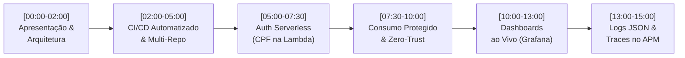

# Plano Detalhado de Implementação — Subfase 5: Pacote de Entrega FIAP & Defesa Técnica (Track B)

> **Projeto:** AutoReparos — Sistema Integrado de Oficina Mecânica  
> **Fase:** Tech Challenge FIAP SOAT — Fase 3  
> **Escopo:** Roteiro Cronometrado de Vídeo Demonstrativo (15 min) e Minuta de Submissão do Portal FIAP  
> **Diretório Alvo:** `docs/entrega/`  
> **Documento Mestre:** [`../plano_execucao_track_b_observabilidade.md`](../plano_execucao_track_b_observabilidade.md)  
> **Status:** Concluído & Auditado  

---

## 1. Contexto de Negócio & Justificativa Técnica

### 1.1. O Desafio da Apresentação Avaliativa
O Tech Challenge da Fase 3 impõe uma restrição severa de tempo: **vídeo demonstrativo de no máximo 15 minutos**. Exceder esse tempo acarreta penalidades diretas na pontuação da banca examinadora.
Para cobrir com profundidade a segregação em 4 repositórios, pipelines de CI/CD, autenticação serverless com CPF, consumo protegido de APIs, os 3 dashboards em tempo real e a correlação de logs e traces distribuídos, a gravação não pode depender de improviso:
- **Roteiro Segundo a Segundo:** O documento define falas prontas, transições de tela e objetivos pedagógicos por bloco.
- **Prevenção de Falhas de Demonstração (Demo Effect):** Métricas e taxas de erro demoram até 5 minutos para consolidar amostras estatísticas no Prometheus. Sem um checklist rigoroso com injeção prévia de tráfego contínuo, os painéis apareceriam em branco ou com taxas de 100% de erro distorcidas.

---

## 2. Roteiro Cronometrado do Vídeo Demonstrativo (15 Minutos)

Arquivo: `docs/entrega/roteiro_video_demonstracao_15min.md`



### 2.1. Divisão Detalhada dos Blocos de Apresentação

| Bloco | Janela de Tempo | Conteúdo Mandatório da Apresentação | Tela / Aplicação |
|:---:|:---:|:---|:---|
| **1** | `00:00 - 02:00` | Apresentação do grupo (15SOAT / Grupo 78), contextualização do negócio da oficina e visão macro da arquitetura em 4 repositórios no GitHub. | Slide de capa + Diagrama de Componentes Cloud. |
| **2** | `02:00 - 05:00` | Demonstração das pipelines no GitHub Actions: build, suíte de 354 testes, análise SonarCloud, Terraform plan/apply automático e governança da branch `main`. | Interface do GitHub Actions nos repositórios. |
| **3** | `05:00 - 07:30` | Chamada à rota `/auth/cliente` no API Gateway: validação de CPF (Módulo 11), checagem no PostgreSQL gerenciado e emissão do JWT efêmero (1h). | Swagger / Postman / Portal Web. |
| **4** | `07:30 - 10:00` | Uso do token JWT para consultar `/api/clientes/meus-veiculos` e `/api/ordem-servico/minhas-os`. Demonstração do isolamento Zero-Trust (filtro de placa alheia devolvendo array vazio com HTTP 200). | Navegador / Swagger UI. |
| **5** | `10:00 - 13:00` | Apresentação ao vivo dos 3 dashboards no Grafana: Volume Diário de OS, Tempo Médio por Status e Erros de Integrações/Latência de Banco. | Grafana (`localhost:3000`) pasta *AutoReparos*. |
| **6** | `13:00 - 15:00` | Rastreamento distribuído de requisições no Jaeger / New Relic e logs estruturados em JSON com campos `TraceId` e `SpanId` correlacionados. | Jaeger UI + Terminal Docker logs. |

### 2.2. Checklist Pré-Gravação & Gerador de Tráfego Contínuo
Para evitar painéis vazios durante o Bloco 5:
- Iniciar o script de tráfego contínuo **pelo menos 10 minutos antes** da gravação do bloco de dashboards:
```bash
TOKEN="<token_obtido_no_login>"
while true; do
  curl -s -o /dev/null -H "Authorization: Bearer $TOKEN" "http://localhost:8080/api/clientes?PageNumber=1&PageSize=10"
  curl -s -o /dev/null -H "Authorization: Bearer $TOKEN" "http://localhost:8080/api/ordem-servico/kanban"
  sleep 2
done
```

---

## 3. Minuta do Documento de Submissão do Portal FIAP

Arquivo: `docs/entrega/template_entrega_portal_fiap.md`

O documento consolida os dados institucionais para compilação em formato PDF:
1. **Identificação do Grupo:** Turma 15SOAT, Grupo 78 e relação completa de integrantes e RMs.
2. **Quadro de URLs dos Repositórios Oficiais:**
   - Repositório Pai / Hub: `https://github.com/Grupo78-PosTech-15SOAT/AutoReparos`
   - Aplicação Principal: `https://github.com/Grupo78-PosTech-15SOAT/AutoReparos.App`
   - Função Serverless: `https://github.com/Grupo78-PosTech-15SOAT/AutoReparos.AuthLambda`
   - Infraestrutura Database: `https://github.com/Grupo78-PosTech-15SOAT/AutoReparos.Infra.Database`
   - Infraestrutura Kubernetes: `https://github.com/Grupo78-PosTech-15SOAT/AutoReparos.Infra.K8s`
3. **Mapeamento de Conformidade com o Edital:** Tabela relacionando os requisitos de avaliação da banca com os capítulos das RFCs e ADRs correspondentes.
4. **Campos Marcados com `🔲`:** Delimitação clara dos itens que requerem preenchimento final da equipe (Link do YouTube/Vimeo e prints de evidência do colaborador `soat-architecture`).

---

## 4. Análise de Riscos, Mitigações e Contingências (Planos B)

| Situação Crítica na Gravação | Impacto | Mitigação / Plano B Documentado no Roteiro |
|:---|:---:|:---|
| Indisponibilidade da AWS no momento da gravação | Alto | O roteiro possui seção alternativa demonstrando a Lambda e a API executando localmente via Docker Compose. |
| Painéis do Grafana exibindo 100% de taxa de erro | Médio | O roteiro orienta verbalizar a explicação estatística: tráfego esparso faz requisições 200 saírem da janela de 5 minutos antes dos erros. |
| Queda de conexão com New Relic | Baixo | Demonstrar a autotelemetria local no Jaeger e Prometheus, comprovando a arquitetura agnóstica do OTel Collector. |

---

## 5. Critérios de Aceite & Definition of Done (DoD)

- [x] Roteiro cronometrado de 15 minutos finalizado em `docs/entrega/roteiro_video_demonstracao_15min.md`.
- [x] Checklist pré-gravação documentado com script de tráfego contínuo.
- [x] Minuta de submissão acadêmica formatada e pronta para compilação em `docs/entrega/template_entrega_portal_fiap.md`.
- [x] Planos B e contingências operacionais registradas para cada bloco de demonstração.
- [x] Links relativos estritos validados em toda a estrutura do pacote de entrega.
