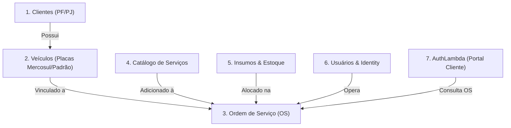
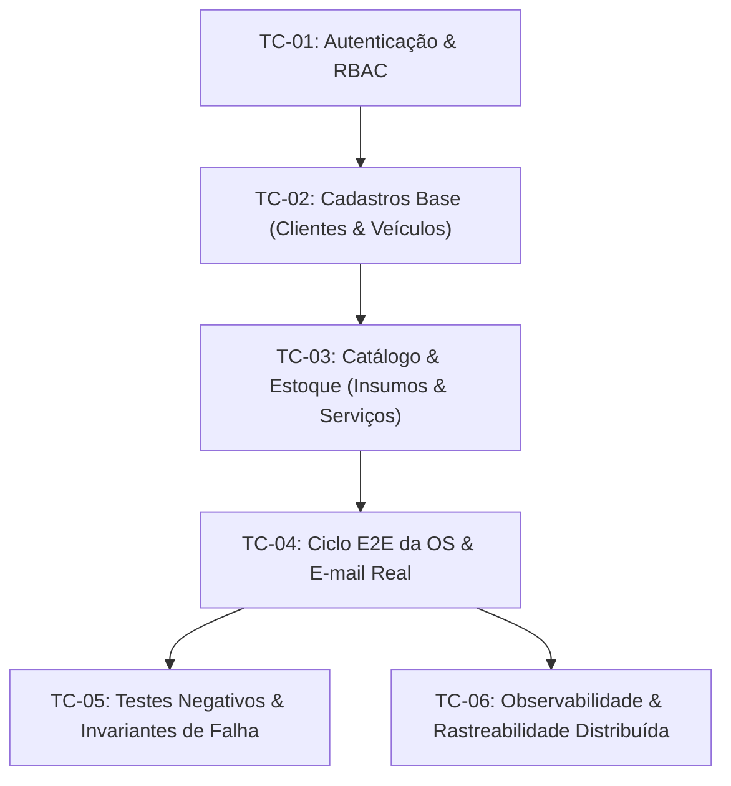

# Especificação Técnica de Testes Integrados: AutoReparos (Docker Compose & Nuvem AWS)

> **Projeto:** AutoReparos - Sistema Integrado de Oficina Mecânica  
> **Fase:** Fase 3 Tech Challenge (SOAT FIAP)  
> **Escopo:** Especificação de Testes Reais em 2 Etapas (Etapa 1: Docker Compose Local | Etapa 2: AWS Cloud Terraform & Kubernetes EKS)  
> **Status:** Aprovada e Alinhada com o Usuário  
> **E-mail de Teste do Cliente (SendGrid):** `josehenriquedotta61@gmail.com`  
> **Observabilidade em Nuvem:** New Relic Ingest License Ativa (`OTEL_VENDOR_CONFIG_ARG` habilitado)  
> **AWS Account:** `683444362184` (`us-east-1`) via AWS CLI  
> **Referências Arquiteturais:**  
> - [`../../architecture/RFC-001-cloud-architecture-and-4-repositories.md`](../../architecture/RFC-001-cloud-architecture-and-4-repositories.md)  
> - [`../../architecture/RFC-002-relational-database-managed-service.md`](../../architecture/RFC-002-relational-database-managed-service.md)  
> - [`../../architecture/ADR-001-api-gateway-selection.md`](../../architecture/ADR-001-api-gateway-selection.md)  
> - [`../cloud-iac/fase3_spec_track_a_cloud_iac.md`](../cloud-iac/fase3_spec_track_a_cloud_iac.md)  
> - [`../observabilidade/fase3_spec_track_b_observability_docs.md`](../observabilidade/fase3_spec_track_b_observability_docs.md)  
> - [`../auth-lambda-portal/fase3_spec_track_c_auth_lambda_portal.md`](../auth-lambda-portal/fase3_spec_track_c_auth_lambda_portal.md)  

---

## 1. Contexto de Conhecimento e Arquitetura

O **AutoReparos** é um sistema distribuído de gestão de oficina mecânica automotiva de alta disponibilidade, estruturado sob os princípios de **Clean Architecture**, **Domain-Driven Design (DDD)** e **Vertical Slice Architecture**.

O ecossistema divide-se em 4 submódulos segregados (arquitetura multi-repo orquestrada pelo repositório pai):
1. **`submodules/AutoReparos.App`**: Núcleo da aplicação monolítica modular, contendo:
   - `AutoReparos.Domain`: Entidades ricas, Value Objects, contratos de repositório e regras de negócio sem dependência externa.
   - `AutoReparos.Application`: Casos de uso, DTOs, validações e orquestrações de fluxo.
   - `AutoReparos.Infra`: Persistência com Entity Framework Core 10, PostgreSQL 16 (Npgsql), ASP.NET Core Identity, JWT interno e SendGrid.
   - `AutoReparos.API`: Minimal APIs RESTful, documentação Swagger/OpenAPI, injeção de dependência e OpenTelemetry SDK.
   - `AutoReparos.Web`: Frontend SPA em Angular 19 com Standalone Components e Signals reativos.
2. **`submodules/AutoReparos.AuthLambda`**: Micro-função serverless em .NET 10 executada na AWS Lambda para autenticação leve e sem senha de clientes finais (validação matemática Módulo 11 de CPF e emissão de JWT efêmero de 1 hora com claim `role: "Cliente"`).
3. **`submodules/AutoReparos.Infra.Database`**: Módulo IaC Terraform provisionando AWS RDS PostgreSQL 16 em subnets privadas, Security Groups de isolamento e AWS Secrets Manager para credenciais dinâmicas.
4. **`submodules/AutoReparos.Infra.K8s`**: Módulo IaC Terraform e Helm Charts provisionando VPC multi-AZ, AWS EKS com Managed Node Groups, HPA (Horizontal Pod Autoscaling), Ingress NGINX e AWS API Gateway HTTP API v2 (`/auth/cliente` -> Lambda; `/api/{proxy+}` -> EKS).

### Modelo de Execução dos Testes em 2 Etapas
Para garantir cobertura empírica e mitigar falhas em ambiente de nuvem, o processo de testes é dividido estritamente em duas etapas sequenciais:
- **Etapa 1 (Docker Compose Local):** Validação funcional ponta a ponta de todas as regras de domínio, transições de estado, concorrência, emissão de e-mails reais (SendGrid para `josehenriquedotta61@gmail.com`), interceptores de CORS, e exportação OTel local (Prometheus, Jaeger, Loki, Grafana) e nuvem (New Relic).
- **Etapa 2 (AWS Cloud Staging/Production):** Validação de provisionamento IaC (Terraform), deploy do Helm chart no EKS, roteamento do AWS API Gateway v2, integração com RDS PostgreSQL gerenciado via subnets privadas, execução da Lambda Serverless, HPA sob carga e telemetria no New Relic.

---

## 2. Domínio de Negócio e Regras Críticas

O sistema gerencia seis contextos delimitados (Bounded Contexts) centrais:

### 2.1. Ciclo de Vida da Ordem de Serviço (`OrdemServico`)
A máquina de estados da Ordem de Serviço é rigorosa e não permite transições arbitrárias:
1. **Rascunho (`Criada`):** Criada por operador de oficina para determinado cliente e veículo.
2. **Em Diagnóstico (`DiagnosticoIniciado`):** Mecânico inspeciona o veículo e inclui serviços e insumos necessários.
3. **Aguardando Aprovação (`AguardandoAprovacao`):** Ao concluir o orçamento, a OS é disparada para o cliente. Um token HMAC criptográfico (`APROVACAO_TOKEN_SECRET`) é gerado com validade temporal e despachado via SendGrid com link público de aprovação/recusa para `josehenriquedotta61@gmail.com`.
4. **Aprovada ou Rejeitada (`Aprovada` / `Cancelada`):** 
   - Se aprovada pelo cliente (via link no e-mail ou portal), a OS avança para autorização de execução.
   - Se rejeitada, o status é cancelado e nenhuma dedução física de estoque é efetuada.
5. **Em Andamento (`EmExecucao`):** Os serviços individuais vinculados à OS são iniciados e concluídos pelos mecânicos.
6. **Finalizada (`Finalizada`):** Todos os serviços foram concluídos e os insumos foram consolidados.
7. **Entregue (`Entregue`):** Registro de retirada do veículo pelo cliente; a OS sai da fila operacional de trabalho da oficina.

### 2.2. Regras de Insumos e Débito de Estoque
- Um insumo possui quantidade em estoque e custo unitário.
- Ao alocar insumo em OS, a quantidade reservada não pode exceder o estoque disponível.
- A baixa física do estoque é efetuada no ciclo de execução do serviço/fechamento da OS.
- Tentativas de movimentar estoque além do saldo devem gerar erro de regra de negócio (`BusinessRuleException` / HTTP 400 ou 422), preservando invariantes atômicos.

### 2.3. Segregação de Identidade e Perfis de Acesso
- **Operadores Internos (Oficina):** Administrador, Mecânico e Recepcionista autenticam-se em `POST /api/auth/login` (Identity) e recebem JWT com claims de role operacional (`OperadorOficina`).
- **Clientes Externos:** Autenticam-se exclusivamente via `POST /auth/cliente` (Portal do Cliente via AuthLambda) com CPF e Email válidos, recebendo JWT de curta duração com claim restrita `ClientePolicy` (acesso apenas a `/api/ordem-servico/minhas-os` e consulta pública de suas OS).

---

## 3. Alvo dos Testes (Target Environments & Componentes)

| Componente | Etapa 1: Docker Compose Local | Etapa 2: AWS Nuvem (Terraform + EKS) |
| :--- | :--- | :--- |
| **Banco de Dados** | Contêiner `postgres:16` (Porta `5433` -> `5432`) | AWS RDS PostgreSQL 16 Multi-AZ (Subnets Privadas) |
| **Backend API** | Contêiner `autoreparos-api` (Porta `8080`) | Pods Kubernetes `AutoReparos.API` (.NET 10) no EKS |
| **Frontend Web** | Contêiner `autoreparos-web` (Porta `4200`) | Pods Kubernetes `AutoReparos.Web` (Angular 19 Nginx) |
| **Auth Cliente** | Simulado / Endpoint de Teste e/ou Lambda Container | AWS Lambda Serverless integrada ao API Gateway v2 |
| **API Gateway** | Roteamento direto local / Nginx proxy | AWS API Gateway HTTP API v2 com VPC Link |
| **Envio de E-mail** | SendGrid API Real para `josehenriquedotta61@gmail.com` | SendGrid API Real injetada via Secrets Manager |
| **Observabilidade Tracing** | Jaeger All-in-One (`http://localhost:16686`) & New Relic | OpenTelemetry Collector exportando para New Relic |
| **Observabilidade Métricas**| Prometheus (`http://localhost:9090`) & New Relic | Prometheus K8s + New Relic Metrics |
| **Observabilidade Logs** | Grafana Loki (`http://localhost:3100`) & New Relic | Loki / CloudWatch / New Relic Logs |
| **Dashboards / UI** | Grafana (`http://localhost:3000`) & New Relic One | New Relic One Dashboards + Grafana K8s |

---

## 4. Matriz de Testes Críticos

A bateria de testes reais é categorizada em 6 grupos críticos:

### 4.1. Grupo TC-01: Autenticação, Perfis e Políticas de Acesso
- **Seed User Login:** Autenticação do usuário inicial `SEED_USER_EMAIL` / `SEED_USER_PASSWORD`. Validação da emissão do JWT, expiração e claim `OperadorOficina`.
- **RBAC Enforcement:** Tentativa de acesso a rotas operacionais (`/api/ordem-servico`, `/api/clientes`) sem header Authorization (deve retornar `401 Unauthorized`).
- **Portal do Cliente (AuthLambda):** Autenticação com CPF e E-mail de cliente cadastrado (`josehenriquedotta61@gmail.com`). Validação de emissão de JWT efêmero (1 hora) e acesso restrito a `GET /api/ordem-servico/minhas-os`.
- **Tentativa de Acesso Cruzado:** Token de cliente tentando criar cliente operacional ou acessar `/api/usuarios` (deve retornar `403 Forbidden`).

### 4.2. Grupo TC-02: Cadastros Base e Validação de Value Objects
- **Cliente PF Real:** Cadastro com CPF válido gerado matematicamente (Módulo 11), nome do usuário e e-mail real `josehenriquedotta61@gmail.com`.
- **Cliente PJ:** Cadastro com CNPJ válido e razão social.
- **Rejeição de Documentos Inválidos:** Teste de cadastro com CPF inválido, tamanho incorreto ou dígitos repetitivos (`111.111.111-11`), confirmando retorno `400 Bad Request`.
- **Veículo com Placa Padrão e Mercosul:** Cadastro de veículos nos dois padrões aceitos (`ABC-1234` e `BRA2E19`).
- **Rejeição de Placa Inválida:** Placas fora do padrão devem ser rejeitadas pelo Value Object `Placa`.

### 4.3. Grupo TC-03: Catálogo de Serviços e Insumos (Controle de Estoque)
- **Criação de Serviços:** Cadastro de diagnóstico e manutenção preventiva com horas estimadas e valor base.
- **Criação de Insumos com Estoque Inicial:** Cadastro de óleo lubrificante, pastilhas de freio e filtros com quantidade controlada.
- **Atualização de Estoque:** Incremento via API e validação de persistência transacional.

### 4.4. Grupo TC-04: Fluxo E2E da Ordem de Serviço & Aprovação por E-mail Real
1. **Abertura da OS:** `POST /api/ordem-servico` vinculando o cliente (`josehenriquedotta61@gmail.com`) e o veículo criado.
2. **Inclusão de Itens:** Adicionar serviços (`POST /api/ordem-servico/{id}/servicos`) e insumos (`POST /api/ordem-servico/{id}/insumos`).
3. **Início do Diagnóstico:** Transição para `DiagnosticoIniciado`.
4. **Envio para Aprovação:** `PATCH /api/ordem-servico/{id}/enviar-para-aprovacao`.
   - **Verificação SendGrid:** A API dispara e-mail real para `josehenriquedotta61@gmail.com` com o link de aprovação/rejeição contendo token assinado.
   - **Pausa Interativa:** O executor de teste pausa e exibe instrução para o usuário abrir o e-mail em sua caixa postal real e clicar no link.
5. **Aprovação do Orçamento:** Acionamento do endpoint `GET /api/ordem-servico/aprovar?token={token}` pelo link recebido no e-mail.
6. **Execução e Baixa de Insumos:** Iniciar e concluir serviços vinculados (`iniciar` -> `concluir`).
7. **Entrega:** Finalizar e entregar o veículo (`entregar`), validando baixa física de estoque no PostgreSQL.

### 4.5. Grupo TC-05: Testes Negativos e Violação de Invariantes
- **Aprovação Duplicada:** Acionar o mesmo token de aprovação mais de uma vez (deve falhar com `400 Bad Request` ou expiração).
- **Token Adulterado:** Enviar token com assinatura corrompida (deve falhar com `400 Bad Request`).
- **Transição Inválida de Status:** Tentar entregar uma OS que ainda está em rascunho ou recusada (deve falhar com violação de regra de negócio).
- **Estoque Insuficiente:** Tentar alocar em uma OS quantidade de insumos maior que o saldo em estoque (deve recusar a transação).
- **Duplicidade de CPF/CNPJ ou Placa:** Cadastrar cliente ou veículo repetido (deve retornar erro de unicidade).

### 4.6. Grupo TC-06: Observabilidade, Rastreabilidade e Nuvem AWS
- **OpenTelemetry Trace Context:** Toda chamada HTTP gera `traceId` propagado por `traceparent` (W3C), visível no Jaeger e New Relic.
- **Exportação de Métricas:** Contadores `http_requests_total` e tempos de resposta no Prometheus e New Relic Metrics.
- **Estrutura de Logs:** Logs estruturados no Loki e New Relic Logs.
- **AWS API Gateway v2 Proxy & CORS:** Validação de headers `Access-Control-Allow-Origin`, preflight `OPTIONS` e roteamento sem quebra de path.
- **EKS HPA & Ingress Nginx:** Validação de tráfego pelo Ingress e réplicas saudáveis no cluster.
