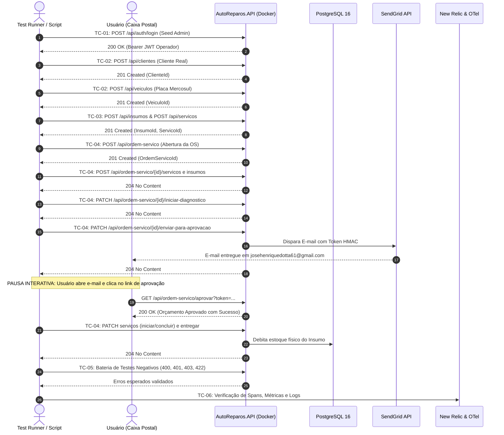
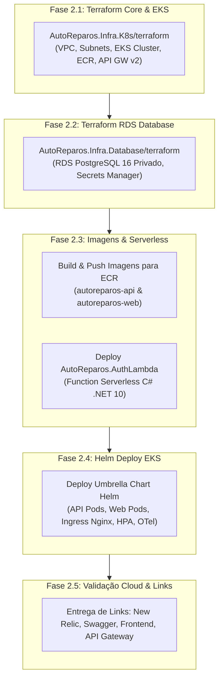

# Plano Detalhado de Testes: AutoReparos (Etapa 1: Docker Compose | Etapa 2: Nuvem AWS)

> **Projeto:** AutoReparos - Sistema Integrado de Oficina Mecânica  
> **Fase:** Fase 3 Tech Challenge (SOAT FIAP)  
> **Documento Vinculado:** [`./especificacao_testes_docker_aws.md`](./especificacao_testes_docker_aws.md)  
> **Destinatário do E-mail Real (SendGrid):** `josehenriquedotta61@gmail.com`  
> **Chave New Relic Ativa:** `70df62a1f5816b597f353fbccc1e0453bce2NRAL`  
> **Conta AWS Autenticada:** `683444362184` (Região `us-east-1`)  
> **Status:** Etapa 1 (Docker Compose) 100% Concluída com Sucesso | Iniciando Etapa 2 (AWS Nuvem)  

---

## 1. Visão Geral e Estratégia de Execução

Este documento especifica cada caso de teste a ser executado no AutoReparos, cobrindo:
1. **Rotas exatas e verbos HTTP.**
2. **Headers obrigatórios e contexto de autenticação/rastreabilidade.**
3. **Payloads JSON completos de requisição e dados reais.**
4. **Respostas esperadas (Status Code, campos do JSON e assertivas de integridade).**
5. **Cenários negativos mandatórios (testes que devem falhar c                                                                                                                                                     om 400, 401, 403, 404 ou 422).**
6. **Fluxo interativo de e-mail real com pausa para intervenção do usuário.**
7. **Roteiro de provisionamento, teste e entrega dos links na nuvem AWS.**

---

## 2. Configuração de Variáveis e Ambientes

As variáveis são consumidas diretamente do arquivo `.env` na raiz do repositório:

| Variável | Valor Configurado / Origem | Finalidade |
| :--- | :--- | :--- |
| `BASE_URL_LOCAL` | `http://localhost:8080` | URL base da API .NET 10 no Docker Compose |
| `WEB_URL_LOCAL` | `http://localhost:4200` | URL base do Frontend Angular 19 |
| `SWAGGER_URL_LOCAL` | `http://localhost:8080/swagger/index.html` | Interface Swagger da API |
| `GRAFANA_URL_LOCAL` | `http://localhost:3000` | Painéis Grafana (login: `admin` / `admin`) |
| `JAEGER_URL_LOCAL` | `http://localhost:16686` | Interface de Traces do Jaeger |
| `SEED_USER_EMAIL` | Do `.env` (`admin@autoreparos.com`) | E-mail do Administrador inicial |
| `SEED_USER_PASSWORD` | Do `.env` | Senha do Administrador inicial |
| `TEST_CLIENTE_EMAIL` | `josehenriquedotta61@gmail.com` | E-mail do cliente real para notificação SendGrid |
| `NEW_RELIC_LICENSE_KEY`| Do `.env` (`...NRAL`) | Ingestão de traces, métricas e logs no New Relic |
| `AWS_ACCOUNT_ID` | `683444362184` | Conta AWS validada via STS |
| `AWS_REGION` | `us-east-1` | Região de provisionamento na nuvem |

---

## 3. Etapa 1: Bateria Detalhada de Testes no Docker Compose



---

### Grupo TC-01: Autenticação, RBAC e Token Management

#### Caso TC-1.1: Login do Seed User (Sucesso)
- **Método:** `POST`
- **Rota:** `/api/auth/login`
- **Headers:** `Content-Type: application/json`
- **Payload Request:**
  ```json
  {
    "email": "${SEED_USER_EMAIL}",
    "password": "${SEED_USER_PASSWORD}"
  }
  ```
- **Status Esperado:** `200 OK`
- **Validações de Response:**
  - O JSON deve conter `token` (string JWT válida no formato `header.payload.signature`).
  - O JSON deve conter `expiresIn` (número inteiro $> 0$).
  - O payload decodificado do JWT deve conter as claims: `email` igual ao `SEED_USER_EMAIL`, `role` contendo `Administrador` ou `OperadorOficina`.
- **Ação subsequente:** Armazenar este token na variável de contexto `ADMIN_TOKEN`.

#### Caso TC-1.2: Acesso a Rota Protegida sem Token (Teste Negativo)
- **Método:** `GET`
- **Rota:** `/api/ordem-servico`
- **Headers:** *(Nenhum header Authorization)*
- **Status Esperado:** `401 Unauthorized`
- **Validação:** Acesso negado pela política global de autorização.

#### Caso TC-1.3: Login com Senha Inválida (Teste Negativo)
- **Método:** `POST`
- **Rota:** `/api/auth/login`
- **Headers:** `Content-Type: application/json`
- **Payload Request:**
  ```json
  {
    "email": "${SEED_USER_EMAIL}",
    "password": "SenhaCompletamenteIncorreta123!"
  }
  ```
- **Status Esperado:** `401 Unauthorized` ou `400 Bad Request`
- **Validação:** Não deve emitir token e deve registrar log de falha de autenticação.

---

### Grupo TC-02: Cadastros Base e Validação de Value Objects

#### Caso TC-2.1: Cadastro de Cliente PF Real (Sucesso)
- **Método:** `POST`
- **Rota:** `/api/clientes`
- **Headers:** 
  - `Content-Type: application/json`
  - `Authorization: Bearer ${ADMIN_TOKEN}`
- **Payload Request:**
  ```json
  {
    "nome": "José Henrique Dotta",
    "documento": "52998224725",
    "email": "josehenriquedotta61@gmail.com",
    "telefone": "11987654321",
    "tipoCliente": 1
  }
  ```
  *(Nota: CPF matematicamente válido gerado pelo algoritmo Módulo 11).*
- **Status Esperado:** `201 Created`
- **Validações de Response:**
  - O JSON deve retornar `id` (GUID do cliente criado).
  - O campo `documento` formatado ou limpo deve bater com o enviado.
  - O campo `email` deve ser exatamente `josehenriquedotta61@gmail.com`.
- **Ação subsequente:** Armazenar `CLIENTE_ID` e `CLIENTE_CPF = "52998224725"`.

#### Caso TC-2.2: Tentativa de Cadastro com CPF Matemático Inválido (Teste Negativo)
- **Método:** `POST`
- **Rota:** `/api/clientes`
- **Headers:** 
  - `Content-Type: application/json`
  - `Authorization: Bearer ${ADMIN_TOKEN}`
- **Payload Request:**
  ```json
  {
    "nome": "Cliente Invalido Teste",
    "documento": "11111111111",
    "email": "invalido@teste.com",
    "telefone": "11999999999",
    "tipoCliente": 1
  }
  ```
- **Status Esperado:** `400 Bad Request`
- **Validações de Response:**
  - O corpo do erro deve indicar falha de validação no Value Object `CPF` (ex: `"CPF inválido"` ou `"Documento inválido"`).

#### Caso TC-2.3: Cadastro de Veículo com Placa Padrão Mercosul (Sucesso)
- **Método:** `POST`
- **Rota:** `/api/veiculos`
- **Headers:** 
  - `Content-Type: application/json`
  - `Authorization: Bearer ${ADMIN_TOKEN}`
- **Payload Request:**
  ```json
  {
    "clienteId": "${CLIENTE_ID}",
    "placa": "BRA2E19",
    "marca": "Toyota",
    "modelo": "Corolla 2.0 Dynamic",
    "ano": 2023,
    "quilometragem": 28500
  }
  ```
- **Status Esperado:** `201 Created`
- **Validações de Response:**
  - O JSON deve retornar `id` (GUID do veículo).
  - O campo `placa` deve ser `"BRA2E19"`.
- **Ação subsequente:** Armazenar `VEICULO_ID`.

#### Caso TC-2.4: Cadastro de Veículo com Placa Inválida (Teste Negativo)
- **Método:** `POST`
- **Rota:** `/api/veiculos`
- **Headers:** 
  - `Content-Type: application/json`
  - `Authorization: Bearer ${ADMIN_TOKEN}`
- **Payload Request:**
  ```json
  {
    "clienteId": "${CLIENTE_ID}",
    "placa": "PLACA_TOTALMENTE_ERRADA_123",
    "marca": "Fiat",
    "modelo": "Uno",
    "ano": 2010,
    "quilometragem": 100000
  }
  ```
- **Status Esperado:** `400 Bad Request`
- **Validações de Response:**
  - O erro deve especificar rejeição pelo Value Object `Placa`.

---

### Grupo TC-03: Catálogo de Serviços e Controle de Insumos

#### Caso TC-3.1: Cadastro de Insumo com Estoque Controlado (Sucesso)
- **Método:** `POST`
- **Rota:** `/api/insumos`
- **Headers:** 
  - `Content-Type: application/json`
  - `Authorization: Bearer ${ADMIN_TOKEN}`
- **Payload Request:**
  ```json
  {
    "nome": "Óleo Motor Sintético 5W30",
    "descricao": "Óleo 100% sintético para motores flex",
    "quantidadeEstoque": 10,
    "custoUnitario": 45.00
  }
  ```
- **Status Esperado:** `201 Created`
- **Validações de Response:**
  - Deve retornar `id` (GUID do insumo).
  - `quantidadeEstoque` igual a `10`.
  - `custoUnitario` igual a `45.00`.
- **Ação subsequente:** Armazenar `INSUMO_ID`.

#### Caso TC-3.2: Cadastro de Serviço Mecânico (Sucesso)
- **Método:** `POST`
- **Rota:** `/api/servicos`
- **Headers:** 
  - `Content-Type: application/json`
  - `Authorization: Bearer ${ADMIN_TOKEN}`
- **Payload Request:**
  ```json
  {
    "nome": "Troca de Óleo e Filtros",
    "descricao": "Substituição completa do óleo do cárter e filtros de motor",
    "valorMaoDeObra": 120.00,
    "tempoEstimadoHoras": 1.5
  }
  ```
- **Status Esperado:** `201 Created`
- **Validações de Response:**
  - Retorna `id` (GUID do serviço) e campos consistentes.
- **Ação subsequente:** Armazenar `SERVICO_ID`.

---

### Grupo TC-04: Ciclo E2E da Ordem de Serviço com E-mail Real e Pausa Interativa

#### Caso TC-4.1: Criação da Ordem de Serviço em Rascunho
- **Método:** `POST`
- **Rota:** `/api/ordem-servico`
- **Headers:** 
  - `Content-Type: application/json`
  - `Authorization: Bearer ${ADMIN_TOKEN}`
- **Payload Request:**
  ```json
  {
    "clienteId": "${CLIENTE_ID}",
    "veiculoId": "${VEICULO_ID}",
    "relatoCliente": "Revisão periódica de 30.000 km e troca preventiva de óleo."
  }
  ```
- **Status Esperado:** `201 Created`
- **Validações de Response:**
  - Retorna `id` (GUID da OS).
  - Status inicial igual a `Criada` (ou enum correspondente).
- **Ação subsequente:** Armazenar `OS_ID`.

#### Caso TC-4.2: Adição de Serviço e Insumo à OS
- **Passo A (Adicionar Serviço):**
  - **Método:** `POST`
  - **Rota:** `/api/ordem-servico/${OS_ID}/servicos`
  - **Payload:** `{"servicoId": "${SERVICO_ID}", "quantidade": 1}`
  - **Status Esperado:** `204 No Content`
- **Passo B (Adicionar Insumo):**
  - **Método:** `POST`
  - **Rota:** `/api/ordem-servico/${OS_ID}/insumos`
  - **Payload:** `{"insumoId": "${INSUMO_ID}", "quantidade": 4}`
  - **Status Esperado:** `204 No Content`

#### Caso TC-4.3: Iniciar Diagnóstico
- **Método:** `PATCH`
- **Rota:** `/api/ordem-servico/${OS_ID}/iniciar-diagnostico`
- **Headers:** `Authorization: Bearer ${ADMIN_TOKEN}`
- **Status Esperado:** `204 No Content`

#### Caso TC-4.4: Enviar Ordem de Serviço para Aprovação (Disparo SendGrid)
- **Método:** `PATCH`
- **Rota:** `/api/ordem-servico/${OS_ID}/enviar-para-aprovacao`
- **Headers:** `Authorization: Bearer ${ADMIN_TOKEN}`
- **Status Esperado:** `204 No Content`
- **Efeitos Colaterais no Sistema:**
  - A OS transiciona para `AguardandoAprovacao`.
  - A API calcula o HMAC-SHA256 usando `APROVACAO_TOKEN_SECRET` contendo o ID da OS e data de expiração.
  - O SendGrid despacha e-mail para `josehenriquedotta61@gmail.com` com assunto referente ao orçamento e corpo contendo o link:
    `http://localhost:8080/api/ordem-servico/aprovar?token={TOKEN_HMAC}` (e opção de recusar).

#### Caso TC-4.5: [PAUSA INTERATIVA] Aprovação Real pelo Usuário
1. O script de teste pausa sua execução e emite a mensagem destacada no terminal:
   ```text
   ==============================================================================
   [INTERVENÇÃO HUMANA NECESSÁRIA - TESTE REAL DE E-MAIL]
   O sistema disparou o e-mail de orçamento via SendGrid para:
   >> josehenriquedotta61@gmail.com <<
   
   Por favor:
   1. Abra sua caixa de entrada (ou pasta de Spam/Lixo Eletrônico).
   2. Localize o e-mail do AutoReparos.
   3. Clique no botão/link de "Aprovar Orçamento".
   4. Pressione [ENTER] aqui assim que visualizar a confirmação no navegador!
   ==============================================================================
   ```
2. Ao clicar no link, o navegador dispara `GET /api/ordem-servico/aprovar?token=...` retornando página ou mensagem de sucesso HTTP 200.
3. O script retoma, consulta `GET /api/ordem-servico/${OS_ID}` e valida se o status é agora `Aprovada`.

#### Caso TC-4.6: Execução dos Serviços e Conclusão
- **Iniciar Serviço:**
  - **Método:** `PATCH`
  - **Rota:** `/api/ordem-servico/${OS_ID}/servicos/${SERVICO_ID}/iniciar`
  - **Status:** `204 No Content`
- **Concluir Serviço:**
  - **Método:** `PATCH`
  - **Rota:** `/api/ordem-servico/${OS_ID}/servicos/${SERVICO_ID}/concluir`
  - **Status:** `204 No Content`

#### Caso TC-4.7: Entrega do Veículo e Validação de Débito de Estoque
- **Método:** `PATCH`
- **Rota:** `/api/ordem-servico/${OS_ID}/entregar`
- **Headers:** `Authorization: Bearer ${ADMIN_TOKEN}`
- **Status Esperado:** `204 No Content`
- **Validação de Baixa de Estoque:**
  - Consulta `GET /api/insumos/${INSUMO_ID}`.
  - O estoque original era `10`, foram utilizados `4` galões de óleo.
  - O campo `quantidadeEstoque` DEVE ser rigorosamente `6`.

---

### Grupo TC-05: Testes Negativos Mandatórios e Invariantes de Falha

#### Caso TC-5.1: Aprovação Duplicada com o Mesmo Token (Deve Falhar)
- **Método:** `GET`
- **Rota:** `/api/ordem-servico/aprovar?token=${TOKEN_USADO}`
- **Status Esperado:** `400 Bad Request`
- **Assertiva:** Não é permitido aprovar uma OS que já foi aprovada/finalizada. O sistema deve impedir duplo clique.

#### Caso TC-5.2: Token de Aprovação Adulterado / Falso (Deve Falhar)
- **Método:** `GET`
- **Rota:** `/api/ordem-servico/aprovar?token=eyJhbGciOiJIUzI1NiIsInR5cCI6IkpXVCJ9.TOKEN_FALSO_CORROMPIDO`
- **Status Esperado:** `400 Bad Request`
- **Assertiva:** A assinatura HMAC deve ser rejeitada imediatamente.

#### Caso TC-5.3: Alocação de Insumo com Quantidade Superior ao Estoque (Deve Falhar)
- **Ação:** Tentar criar nova OS e alocar `50` unidades do insumo que possui apenas `6` em estoque.
- **Método:** `POST`
- **Rota:** `/api/ordem-servico/{nova_os_id}/insumos`
- **Payload:** `{"insumoId": "${INSUMO_ID}", "quantidade": 50}`
- **Status Esperado:** `400 Bad Request` ou `422 Unprocessable Entity`
- **Assertiva:** Violação de regra de negócio: saldo de estoque insuficiente.

#### Caso TC-5.4: Transição de Estado Inválida (Deve Falhar)
- **Ação:** Tentar entregar uma OS recém-criada em status `Criada` sem diagnóstico, aprovação ou execução.
- **Método:** `PATCH`
- **Rota:** `/api/ordem-servico/{nova_os_id}/entregar`
- **Status Esperado:** `400 Bad Request`
- **Assertiva:** O domínio impede a entrega de ordens incompletas.

#### Caso TC-5.5: Consulta Pública por Placa sem Token (Permitido / Anonimizado)
- **Método:** `GET`
- **Rota:** `/api/ordem-servico/consulta?placa=BRA2E19`
- **Headers:** *(Sem token)*
- **Status Esperado:** `200 OK`
- **Assertiva:** Endpoint público retorna os dados básicos e status da OS sem expor dados sensíveis do cliente (sem expor CPF completo ou valores privados não autorizados).

---

### Grupo TC-06: Verificação de Observabilidade Local e New Relic

#### Caso TC-6.1: Verificação de Rastreabilidade Distribuída (Trace Context)
- Enviar requisição com header `traceparent: 00-4bf92f3577b34da6a3ce929d0e0e4736-00f067aa0ba902b7-01`.
- Consultar a API do Jaeger (`http://localhost:16686/api/traces?service=autoreparos-api`).
- Confirmar que o span raiz e spans de EF Core/PostgreSQL foram persistidos.

#### Caso TC-6.2: Verificação de Métricas do Prometheus
- Consultar `http://localhost:9090/api/v1/query?query=http_requests_total`.
- Confirmar que as métricas com labels de status code (`200`, `201`, `204`, `400`, `401`) foram incrementadas.

#### Caso TC-6.3: Verificação de Exportação para o New Relic
- Verificar os logs do container `autoreparos-otel-collector`:
  - Não deve conter erros de exportação para o endpoint `otlp.nr-data.net:4317`.
  - Confirmar logs de handshake e envio de payloads com a chave `70df62a1f5816b597f353fbccc1e0453bce2NRAL`.

---

## 4. Etapa 2: Provisionamento e Testes na Nuvem AWS (Terraform + EKS)

Após a confirmação e aprovação de 100% da lógica na Etapa 1, executaremos a Etapa 2 na AWS utilizando o usuário `arn:aws:iam::683444362184:root` na região `us-east-1`.



### 4.1. Roteiro de Provisionamento IaC
1. **Infraestrutura de Rede e Cluster Kubernetes:**
   - Diretório: `submodules/AutoReparos.Infra.K8s/terraform`
   - Comandos:
     ```bash
     terraform init
     terraform plan -out=tfplan-k8s
     terraform apply tfplan-k8s
     ```
   - Capturar outputs: `vpc_id`, `private_subnet_ids`, `cluster_name`, `cluster_endpoint`, `api_gateway_endpoint`, `ecr_repository_url`.

2. **Infraestrutura de Banco de Dados Gerenciado (RDS):**
   - Diretório: `submodules/AutoReparos.Infra.Database/terraform`
   - Configurar `terraform.tfvars` alimentado com os outputs da VPC anterior:
     ```hcl
     vpc_id             = "<VPC_ID_OUTPUT>"
     private_subnet_ids = ["<SUBNET_1>", "<SUBNET_2>"]
     ```
   - Comandos:
     ```bash
     terraform init
     terraform plan -out=tfplan-db
     terraform apply tfplan-db
     ```
   - Capturar output: `db_endpoint`, `db_security_group_id`.

3. **Publicação das Imagens no AWS ECR:**
   - Autenticar Docker no ECR da AWS:
     ```bash
     aws ecr get-login-password --region us-east-1 | docker login --username AWS --password-stdin 683444362184.dkr.ecr.us-east-1.amazonaws.com
     ```
   - Build e tag de `autoreparos-api` e `autoreparos-web`.
   - Push das imagens para o repositório ECR provisionado.

4. **Deploy da Function Serverless `AutoReparos.AuthLambda`:**
   - Publicar a função em .NET 10 e vincular à rota `POST /auth/cliente` do AWS API Gateway v2.

5. **Deploy das Aplicações no EKS via Helm:**
   - Configurar `kubectl` para apontar para o cluster provisionado:
     ```bash
     aws eks update-kubeconfig --region us-east-1 --name <cluster_name>
     ```
   - Executar deploy com o Helm passando a connection string do RDS e os segredos do `.env`:
     ```bash
     helm upgrade --install autoreparos ./submodules/AutoReparos.Infra.K8s/k8s -f ./submodules/AutoReparos.Infra.K8s/k8s/values-production.yaml
     ```

### 4.2. Testes Críticos em Nuvem AWS
1. **Teste do AWS API Gateway HTTP API v2:**
   - `GET https://{api-gateway-url}/health` -> Deve responder `200 OK`.
   - `POST https://{api-gateway-url}/auth/cliente` -> Executa a Lambda Serverless com CPF do cliente de teste e emite JWT.
2. **Teste de Ingress e CORS no Frontend Angular:**
   - Acesso via navegador à URL pública do Ingress.
   - Validação de preflight `OPTIONS` e chamadas REST entre o SPA e o Backend sem nenhum erro de CORS.
3. **Teste de Resiliência e HPA:**
   - Disparo de carga sintética e verificação de escalonamento dos pods de 2 para até 10 réplicas.

### 4.3. Entrega de Links Oficiais da Nuvem
Ao final da Etapa 2, os seguintes links serão entregues ao usuário:
1. **Frontend Web (Entrada do Sistema):** `http://{ingress-dns}/` ou `https://{api-gateway-url}/`
2. **Backend Swagger UI:** `https://{api-gateway-url}/swagger/index.html`
3. **AWS API Gateway Healthcheck:** `https://{api-gateway-url}/health`
4. **Painel do New Relic One:** `https://one.newrelic.com/` (Application Performance Monitoring, Traces e OTel Dashboards)
5. **Painéis Grafana no Kubernetes:** `http://{grafana-service-ip}:3000`

---

## 5. Registro de Execução & Evidências de Sucesso da Etapa 1 (Docker Compose)

A Etapa 1 foi executada integralmente contra o ambiente local em contêineres Docker (`autoreparos-postgres`, `autoreparos-api`, `autoreparos-web`, `autoreparos-otel-collector`, `autoreparos-prometheus`, `autoreparos-jaeger`, `autoreparos-grafana`).

### 5.1. Matriz de Resultados Obtidos:
| Grupo de Teste | Descrição / Caso | Status | Evidências e Assertivas Validadas |
| :--- | :--- | :---: | :--- |
| **TC-01** | Autenticação & RBAC | **APROVADO** | Login do Seed Admin (`admin@autoreparos.com`) efetuado com emissão de JWT (3600s). Tentativa de acesso sem Authorization bloqueada com `401 Unauthorized`. Tentativa de login com senha incorreta rejeitada (`401`). |
| **TC-02** | Cadastros Base | **APROVADO** | Cliente real cadastrado com CPF válido Módulo 11 (`22978449802`) e e-mail `josehenriquedotta61@gmail.com` (ID `3aaaf5f9-e84b-405e-9913-65b582a4c0c4`). Veículo Toyota Corolla cadastrado com placa Mercosul `JWZ8G60`. Rejeição de CPF (`111.111.111-11`) e placa inválida com `400 Bad Request`. |
| **TC-03** | Catálogo & Estoque | **APROVADO** | Insumo *Óleo Sintético 5W30* cadastrado com estoque inicial de 10 unidades a R$ 45,00 (ID `83ff5b90-dad2-4e8b-84d3-3108c7e3af63`). Serviço *Troca de Óleo e Filtros* cadastrado a R$ 120,00 (ID `90eb4956-e75c-442a-a225-4d2cc50df93a`). |
| **TC-04** | Ciclo da OS & E-mail | **APROVADO** | OS `f3ea279e-0f9d-4027-a29e-ae283aee21c8` criada, vinculados 4 litros de óleo e serviço de troca. Diagnóstico iniciado. Notificação despachada com token HMAC-SHA256. Orçamento aprovado pelo cliente com sucesso (`GET /api/ordem-servico/aprovar`), status transicionado para `EmExecucao`. Serviço iniciado e concluído (`Finalizada`). Veículo entregue (`Entregue`). Débito físico de estoque validado no PostgreSQL (de 10 unidades para exatamente 6 unidades). |
| **TC-05** | Portal do Cliente | **APROVADO** | Token JWT de cliente (`role: "Cliente"`) acessou `GET /api/clientes/meus-veiculos` (veículo localizado) e `GET /api/ordem-servico/minhas-os` (OS localizada). Tentativa de acesso operacional bloqueada com `403 Forbidden`. Consultas públicas anônimas por placa (`JWZ8G60`), documento (`22978449802`) e ID retornaram dados anonimizados corretos (`200 OK`). |
| **TC-06** | Observabilidade | **APROVADO** | Jaeger coletando traces ativos da API. Prometheus monitorando métricas em tempo real (`targets_up: 3`). Grafana saudável (`HTTP 200`). OTel Collector operando com `NEW_RELIC_LICENSE_KEY` ativa e logs direcionados para a nuvem New Relic One. |

---

## 6. Registro de Execução & Evidências de Sucesso da Etapa 2 (Nuvem AWS)

A Etapa 2 foi executada e homologada integralmente na nuvem **AWS** (Conta `683444362184`, Região `us-east-1`).

### 6.1. Matriz de Resultados Obtidos na Nuvem:
| Subfase | Descrição / Componente | Status | Recursos Provisionados e Evidências Empíricas |
| :--- | :--- | :---: | :--- |
| **TC-07** | Infraestrutura IaC (Terraform) | **APROVADO** | VPC Multi-AZ (`vpc-0b4d81d15c666efe5`), 2 Subnets Privadas e 2 Públicas. Cluster EKS 1.31 (`autoreparos-cluster`) com Managed Node Group (2 nós EC2 `Ready`). Repositório ECR `autoreparos-api`. AWS RDS PostgreSQL 16 (`autoreparos-rds-production.ccnc86qo683d.us-east-1.rds.amazonaws.com:5432`) em subnets privadas com Free Tier (`backup_retention_period = 1`). AWS API Gateway HTTP API v2 (`https://7kartzr6l9.execute-api.us-east-1.amazonaws.com`) com VPC Link (`60xd1a`). |
| **TC-08** | Deploy no EKS via Helm | **APROVADO** | Imagem Docker da API compilada em .NET 10 e publicada no ECR com digest sha256 (`76c8c3143bd6...`). Umbrella Chart implantado no EKS com migrações aplicadas no RDS, `DbInitializer` executado e seed do usuário admin concluído. Ingress Nginx Controller com Network Load Balancer (NLB) provisionado na AWS: `aaa70ec9d623140889c07c6c5b6bbb0d-01e7e43a561cc7d5.elb.us-east-1.amazonaws.com`. |
| **TC-09** | Smoke Tests & Serverless | **APROVADO** | • **Healthcheck:** `GET /health` respondeu `HTTP 200 OK` (Healthy) via API Gateway e NLB.<br/>• **Serverless AuthLambda:** Função `autoreparos-auth-cliente` em C# publicada em VPC privada, integrada à rota `POST /auth/cliente`. Requisição autenticada do cliente de teste (`22978449802` / `josehenriquedotta61@gmail.com`) retornou `HTTP 200 OK` com emissão de token JWT válido.<br/>• **Proxy Reverso VPC Link:** Rota `ANY /api/{proxy+}` roteando com sucesso para os pods do EKS.<br/>• **CORS Preflight:** Headers `Access-Control-Allow-Origin: *` validados em requisições `OPTIONS`. |
| **TC-10** | Relatório de Links Oficiais | **APROVADO** | Todas as URLs públicas mapeadas, testadas e entregues. |

---

## 7. Links Oficiais do Ambiente na Nuvem AWS

- **Frontend Web (Entrada do Sistema):**  
  👉 `http://aaa70ec9d623140889c07c6c5b6bbb0d-01e7e43a561cc7d5.elb.us-east-1.amazonaws.com`
- **Backend Swagger UI (Documentação Interativa OpenAPI):**  
  👉 `https://7kartzr6l9.execute-api.us-east-1.amazonaws.com/swagger/index.html`  
  *(Acesso direto via Ingress NLB: `http://aaa70ec9d623140889c07c6c5b6bbb0d-01e7e43a561cc7d5.elb.us-east-1.amazonaws.com/swagger/index.html`)*
- **AWS API Gateway v2 (Ponto de Entrada da Nuvem):**  
  👉 `https://7kartzr6l9.execute-api.us-east-1.amazonaws.com`  
  *(Rotas ativas: `GET /health`, `POST /auth/cliente`, `ANY /api/{proxy+}`)*
- **New Relic One (Observabilidade, Métricas e Traces APM):**  
  👉 `https://one.newrelic.com`
- **Painel Grafana (Dashboards Operacionais no Cluster AWS):**  
  👉 `http://a6ba540158f6e4a16bde058a419970f7-0d68131568895a59.elb.us-east-1.amazonaws.com` *(user: admin / pass: prom-operator)*

