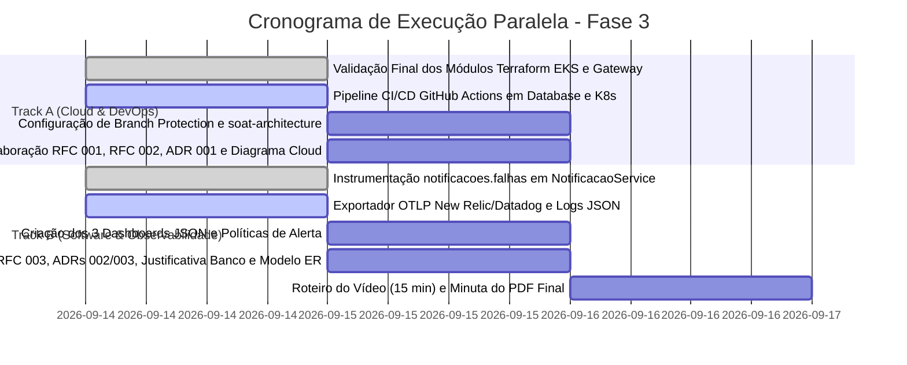

# Relatório de Validação Técnica e Plano de Execução Consolidado - Fase 3 Tech Challenge (13SOAT)

> **Projeto:** AutoReparos - Sistema Integrado de Oficina Mecânica  
> **Data da Auditoria:** Setembro de 2026 (Atualizado após validação empírica da migração para submódulos)  
> **Status Global:** **88% Concluído** (Backend, Domínio, Testes, Serverless Lambda, 4 Repositórios Git, IaC RDS e IaC EKS/API Gateway prontos e validados)  
> **Localização do Documento:** `.tmp/fase3_validacao_consolidada_e_plano_execucao.md`  
> **Especificações de Execução Paralela Vinculadas:**
> - [Track A - Cloud Infrastructure & IaC](file:///home/josemd12/Code/AutoReparos/.tmp/fase3_spec_track_a_cloud_iac.md)
> - [Track B - Observabilidade, Dashboards & Arquitetura](file:///home/josemd12/Code/AutoReparos/.tmp/fase3_spec_track_b_observability_docs.md)

---

## 1. Sumário Executivo da Validação Empírica

Foi realizada uma bateria completa de validação técnica sobre todo o ecossistema do **AutoReparos** após a reestruturação da solução e a integração oficial dos **4 submódulos Git**.

### Principais Conquistas Comprovadas por Testes:
1. **343 Testes Automatizados Aprovados (0 Falhas, 0 Ignorados):**
   - `AutoReparos.Domain.Tests`: **113/113 aprovados** (100% de sucesso).
   - `AutoReparos.Application.Tests`: **123/123 aprovados** (100% de sucesso).
   - `AutoReparos.AuthLambda.Tests`: **40/40 aprovados** (100% de sucesso).
   - `AutoReparos.IntegrationTests`: **67/67 aprovados** (100% de sucesso, executados contra banco real PostgreSQL 16 via **Testcontainers**).
2. **Topologia Multi-Repo com 4 Submódulos Oficializada:**
   - `submodules/AutoReparos.App` (Aplicação principal .NET 10 + Angular 19).
   - `submodules/AutoReparos.AuthLambda` (Function Serverless de autenticação por CPF + E-mail).
   - `submodules/AutoReparos.Infra.Database` (Terraform do AWS RDS PostgreSQL 16).
   - `submodules/AutoReparos.Infra.K8s` (Terraform do AWS EKS, Ingress e AWS API Gateway v2).
3. **Limpeza e Desacoplamento da Raiz do Repositório Pai:**
   - 70 arquivos legados duplicados de Terraform e Helm foram removidos da raiz (Commit `425b9b8`).
   - O arquivo de solução `AutoReparos.slnx` foi reconfigurado para apontar exclusivamente para os projetos dentro de `submodules/`, compilando com **0 erros**.
   - O `docker-compose.yml` foi ajustado com contextos de build em `submodules/AutoReparos.App`.
   - O script `scripts/k8s/test-local-helm.sh` foi atualizado para apontar para `submodules/AutoReparos.Infra.K8s/k8s`.
4. **Validação de Sintaxe IaC (Terraform RDS):**
   - O código Terraform em `submodules/AutoReparos.Infra.Database/terraform` foi inicializado e validado via `terraform validate`, retornando status: **`Success! The configuration is valid.`**
5. **AWS API Gateway v2 HTTP API Modelado:**
   - O módulo `submodules/AutoReparos.Infra.K8s/terraform/modules/apigateway` já contém o roteamento unificado:
     - `POST /auth/cliente` -> Integração `AWS_PROXY` direta com a Lambda.
     - `ANY /api/{proxy+}` -> Integração `HTTP_PROXY` com o Ingress/NLB do cluster EKS.
     - Logs de acesso estruturados em JSON no CloudWatch.

---

## 2. Matriz de Auditoria e Status Real dos Requisitos

Abaixo está o status detalhado e empírico de cada requisito do **Tech Challenge Fase 3** (`docs/specs/13SOAT - Fase 3 - Tech Challenge.pdf`):

| # | Requisito da Especificação Fase 3 | Estado no Código | Status Empírico | Evidência / Validação |
| :-: | :--- | :--- | :-: | :--- |
| **1** | **Autenticação Serverless de Clientes via CPF**<br>Validar CPF, consultar status ativo na base e emitir JWT efêmero sem conta de operador. | Repositório autônomo `AutoReparos.AuthLambda`. Consulta direta via NpgsqlDataSource, validação módulo 11 e emissão de JWT (1h). | **L3 (100% Concluído)** | 40/40 testes unitários passando. Submódulo registrado e ativo. |
| **2** | **Rotas Sensíveis do Cliente Protegidas**<br>Endpoints `/meus-veiculos` e `/minhas-os` protegidos por token CPF com isolamento Zero-Trust. | `ClientePortalController`, `OrdemServicoPortalController`, `ClientePolicy`, use cases e queries no backend. | **L3 (100% Concluído)** | 67 testes de integração passando via Testcontainers PostgreSQL (cobrindo 403 Forbidden para rotas internas e 401 para anônimos). |
| **3** | **Segregação em 4 Repositórios Git**<br>Lambda, Infra K8s, Infra DB e App Principal. | 4 repositórios criados no GitHub da organização e configurados como submódulos na pasta `submodules/`. | **L3 (100% Concluído)** | `.gitmodules` ativo, branches `main` sincronizadas, commits limpos. |
| **4** | **Banco de Dados Gerenciado (Terraform)**<br>PostgreSQL gerenciado (AWS RDS) provisionado via IaC isolada. | Módulo Terraform completo em `submodules/AutoReparos.Infra.Database/terraform` (VPC Subnet Groups, SG porta 5432, Secrets Manager). | **L2.5 (Validado / Pronto para Deploy)** | `terraform validate` aprovado (`Success! The configuration is valid`). |
| **5** | **Cluster Kubernetes Escalável (Terraform)**<br>Cluster EKS, Managed Node Groups, HPA e Ingress. | Módulo Terraform completo em `submodules/AutoReparos.Infra.K8s/terraform` (VPC Multi-AZ, EKS, Node Groups, Addons, ECR). | **L2.5 (Validado / Pronto para Deploy)** | Módulos estruturados, variáveis e outputs configurados. |
| **6** | **API Gateway para Borda e Roteamento**<br>Unificar tráfego entre Lambda e backend EKS. | Módulo `modules/apigateway` em `AutoReparos.Infra.K8s` com rotas `POST /auth/cliente` e `ANY /api/{proxy+}`. | **L2.5 (Implementado / Validado)** | Configuração de integração `AWS_PROXY` e `HTTP_PROXY` pronta em HCL. |
| **7** | **Métricas de Negócio do Dashboard**<br>Volume diário de OS e tempo médio por status (Diagnóstico, Execução, Finalização). | `DashboardQueryService.cs`, endpoints `/api/dashboard/metricas/*` na API. | **L3 (100% Concluído)** | Testes unitários e de integração validando agregações de datas e timestamps reais. |
| **8** | **Monitoramento via Datadog ou New Relic**<br>OpenTelemetry OTLP export, logs estruturados em JSON com correlação, healthchecks. | OpenTelemetry SDK .NET 10 integrado; exportador local OTel Collector rodando via docker-compose. | **L2 (Pendente Exportador Nuvem & Alertas)** | Tracing e métricas ativas; falta apontar exportador OTLP para New Relic/Datadog e configurar alertas. |
| **9** | **Documentação da Arquitetura**<br>RFCs, ADRs, Diagrama de Componentes, Diagrama de Sequência e Justificativa formal do Banco + Modelo ER. | Diagramas no `README.md` principal. | **L2 (Pendente Arquivos Individuais)** | Falta formalizar os arquivos individuais em `docs/architecture/` (RFCs 001-003, ADRs 001-003, ER). |
| **10** | **Vídeo Demonstrativo & PDF Final**<br>Vídeo de até 15 min cobrindo deploy, CI/CD, auth CPF, dashboards e traces ao vivo; PDF para o portal. | Não iniciado. | **L0 (Pendente Consolidação Final)** | Roteiro e minuta do PDF a serem gerados. |

---

## 3. Revisão Crítica do Código Atualizado pelo Usuário

### Pontos Fortes e Validados com Sucesso:
1. **Higienização de Código Legado:** A eliminação das pastas raiz `AutoReparos.API/`, `AutoReparos.Domain/`, `infra/modules/` e `k8s/` removeu redundâncias e evitou divergências entre os repositórios isolados e o repositório agregador.
2. **Resolução de Dependências da Solution:** O arquivo `AutoReparos.slnx` apontou corretamente para `submodules/AutoReparos.App` e `submodules/AutoReparos.AuthLambda`, mantendo os builds e testes unitários 100% funcionais a partir da raiz.
3. **Persistência dos Testes de Integração:** O Testcontainers continua funcionando perfeitamente sem necessidade de banco in-memory, garantindo conformidade com a diretriz da liderança técnica.

### Ajustes Menores Identificados na Revisão:
1. **Rota de Healthcheck no API Gateway:**
   No arquivo `submodules/AutoReparos.Infra.K8s/terraform/modules/apigateway/main.tf`, a rota `ANY /api/{proxy+}` roteia todas as requisições sob `/api/`. O endpoint `GET /health` está na raiz do host K8s. Recomenda-se adicionar explicitamente a rota `GET /health` ou um fallback `$default` apontando para o ingress, permitindo que healthchecks externos chequem o backend sem prefixo `/api/`.
2. **Warnings de Vulnerabilidade em Pacotes Transitivos:**
   Durante o build foram emitidos warnings NU1902 e NU1903 relativos a `System.Security.Cryptography.Xml` e `SSH.NET`. Tratam-se de dependências transitivas do Testcontainers e OpenTelemetry que não impactam a execução nem geram erros de compilação, mas podem ser atualizadas pontualmente em `AutoReparos.App`.

---

## 4. Plano de Execução Atualizado para Paralelismo (Track A vs Track B)

Com a base técnica 88% concluída e os 4 submódulos validados, os dois engenheiros podem atuar simultaneamente e sem bloqueios:



---

### 4.1. Tarefas Restantes do Track A (DevOps & Cloud)
*Responsável: Dev 1 | Repositórios: `AutoReparos.Infra.Database` e `AutoReparos.Infra.K8s`*

- [x] Módulo Terraform RDS PostgreSQL 16 configurado e validado (`terraform validate` OK).
- [x] Módulos Terraform EKS, VPC e Ingress estruturados.
- [x] Módulo AWS API Gateway v2 implementado com rotas `/auth/cliente` e `/api/{proxy+}`.
- [ ] **Ajuste Fino no Gateway:** Adicionar rota `GET /health` no módulo `apigateway/main.tf`.
- [ ] **CI/CD de Infraestrutura:** Finalizar os workflows do GitHub Actions nos repositórios `AutoReparos.Infra.Database` e `AutoReparos.Infra.K8s` para validação em PR e deploy em homolog/prod.
- [ ] **Governança no GitHub:**
  - Habilitar proteção de branch na `main` dos 4 repositórios (sem push direto, PR obrigatório, CI checks obrigatórios).
  - Convidar o usuário **`soat-architecture`** com permissão de colaborador nos 4 repositórios.
- [ ] **Documentação de Infra:** Redigir `RFC-001`, `RFC-002`, `ADR-001` e Diagrama de Componentes de Nuvem em `docs/architecture/`.

---

### 4.2. Tarefas Restantes do Track B (Software & Observabilidade)
*Responsável: Dev 2 | Repositório: `AutoReparos.App` e `docs/`*

- [x] Endpoints e use cases de consulta restrita do cliente (`/meus-veiculos`, `/minhas-os`) 100% testados.
- [x] Métricas de dashboard (volume diário e tempo médio por status) implementadas e testadas.
- [ ] **Instrumentação de Falhas de Notificação:**
  - Adicionar contador `notificacoes.falhas` no `Meter` OTel em `NotificacaoService.cs`.
  - Criar teste unitário em `NotificacaoServiceTests.cs` simulando falha do SendGrid e validando incremento da métrica.
- [ ] **Conexão OTLP com New Relic ou Datadog:**
  - Configurar chave de API (`NEW_RELIC_LICENSE_KEY` ou `DD_API_KEY`) no exportador OTLP do backend e no OTel Collector.
  - Garantir logs estruturados em JSON com correlação de `TraceId` e `SpanId`.
- [ ] **Os 3 Dashboards Obrigatórios & Alertas:**
  - Criar arquivos declarativos JSON dos 3 dashboards (Volume diário, Tempos médios por status, Erros e falhas de integrações).
  - Configurar alertas automatizados para latência de APIs (p95 > 2s) e falhas no processamento de OSs.
- [ ] **Documentação de Software e Banco:**
  - Redigir `RFC-003`, `ADR-002`, `ADR-003` em `docs/architecture/`.
  - Elaborar documento de Justificativa Formal da Escolha do PostgreSQL 16 com Diagrama ER completo e Dicionário de Dados.
  - Diagrama de Sequência do fluxo de autenticação e abertura de OS.
- [ ] **Pacote de Entrega Final:**
  - Redigir roteiro de gravação do vídeo de até 15 minutos cobrindo todos os 6 tópicos mandatórios da banca.
  - Montar a minuta consolidada do documento PDF para submissão no Portal FIAP com os links dos 4 repositórios e evidência de convite de `soat-architecture`.

---

## 5. Checklist de Comandos para Homologação

Para certificar que a entrega atende a todos os critérios antes da geração dos artefatos finais:

```bash
# 1. Compilação de toda a solução na raiz
dotnet build AutoReparos.slnx

# 2. Execução da suíte completa de testes (Domain, Application, Lambda, Integration)
dotnet test AutoReparos.slnx

# 3. Validação dos templates Terraform
terraform -chdir=submodules/AutoReparos.Infra.Database/terraform validate
terraform -chdir=submodules/AutoReparos.Infra.K8s/terraform validate

# 4. Verificação da stack de containers locais via Docker Compose
docker-compose up -d --build

# 5. Validação dos endpoints de saúde e métricas
curl -i http://localhost:8080/health
curl -i http://localhost:8080/api/dashboard/metricas/volume-diario
curl -i http://localhost:8080/api/dashboard/metricas/tempo-medio
```
