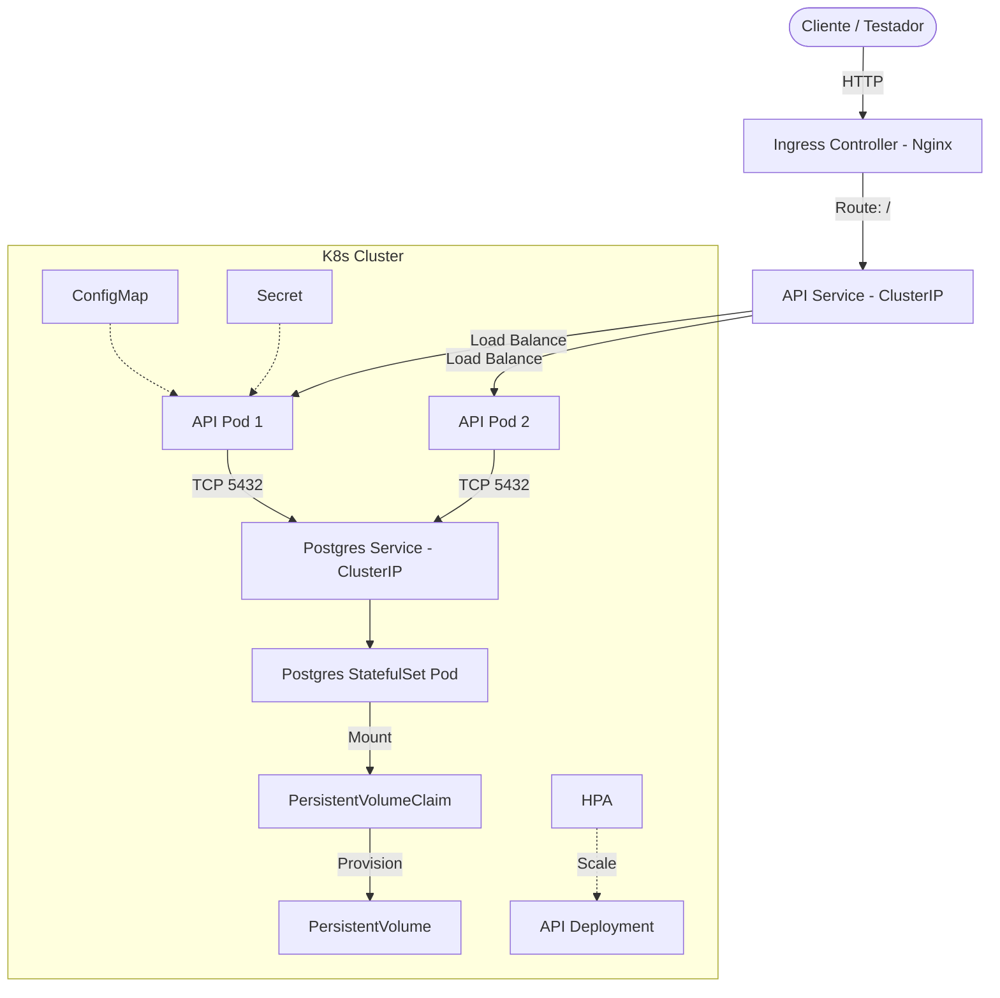

# Especificação Técnica: Kubernetes & Helm para AutoReparos

Este documento detalha o planejamento, a estrutura e a arquitetura para a orquestração da aplicação **AutoReparos** utilizando **Kubernetes (K8s)** e **Helm**.

---

## 🏗️ 1. Arquitetura Proposta

A arquitetura do cluster Kubernetes será composta por:

1. **API (`autoreparos-api`):** Escalável dinamicamente (HPA), exposta internamente por um Service (`ClusterIP`) e acessível externamente via recurso de **Ingress**.
2. **Banco de Dados (`postgres`):** StatefulSet com um volume persistente (PV/PVC).
3. **Gerenciamento de Configurações:** Centralizado em `ConfigMap` e `Secret`.
4. **Resiliência:** Liveness e Readiness probes baseadas no endpoint `/health` da API.



---

## 📂 2. Estrutura de Arquivos (Helm Chart)

```text
k8s/
└── autoreparos/
    ├── Chart.yaml
    ├── values.yaml
    └── templates/
        ├── _helpers.tpl
        ├── configmap.yaml
        ├── secret.yaml
        ├── postgres-pvc.yaml
        ├── postgres-statefulset.yaml
        ├── postgres-service.yaml
        ├── api-deployment.yaml
        ├── api-service.yaml
        ├── api-ingress.yaml
        └── api-hpa.yaml
```

---

## ⚙️ 3. Configurações (`values.yaml`)

```yaml
replicaCount: 2

image:
  repository: autoreparos-api
  pullPolicy: IfNotPresent
  tag: "latest"

service:
  type: ClusterIP
  port: 8080

ingress:
  enabled: true
  className: nginx
  hosts:
    - host: autoreparos.local
      paths:
        - path: /
          pathType: Prefix

postgres:
  image: postgres:16
  database: autoreparos
  user: admin
  password: "CHANGE_ME"
  storageSize: 2Gi

config:
  jwtExpiryHours: "2"
  seedUserEmail: "admin@autoreparos.com"
  sendGridFromEmail: "noreply@autoreparos.com"
  sendGridFromName: "AutoReparos"
  appBaseUrl: "http://autoreparos.local"

secrets:
  jwtSecret: "DUMMY_JWT_SECRET_KEY_MINIMUM_32_CHARACTERS"
  seedUserPassword: "DUMMY_SEED_USER_PASSWORD_123"
  aprovacaoTokenSecret: "DUMMY_APPROVAL_TOKEN_SECRET_KEY"
  sendGridApiKey: "SG.dummy_key_placeholder"

resources:
  requests:
    cpu: 100m
    memory: 256Mi
  limits:
    cpu: 500m
    memory: 512Mi

hpa:
  minReplicas: 2
  maxReplicas: 10
  targetCPUUtilizationPercentage: 40
  targetMemoryUtilizationPercentage: 40
```

---

## 🔐 4. Estratégia de Segurança para Segredos Locais

1. O arquivo `k8s/values-secrets.yaml` conterá os dados reais e sensíveis.
2. Adicionaremos este arquivo ao `.gitignore`:

   ```text
   k8s/values-secrets.yaml
   ```

3. O conteúdo do arquivo local `k8s/values-secrets.yaml`:

   ```yaml
   postgres:
     password: "admin123"

   secrets:
     jwtSecret: "FBQOvEaUYAlmdilnGOk7vKzO9xUHiLgb8QCFUrk6af9"
     seedUserPassword: "Admin@123"
     aprovacaoTokenSecret: "another_super_secret_key_for_approval_tokens_with_enough_length"
     sendGridApiKey: "SG.dummy_key"
   ```

4. Comando para deploy mesclando os arquivos:

   ```bash
   helm upgrade --install autoreparos ./k8s/autoreparos -f k8s/autoreparos/values.yaml -f k8s/values-secrets.yaml
   ```

---

## 💻 5. Alterações no Código C# (API Health Checks)

Edições no arquivo [Program.cs](file:///mnt/c/Users/joseh/Documents/Github/Fiap/AutoReparos/AutoReparos.API/Program.cs):

### Registro do Serviço

```csharp
builder.Services.AddHealthChecks();
```

### Configuração do Endpoint

```csharp
app.MapHealthChecks("/health");
```

---

## 🛠️ 6. Plano de Implementação

1. **Código C#:** Atualizar o [Program.cs](file:///mnt/c/Users/joseh/Documents/Github/Fiap/AutoReparos/AutoReparos.API/Program.cs) para expor `/health`.
2. **Git:** Ignorar `k8s/values-secrets.yaml` no `.gitignore`.
3. **Helm Chart:** Criar os diretórios e arquivos de templates em `k8s/autoreparos/`.
4. **Segredos Locais:** Criar `k8s/values-secrets.yaml` com os dados reais de teste obtidos em [AGENTS.md](file:///mnt/c/Users/joseh/Documents/Github/Fiap/.agents/AGENTS.md).
5. **Documentação:** Adicionar instruções de deploy no `README.md`.
